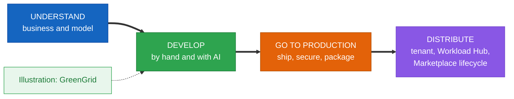
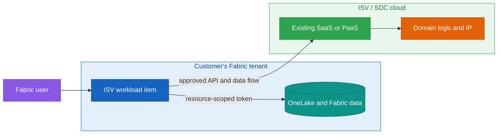
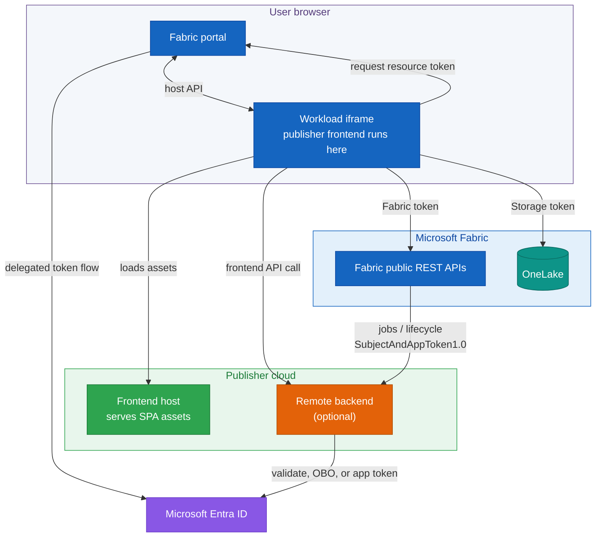
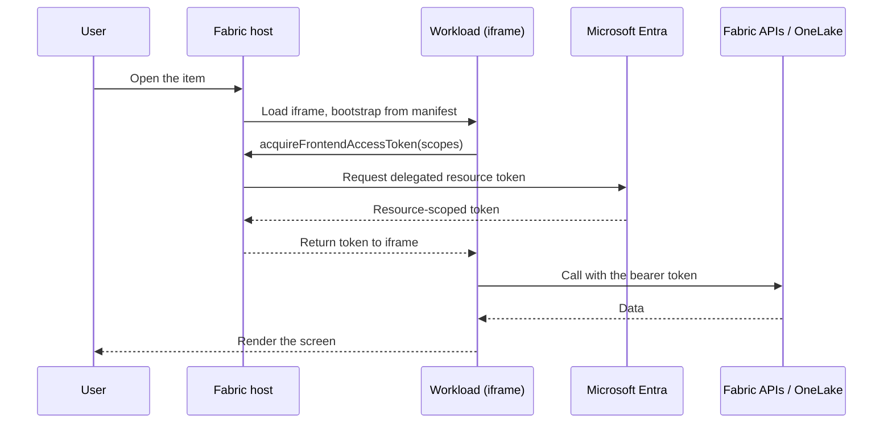
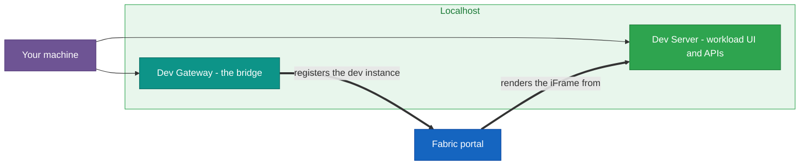
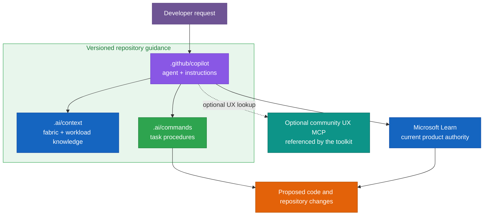
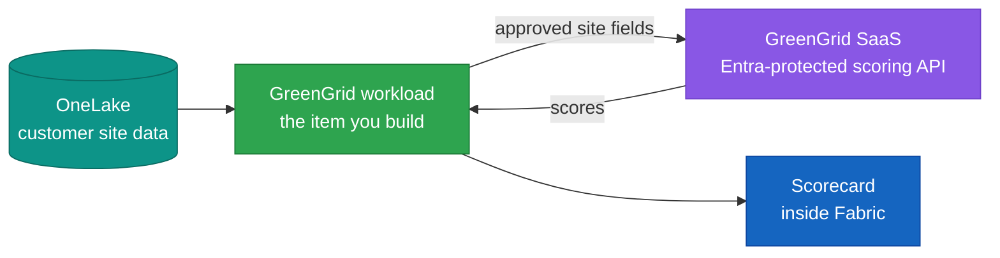
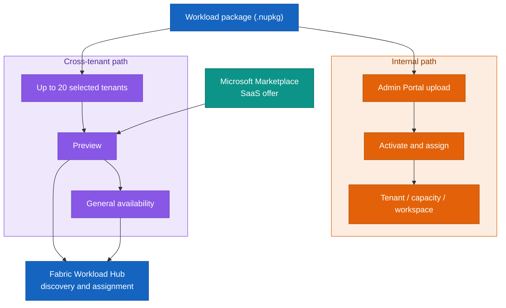

# Building Production-Ready Workloads for Microsoft Fabric

*From the ISV business case and architecture to secure delivery, operations, and distribution*

> Pin the technical reference record near the opening: implementation commit, separate release-tag commit, frontend SDK dependency range and lockfile status, publishing-validator tag/commit, technical verification date, editorial date, and validation scope. State plainly that documentary and static checks do not equal tenant execution.

> Reviewed against Microsoft Learn and the official toolkit repositories on September 17, 2026.

## Contents

**[Choose your path](#choose-your-path)**

**[0. Before you begin](#0-before-you-begin)**

**Understand**

- **[1. What a workload is, and why an ISV would build one](#1-what-a-workload-is-and-why-an-isv-would-build-one)**
- **[2. How a workload runs: architecture, the host, and one request](#2-how-a-workload-runs-architecture-the-host-and-one-request)**
- **[3. The manifest package: the contract with Fabric](#3-the-manifest-package-the-contract-with-fabric)**
- **[4. Identity and access with Microsoft Entra](#4-identity-and-access-with-microsoft-entra)**

**Develop**

- **[5. The toolkit and the development environment](#5-the-toolkit-and-the-development-environment)**
- **[6. Building an item: editor, data, and capabilities](#6-building-an-item-editor-data-and-capabilities)**
- **[7. Developing with AI assistance](#7-developing-with-ai-assistance)**
- **[8. Diagnostics and debugging](#8-diagnostics-and-debugging)**
- **[9. Illustration: GreenGrid](#9-illustration-greengrid)**

**Go to production**

- **[10. From developer mode to production](#10-from-developer-mode-to-production)**
- **[11. Hosting, domain, and identity](#11-hosting-domain-and-identity)**
- **[12. Security and compliance](#12-security-and-compliance)**
- **[13. Packaging, validation, and CI/CD](#13-packaging-validation-and-cicd)**
- **[14. Patterns and anti-patterns](#14-patterns-and-anti-patterns)**

**Distribute**

- **[15. Make it available in your tenant](#15-make-it-available-in-your-tenant)**
- **[16. Publish across tenants: Workload Hub and Microsoft Marketplace](#16-publish-across-tenants-workload-hub-and-microsoft-marketplace)**
- **[17. The post-publish lifecycle](#17-the-post-publish-lifecycle)**
- **[18. Recap and next steps](#18-recap-and-next-steps)**

**Appendices**

---

> A self-contained manuscript for the Workload part of the book (target: about 190 to 200 pages when expanded).
> Topic: extending Microsoft Fabric with the **Extensibility Toolkit**.
> Audience: ISVs, software development companies, developers, and architects building their first Fabric workload.

---

## How the chapter is organized

The manuscript starts with the ISV business case, then teaches the workload model in four movements. GreenGrid appears at the end of Develop as a worked illustration, not a reference architecture.

- **Understand**, what a workload is and how it runs inside Fabric.
- **Develop**, how you build a workload by hand and with the repository's AI guidance. Then an illustration with **GreenGrid**.
- **Go to production**, shipping a workload, its security and compliance, packaging and CI/CD.
- **Distribute**, make the workload available in a tenant, publish it to the marketplace with its review and monetization, and run it through its post-publish life.

### The worked illustration

| Illustration | Appears in | Why it is there |
|---|---|---|
| **GreenGrid** | Develop | A workload built locally with the Dev Gateway, explained from scratch |

### Indicative page budget

| Sections | Movement | Pages |
|---|---|---|
| 0 | Before you begin | ~5 |
| 1-4 | Understand | ~35 |
| 5-9 | Develop (by hand, with AI, diagnostics, GreenGrid) | ~80 |
| 10-14 | Go to production | ~45 |
| 15-18 | Distribute | ~30 |
| Appendices A-G | Reference | ~10 |
| **Total** | | **~205** |

---

## Choose your path

- State the primary audience: ISV/SDC product and engineering teams, with developer, security, operations, administration, and publishing readers.
- State assumed knowledge: web applications, REST/JSON, OAuth concepts, source control, and basic Fabric workspaces/items. TypeScript/React and Python are scenario-specific.
- State learning outcomes: decide whether a workload fits, explain boundaries, build and diagnose an item, define a release unit, and choose a distribution path.

| Path | Sections | Outcome |
|---|---|---|
| **Fast track** | 0 → 2 → 5 → 6 → 9 | Follow the source-inspected first-workload path and connect the GreenGrid example |
| **Production track** | 10 through 17 | Turn the prototype into a hosted, secured, packaged, assigned, and supportable product |

- Introduce a visual convention for **Stable concept** versus **Current platform behavior, verified September 2026**.
- Direct business readers to section 1 before either technical path.

# 0. Before you begin

- 0.1 Environment, accounts, and assumed concepts. Entra app creation rights and an F, P, or Trial capacity are required. An Azure subscription is optional until Azure hosting is used. Node.js, PowerShell, .NET, Azure CLI, and the toolkit scripts. Administrator, capacity, workspace, publisher, and user roles kept separate.
- 0.2 A source-inspected first-run path, used only after the common and local-development prerequisites are satisfied. Record the expected Hello World result and the pinned setup-script defect without claiming tenant execution.
- 0.3 Common pitfalls, the environment traps that catch people before any code, capacity, developer mode, env files, token audience, framing, and package version.

---

# Understand

> What a workload is, how Fabric runs it, and the contract that makes it native, anchored by one concrete request.

## 1. What a workload is, and why an ISV would build one

- Introduce GreenGrid immediately as the running example: an energy-scoring SaaS that works with approved OneLake data while its scoring IP stays in the publisher cloud.
- 1.1 The ISV business case: bring your service to Fabric data. Cover ISVs and SDCs, an existing SaaS or PaaS, publisher-owned IP, lower per-customer integration work, and a repeatable path from one tenant to selected customers and public distribution. Separate Workload Hub installation from Microsoft Marketplace commerce.
- 1.2 What Fabric gives you, and what a workload adds. Workspaces, items, Fabric APIs, OneLake data, and explicit integrations with catalog, monitoring, Git, and deployment. State clearly that sensitivity protection and built-in behavior are not inherited automatically.
- 1.3 The toolkit, when to use it, and its limits. Add an observable decision matrix comparing a Fabric workload, Power BI custom visual, Activator, pipeline/notebook/function, and separate SaaS experience. Include persistent item, dedicated editor, lifecycle, distribution, required skills, SDK compatibility, publishing review, consent, support, and operations.

## 2. How a workload runs: architecture, the host, and one request

- 2.1 The Fabric host, your frontend, and an optional backend. Include Fabric APIs, OneLake resources, Entra, and the fact that the publisher frontend runs inside the iframe after loading from its endpoint.

- Add a relationship table separating frontend → Fabric/OneLake, frontend → publisher API, Fabric → remote endpoint (`SubjectAndAppToken1.0`), and publisher backend → target resource.
- 2.2 Items as native artifacts, with explicit integrations. Control-plane item definitions are separate from OneLake data. Catalog, monitoring, Git, deployment, jobs, and lifecycle behavior each need configuration and validation.
- 2.3 A request, step by step, from opening an item to acquiring a resource-scoped delegated token and calling the matching Fabric, OneLake, or publisher endpoint.

## 3. The manifest package: the contract with Fabric

- 3.1 Workload, product, and paired item manifests. Separate source tree from built package structure. Add an object/level/owner/delivery-or-storage/change-moment table for workload manifest, product manifest, item-type XML/JSON, and item-instance definition parts. Keep current package limits with exact sources.
- 3.2 Identity and naming, `Org.[Name]` for one tenant versus `[Publisher].[Workload]` for cross-tenant publication. Permanent reservation on first confirmation, assignment scopes, public publishing requirements, and the separate Microsoft Marketplace SaaS offer.

| Aspect | `Org.[Name]` (internal) | `[Publisher].[Workload]` (cross-tenant) |
|---|---|---|
| Audience | Your own tenant | Other tenants |
| Registration | No separate workload-name registration | Name and publishing tenant reserved permanently |
| Availability | Upload, activate, and assign | Selected tenants, Preview, then GA |
| Requirements | General hosting, identity, and manifest requirements | General, workload, item, attestation, support, and review requirements |
| Commerce | Not required | Microsoft Marketplace SaaS offer required for Preview and GA |
| Name length | No separate limit established by the cited publishing overview | Workload portion at most 32 characters |

## 4. Identity and access with Microsoft Entra

- 4.1 Delegated frontend tokens and backend OBO. Use the documented token result property, one acquisition API but separate resource audiences and tokens, and OBO only for backend exchange.
- 4.2 Entra applications, scopes, and service identities. Distinguish v2 client-ID audiences from v1 audience rules, pair issuer/version/audience, and state that token and scope validation do not replace tenant/workspace/item authorization. Keep `Fabric.Extend`, hosting-mode-specific redirects, backend credentials, and managed identity roles separate.

---

# Develop

> How a workload is built, first by hand, then with the repository's AI guidance, followed by diagnosis and the GreenGrid illustration.

## 5. The toolkit and the development environment

- 5.1 The starter kit, setup script, and Entra applications. Contrast the Learn `Setup.ps1` wrapper command with the pinned `SetupWorkload.ps1` implementation, list its parameters, and document the unsupported final `-Force` handoff. Show why local development still uses real delegated identity.
- 5.2 Dev Server, Dev Gateway, and the Hello World checkpoint. Exact tenant-setting names, personal Fabric Developer Mode, F/P/Trial capacity, Chromium Local Network Access, source-inspected script signatures, the Linux `InteractiveLogin` caveat, and the expected two-terminal result without claiming tenant execution.

## 6. Building an item: editor, data, and capabilities

- 6.1 The item, its editor, and how it surfaces. Add the source-verified `scripts/Setup/CreateNewItem.ps1 -ItemName ... [-srcItemName ...]` path, its `scripts/Setup` working directory, and the mandatory `ITEM_NAMES`, `Product.json`, locale, and `App.tsx` follow-up. Then cover views, routes, paired item manifests, and compact definition parts updated through item CRUD APIs.
- 6.2 Separating item definitions from OneLake data. Resource-specific Storage tokens, backend OBO for OneLake when needed, and no customer data, secrets, or large results in the item definition.
- 6.3 Remote jobs, lifecycle events, and other capabilities. `SwitchToRemoteHosting.ps1` signature and source-inspected caveats, `HostingType="Remote"`, schema `2.100.0`, Job Scheduler declarations, unresolved official job-route differences, base Monitoring Hub listing versus optional actions and Recent Runs, soft/hard delete, and restore.

## 7. Developing with AI assistance

> The toolkit repository includes AI guidance and a Copilot agent. These files are versioned project documentation and can lag behind Microsoft Learn. The optional UX MCP referenced by the toolkit is community-hosted, not a Microsoft Fabric service.

- Add the visual rule **AI output is a proposal, not platform truth**.
- Structure the method as Frame → Ground → Bound → Review → Verify, with an expected result for each step, followed by the four contract gates: SDK → manifests → build → runtime.

- 7.1 Repository guidance: useful, mutable, and versioned. `.ai/context`, `.ai/commands`, and the difference between written procedures and shipped executable commands.
- 7.2 The Copilot agent and the optional community UX MCP. `@fabric`, scoped instructions, review of community dependencies, and no implied Microsoft certification.
- 7.3 What it generates, and keeping it honest. Paired item manifests, routes, locales, scoped token calls, Dev Gateway verification, local package checks, and separate publishing validation.

## 8. Diagnostics and debugging

- 8.1 Reading the chain, and the token and manifest boundaries. Use observations and one discriminating test at a time instead of mapping one symptom to one cause. Keep resource scopes/audiences, tenant/issuer policy, redirects, local checks, and publishing validation distinct.
- 8.2 The Dev Gateway, the iframe boundary, and correlation. Browser Local Network Access, local-version precedence, and explicit propagation of `ActivityId`/`RequestId` only where those identifiers are present.

## 9. Illustration: GreenGrid

> A teaching sample, not a reference architecture. It isolates the development concepts and deliberately skips production concerns.

- 9.1 What GreenGrid is, a fictional ISV/SDC whose Entra-protected SaaS holds the scoring algorithm. The workload reads approved OneLake fields and sends a documented payload to the publisher boundary.

- 9.2 The scoring service, in Python. Protect it with a delegated GreenGrid API scope, then add unit tests and container packaging.
- 9.3 Milestone 1: the workload calls the service. Seed input and an authenticated SaaS call with no browser API key.
- 9.4 Milestones 2 and 3: real data and a native screen. A separate OneLake Storage token, real data behind the same function, then a graphical Fabric-themed view.

---

# Go to production

> What changes from developer mode, how you secure it, how you package and automate it, and the patterns that keep it sound.

## 10. From developer mode to production

- 10.1 What changes. Keep the dev/production comparison, then separate configuration substitutions, production design decisions, and operational proof with observable exit evidence.

| Concern | Developer mode | Production |
|---|---|---|
| Delivery to Fabric | Dev Gateway bridges localhost | Fabric loads your hosted URL directly |
| Frontend host | localhost | Your cloud, HTTPS, on a verified domain |
| Backend identity | Development app and local credentials | Backend app credential for remote flows, managed identity where supported |
| Telemetry | Console and local logs | Application Insights, correlation IDs retained |
| Reaching users | Your dev workspace | Upload, activate, assign, or publish across tenants |

- 10.2 What to verify across the transition: verified domain, HTTPS, CSP for Fabric and Power BI portal domains, CORS, resource-specific token audiences, new package version, and token lifetime.

## 11. Hosting, domain, and identity

- 11.1 Hosting, the verified domain, and the resource ID, a frontend and optional backend on your cloud. The frontend as a subdomain of a verified Entra domain, the resource ID format.
- 11.2 User delegation, backend credentials, and managed identities. Current remote OBO/S2S reference flow uses a rotated server-side backend credential. Managed identity remains appropriate for supported service calls.

## 12. Security and compliance

- 12.1 Data boundaries, labels, and publisher responsibility. Add a table mapping tenant isolation, resource authorization, publisher data transfers, logs, secrets, consent changes, and incident escalation to the control, responsible party, and release evidence. Preserve the warning that sensitivity labels/protection are not automatically applied.
- 12.2 Secrets, telemetry, monitoring, and support. Backend credentials in Key Vault, managed identity where supported, no secrets in frontend or URLs, `ActivityId`/`RequestId`, publisher SLA/help/livesite contacts, and the boundary between Microsoft platform support and publisher support.

## 13. Packaging, validation, and CI/CD

- 13.1 Package build, schema checks, and publishing validation. Define the release unit across package, frontend, backend, definition schema, and permissions. Use one version source of truth, verify the manifest and generated `.nupkg`, and document the pinned build script's unchecked native exit codes. Pin validator `v2025.12.1`, use its effective Node.js 20 minimum, canonical `Preview` or `GeneralAvailability` stage, and generated evidence after tenant publication.
- 13.2 Automating the pipeline. Infrastructure as code, Windows runner for current PowerShell scripts, publisher-owned lockfile before `npm ci`, pinned `build:prod` script name, OIDC for Azure deployment, UI-based package upload, Admin API automation only for listing/assignment, and a validation-stage table with inputs, outputs, owners, and evidence.

## 14. Patterns and anti-patterns

- 14.1 Patterns that hold up. Tie each pattern to a product decision and its operational consequence.
- 14.2 Anti-patterns to avoid. Tie each shortcut to the concrete runtime, security, publication, or migration failure it creates.

---

# Distribute

> Put a finished workload in front of users, then keep it running.

## 15. Make it available in your tenant

- 15.1 Admin Portal upload, activation, and assignment. Publish versus Manage my tenant, unique versions, deactivation before deletion, and tenant/capacity/workspace assignment.
- 15.2 Internal publishing with Org.[Name]. No separate workload-name registration, but all general hosting, identity, manifest, security, and tenant requirements still apply.

## 16. Publish across tenants: Workload Hub and Microsoft Marketplace

- 16.1 Selected tenants, Preview, and GA. Add the full stage matrix: audience, identity/naming, prerequisites, actor, validation, observable result, and exact source. Selected tenants use a publisher test plan rather than formal publishing validation. Preview and GA approval belongs to the publisher and Fabric workload team, while customer administrators act later on consent and assignment. Define publish, activate, consent, and assign separately.

- 16.2 Publishing requirements, commerce, and support. Fabric validation and attestation, privacy/terms/help links, verified publisher, trial-requirement discrepancy, and the required Microsoft Marketplace SaaS offer with Contact me, Free trial, Get it now (Free), or Sell through Microsoft.
- 16.3 Choosing a path. Reuse the product-fit criteria from 1.3, then compare internal, selected-tenant, Preview, and GA paths by audience, durable cost, and hard-to-change decisions. State that distribution is a channel, not a sales guarantee.

## 17. The post-publish lifecycle

- 17.1 Updates, migration, and deprecation. Definition migration, activation, deactivation, and keeping customer data separate from control-plane definition parts.
- 17.2 Monitoring, consent, rollback, and feature flags. Roll back by packaging known-good code under a new forward version, not by reusing an old package version.

## 18. Recap and next steps

- 18.1 The workload model end to end, the ISV/SDC business bridge, and concrete next actions by role: product owner, architect/security lead, developer, release engineer, and publisher/operations owner.

---

## Appendices

- **Appendix A: Manifest package reference** (`WorkloadManifest.xml`, `Product.json`, paired item XML/JSON, release checks, limits, naming)
- **Appendix B: Setup, development, package, and validator commands** (actor, directory, exact parameters, expected output, versioned source, and source-inspected defects)
- **Appendix C: AI guidance reference** (guidance hierarchy and the SDK → manifests → build → runtime gates)
- **Appendix D: Python service reference** (example location, dependencies, label, boundary, and production gaps)
- **Appendix E: Release and compliance checklist, diagnostics quick reference**
- **Appendix F: Glossary and resources** (reference baseline, provenance register, primary sources, and maintenance rule)
- **Appendix G: Quick reference** (commands and essential decisions, with links back to the full explanations)

---

*Illustration: GreenGrid (development, FY27FabricMotion repository, micro hack 2). Primary references: Microsoft Learn Extensibility Toolkit documentation, Fabric Admin Workloads API reference, Microsoft Marketplace SaaS offer documentation, and the official microsoft/fabric-extensibility-toolkit repository.*
