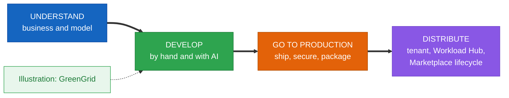
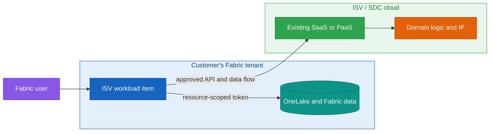
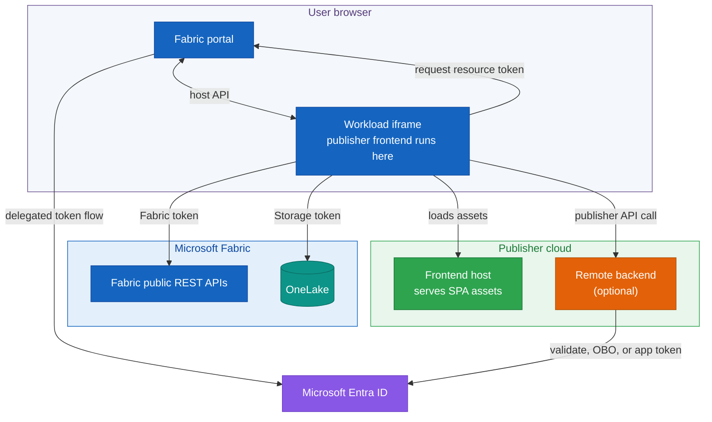
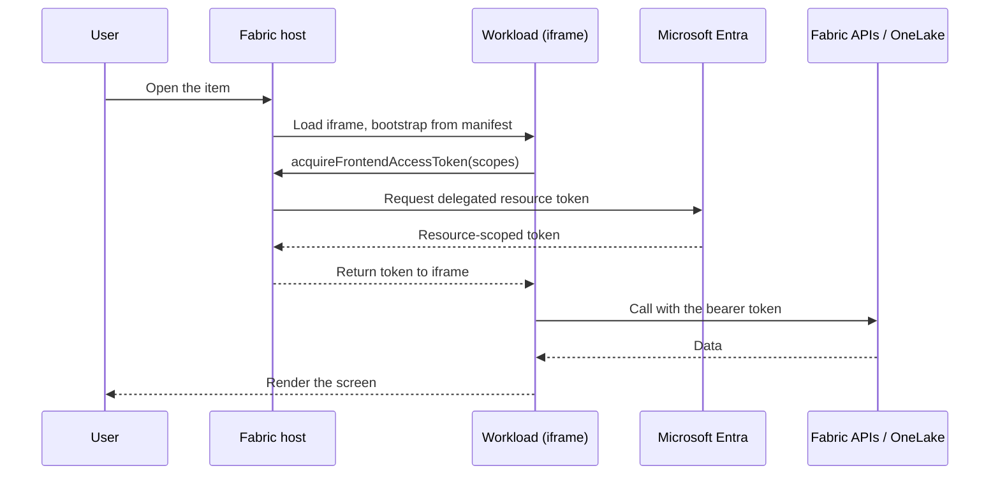
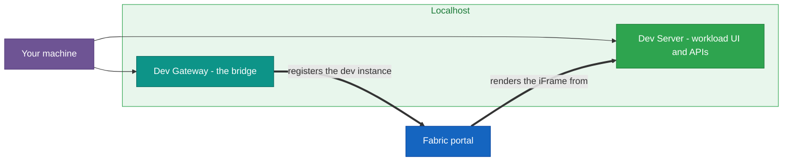
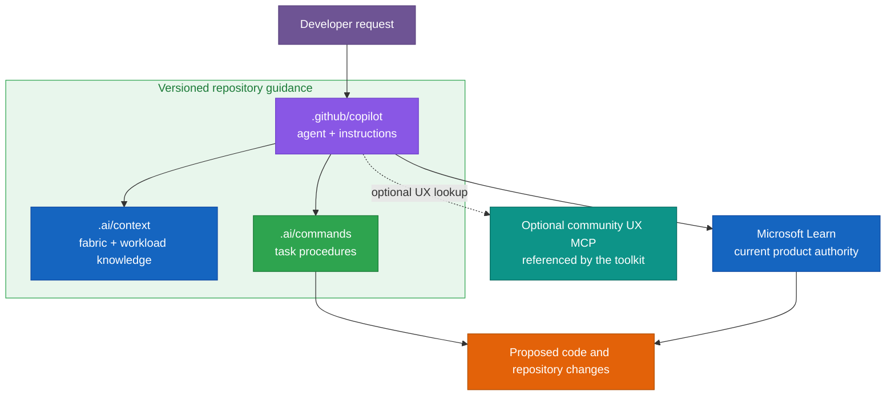
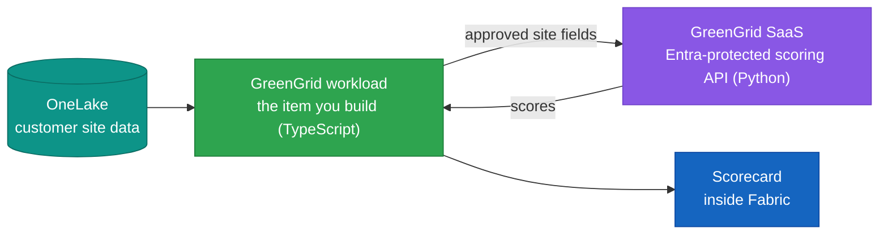

# Building Production-Ready Workloads for Microsoft Fabric

### From the ISV business case and architecture to secure delivery, operations, and distribution

> Reviewed against Microsoft Learn and the official toolkit repositories on September 17, 2026.

## Contents

**[Choose your path](#choose-your-path)**

**[0. Before you begin](#0-before-you-begin)**

- [A five-minute first run](#a-five-minute-first-run)
- [Common pitfalls](#common-pitfalls)

**Understand**

- **[1. What a workload is, and why an ISV would build one](#1-what-a-workload-is-and-why-an-isv-would-build-one)**
  - [1.1 The ISV business case: bring your service to Fabric data](#11-the-isv-business-case-bring-your-service-to-fabric-data)
  - [1.2 What Fabric gives you, and what a workload adds](#12-what-fabric-gives-you-and-what-a-workload-adds)
  - [1.3 The toolkit, when to use it, and its limits](#13-the-toolkit-when-to-use-it-and-its-limits)
- **[2. How a workload runs: architecture, the host, and one request](#2-how-a-workload-runs-architecture-the-host-and-one-request)**
  - [2.1 The Fabric host, your frontend, and an optional backend](#21-the-fabric-host-your-frontend-and-an-optional-backend)
  - [2.2 Items as native artifacts, with explicit integrations](#22-items-as-native-artifacts-with-explicit-integrations)
  - [2.3 A request, step by step](#23-a-request-step-by-step)
- **[3. The manifest package: the contract with Fabric](#3-the-manifest-package-the-contract-with-fabric)**
  - [3.1 Workload, product, and paired item definitions](#31-workload-product-and-paired-item-definitions)
  - [3.2 Identity and naming](#32-identity-and-naming)
- **[4. Identity and access with Microsoft Entra](#4-identity-and-access-with-microsoft-entra)**
  - [4.1 Delegated frontend tokens and backend OBO](#41-delegated-frontend-tokens-and-backend-obo)
  - [4.2 Entra applications, scopes, and service identities](#42-entra-applications-scopes-and-service-identities)

**Develop**

- **[5. The toolkit and the development environment](#5-the-toolkit-and-the-development-environment)**
  - [5.1 The starter kit, setup script, and Entra applications](#51-the-starter-kit-setup-script-and-entra-applications)
  - [5.2 Dev Server, Dev Gateway, and the Hello World checkpoint](#52-dev-server-dev-gateway-and-the-hello-world-checkpoint)
- **[6. Building an item: editor, data, and capabilities](#6-building-an-item-editor-data-and-capabilities)**
  - [6.1 The item, its editor, and how it surfaces](#61-the-item-its-editor-and-how-it-surfaces)
  - [6.2 Separating item definitions from OneLake data](#62-separating-item-definitions-from-onelake-data)
  - [6.3 Remote jobs, lifecycle events, and other capabilities](#63-remote-jobs-lifecycle-events-and-other-capabilities)
- **[7. Developing with AI assistance](#7-developing-with-ai-assistance)**
  - [7.1 Repository guidance: useful, mutable, and versioned](#71-repository-guidance-useful-mutable-and-versioned)
  - [7.2 The Copilot agent and the optional community UX MCP](#72-the-copilot-agent-and-the-optional-community-ux-mcp)
  - [7.3 What it generates, and keeping it honest](#73-what-it-generates-and-keeping-it-honest)
- **[8. Diagnostics and debugging](#8-diagnostics-and-debugging)**
  - [8.1 Reading the chain, and the token and manifest boundaries](#81-reading-the-chain-and-the-token-and-manifest-boundaries)
  - [8.2 The Dev Gateway, the iframe boundary, and correlation](#82-the-dev-gateway-the-iframe-boundary-and-correlation)
- **[9. Illustration: GreenGrid](#9-illustration-greengrid)**
  - [9.1 What GreenGrid is](#91-what-greengrid-is)
  - [9.2 The scoring service, in Python](#92-the-scoring-service-in-python)
  - [9.3 Milestone 1: the workload calls the service](#93-milestone-1-the-workload-calls-the-service)
  - [9.4 Milestones 2 and 3: real data and a native screen](#94-milestones-2-and-3-real-data-and-a-native-screen)

**Go to production**

- **[10. From developer mode to production](#10-from-developer-mode-to-production)**
  - [10.1 What changes](#101-what-changes)
  - [10.2 What to verify across the transition](#102-what-to-verify-across-the-transition)
- **[11. Hosting, domain, and identity](#11-hosting-domain-and-identity)**
  - [11.1 Hosting, the verified domain, and the resource ID](#111-hosting-the-verified-domain-and-the-resource-id)
  - [11.2 User delegation, backend credentials, and managed identities](#112-user-delegation-backend-credentials-and-managed-identities)
- **[12. Security and compliance](#12-security-and-compliance)**
  - [12.1 Data boundaries, labels, and publisher responsibility](#121-data-boundaries-labels-and-publisher-responsibility)
  - [12.2 Secrets, telemetry, monitoring, and support](#122-secrets-telemetry-monitoring-and-support)
- **[13. Packaging, validation, and CI/CD](#13-packaging-validation-and-cicd)**
  - [13.1 Package build, schema checks, and publishing validation](#131-package-build-schema-checks-and-publishing-validation)
  - [13.2 Automating the pipeline](#132-automating-the-pipeline)
- **[14. Patterns and anti-patterns](#14-patterns-and-anti-patterns)**
  - [14.1 Patterns that hold up](#141-patterns-that-hold-up)
  - [14.2 Anti-patterns to avoid](#142-anti-patterns-to-avoid)
**Distribute**

- **[15. Make it available in your tenant](#15-make-it-available-in-your-tenant)**
  - [15.1 Admin Portal upload, activation, and assignment](#151-admin-portal-upload-activation-and-assignment)
  - [15.2 Internal publishing with Org.[Name]](#152-internal-publishing-with-orgname)
- **[16. Publish across tenants: Workload Hub and Microsoft Marketplace](#16-publish-across-tenants-workload-hub-and-microsoft-marketplace)**
  - [16.1 Selected tenants, Preview, and GA](#161-selected-tenants-preview-and-ga)
  - [16.2 Publishing requirements, commerce, and support](#162-publishing-requirements-commerce-and-support)
  - [16.3 Choosing a path](#163-choosing-a-path)
- **[17. The post-publish lifecycle](#17-the-post-publish-lifecycle)**
  - [17.1 Updates, migration, and deprecation](#171-updates-migration-and-deprecation)
  - [17.2 Monitoring, consent, rollback, and feature flags](#172-monitoring-consent-rollback-and-feature-flags)
- **[18. Recap and next steps](#18-recap-and-next-steps)**

**Appendices**

- [Appendix A: Manifest package reference](#appendix-a-manifest-package-reference)
- [Appendix B: Setup, development, package, and validator commands](#appendix-b-setup-development-package-and-validator-commands)
- [Appendix C: AI guidance reference](#appendix-c-ai-guidance-reference)
- [Appendix D: Python service reference](#appendix-d-python-service-reference)
- [Appendix E: Release and compliance checklist, diagnostics quick reference](#appendix-e-release-and-compliance-checklist-diagnostics-quick-reference)
- [Appendix F: Glossary and resources](#appendix-f-glossary-and-resources)
- [Appendix G: One-page cheat sheet](#appendix-g-one-page-cheat-sheet)

---

Microsoft Fabric ships with a broad set of items: lakehouses, notebooks, pipelines, reports, and many more. An independent software vendor (ISV) or software development company (SDC) still has a different problem to solve. Its product may already run as SaaS or PaaS, hold years of domain knowledge, and serve customers well, yet remain disconnected from the data those customers manage in Fabric. A workload creates the bridge. It puts the company's experience inside Fabric while the service and intellectual property remain on infrastructure the company operates.

That position can shorten a customer's path from data to product value. The customer works in a familiar Fabric workspace and can keep source data in OneLake. The ISV avoids rebuilding its service separately for every account, while gaining a route to selected tenants and, after the required review and Marketplace setup, broader distribution through the Fabric ecosystem. The opportunity is real, but it is not automatic: the publisher still owns the service, its security, its support model, and every data transfer outside Fabric.

This manuscript teaches the workload model in four movements. First, why an ISV would build one and how Fabric runs it. Second, how to develop an item with the toolkit, including the local loop, definitions, OneLake data, AI guidance, and diagnostics. Third, how to host, secure, package, and operate it. Fourth, how to assign it inside one tenant or publish it across tenants.

GreenGrid appears as a worked illustration at the end of the Develop movement. It is not a reference architecture. Its job is to make the development loop concrete before the chapter returns to product-neutral production and distribution guidance.

The official starter kit uses TypeScript and React for the publisher-hosted frontend that Fabric loads in an iframe. The backend is optional and can use any HTTPS-capable stack. This manuscript uses Python for scoring, token validation, jobs, and operational examples because it is common in data teams. Each snippet states whether it belongs in the browser or on the server.



## Choose your path

This manuscript supports two reading paths:

| Path | Read | Outcome |
|---|---|---|
| **Fast track** | 0 → 2 → 5 → 6 → 9 | Open a first workload, understand the runtime path, build an item, and connect the GreenGrid example |
| **Production track** | Sections 10 through 17 | Turn the prototype into a hosted, secured, packaged, assigned, and supportable product |

Read section 1 first when the decision is commercial rather than technical: it explains why an ISV or SDC would invest in a workload and which parts of the existing SaaS or PaaS stay unchanged.

Two labels separate durable architecture from details that Microsoft may change:

> **Stable concept.** A design rule or boundary that should remain useful across toolkit releases.

> **Current platform behavior, verified September 2026.** A command, limit, schema, tenant setting, publishing stage, or other time-sensitive implementation detail.

---

# 0. Before you begin

The chapter assumes a working environment and a little background, and naming them up front keeps the later sections from stopping to backfill.

> Note on freshness. The Extensibility Toolkit moves quickly, and parts of it are in preview. Command names, manifest fields, and documentation links shift between releases. Where this chapter gives a specific name or URL, read it as correct at the time of writing, and check it against the current toolkit repository and the Microsoft Learn documentation when something does not match.

You need a Microsoft Entra tenant where you can create the required application registrations, plus a Fabric workspace on an F, P, or Trial capacity. An Azure subscription is optional for the local Hello World path. You need one only if you choose Azure for hosting or supporting services. Fabric administrators and workspace or capacity administrators handle different settings, so do not assume one account can perform every step. On your machine you need:

- Node.js, for the frontend and the toolkit scripts.
- A recent Python, for the services and tooling this chapter writes in.
- PowerShell 7, which the setup and run scripts use.
- The Azure CLI, for the Entra app creation the setup script performs and the `az login` identity the backend uses in development.
- The .NET SDK, because the workload package is built and validated as a NuGet `.nupkg`.
- A code editor, with Visual Studio Code the common choice, since the toolkit ships its AI assets for it.

The chapter also assumes a few concepts rather than teaching them: web hosting and HTTPS, REST and JSON, OAuth and OpenID Connect tokens, iframe messaging through `postMessage`, and OneLake paths, the `Files` and `Tables` of a Lakehouse. Keep the roles separate. Tenant administrators enable settings, capacity or workspace administrators control assignment and development access, publishers manage applications and packages, and users create and open items.

Snippet labels have a precise meaning:

- **Teaching example** explains one boundary or decision and omits surrounding production concerns.
- **Production pattern** shows a reusable security or operational shape, but still needs application-specific design.
- **Current reference, verified September 2026** records a command or platform detail that should be rechecked against current documentation.

If you want to follow the Python examples, a single environment file covers them. None of the packages are exotic. They are the standard Azure, web, and data libraries.

> **Teaching example.** Local Python environment used by the manuscript examples.

```bash
python -m venv .venv
# Windows:  .venv\Scripts\Activate.ps1
# macOS/Linux:  source .venv/bin/activate
pip install fastapi "uvicorn[standard]" pydantic \
            pyjwt[crypto] requests \
            azure-identity azure-storage-file-datalake \
            pandas pytest
```

`fastapi` and `uvicorn` run the small services, `pydantic` validates their inputs, `pyjwt[crypto]` validates Fabric tokens, `azure-identity` and `azure-storage-file-datalake` reach Azure and OneLake, `pandas` parses tabular data, and `pytest` tests the algorithm. Each is introduced where it is first used.

A practical note on the snippets: the TypeScript examples run in the browser through the toolkit SDK. The Python examples run in publisher-hosted services called over HTTPS. Each snippet states which side of the boundary it belongs to.

### A five-minute first run

If you would rather see something on screen before reading the model, this is the shortest path from an empty folder to a working item open inside Fabric. It is the same Hello World the rest of the chapter builds on, and section 5 explains every step it runs through here.

> **Current reference, verified September 2026.** Starter-kit setup and local run sequence.

```powershell
# 1. clone the starter kit
git clone https://github.com/microsoft/fabric-extensibility-toolkit
cd fabric-extensibility-toolkit

# 2. one-time setup: registers the Entra app and writes your config
cd scripts/Setup
pwsh ./SetupWorkload.ps1 -WorkloadName "Org.YourWorkload"

# 3. two terminals: serve the workload, then bridge Fabric to it
cd ../Run
pwsh ./StartDevServer.ps1     # terminal 1
pwsh ./StartDevGateway.ps1    # terminal 2
```

After the required tenant settings are enabled, turn on personal Fabric Developer Mode and use a workspace on an F, P, or Trial capacity. Open the starter kit's Hello World item. If it does not load, check the settings, browser Local Network Access, environment files, and both local processes before changing code.

### Common pitfalls

Most early trouble is environment, not code. Knowing the usual traps up front turns a lost afternoon into a five-second check.

- The workspace is on the wrong capacity. Development needs a supported F, P, or Trial capacity. Power BI Pro alone is not enough.
- A required tenant setting is off. Development and assignment use separate settings, and the exact current names appear in section 5.
- The environment files disagree with the portal. A stale app id, a different workspace, or a workload name that does not match is the usual reason the portal does not show your workload.
- The token audience is wrong. A 401 from your backend almost always means the token's `aud` is not your Application ID URI.
- Browser local-network access or framing is blocked. Current Chromium-based browsers can block the portal from reaching localhost even when the gateway is running.
- The package version was already uploaded. Fabric refuses a duplicate, so every upload needs a fresh version.

Each of these has a home later in the chapter. Naming them here means you recognize them on sight.

---

# Understand

> **Key takeaways**
>
> - A workload gives an ISV or SDC a product surface inside Fabric while its SaaS, PaaS, and intellectual property stay in the publisher's cloud.
> - It can connect that service to Fabric and OneLake data, but every transfer to publisher-hosted code remains the publisher's responsibility.
> - Native integrations such as catalog, monitoring, Git, and deployment must be configured and validated. They are not inherited automatically.
> - The package contains a workload manifest, a product manifest, and paired XML and JSON definitions for each item type.
> - Reach for a workload when a user would create and open it as their own object, and a lighter extensibility point otherwise.

## 1. What a workload is, and why an ISV would build one

Most ISVs and SDCs do not start from an empty repository. They already have a service, an API, domain logic, support processes, and customers. The question is whether that product should remain a separate destination or become part of the place where Fabric users already work with data. A workload provides the second option.

> **Running example: GreenGrid.** GreenGrid already operates an energy-scoring SaaS. It wants Fabric customers to score approved data from OneLake without moving the scoring logic and intellectual property into the customer's tenant. The example returns throughout the architecture and development sections before becoming the worked implementation in section 9.

### 1.1 The ISV business case: bring your service to Fabric data

A workload changes where the customer meets the product. The user opens an item in a Fabric workspace instead of switching to another portal, exporting data, and rebuilding context in a separate application. The ISV can reuse the service it already operates rather than deploying a dedicated copy for each customer. The workload becomes the product surface inside Fabric. The SaaS or PaaS remains the execution surface behind it.

This creates a practical bridge between two estates:

- Fabric holds the customer's workspaces, items, identity context, and OneLake data.
- The publisher keeps its algorithms, operational services, and product roadmap in its own cloud.
- The workload joins them through declared APIs, scoped tokens, and an item the customer can assign to the right capacities or workspaces.



The model opens a repeatable route to more than one customer. An internal `Org.[Name]` package can serve one organization. A publisher-named workload can be tested with selected tenants, up to the current limit of twenty, before the publisher requests public Preview and GA. Public distribution also requires the current Fabric publishing checks and a Microsoft Marketplace SaaS offer in Partner Center. The Workload Hub handles discovery, consent, and assignment inside Fabric. Microsoft Marketplace handles the commercial listing and licensing options.

This route does not remove the normal work of selling and operating software. Customers still assess security, residency, support, pricing, and the data the publisher receives. The business advantage is narrower and more useful: the ISV can bring one maintained service to Fabric customers through a consistent product surface, without surrendering its intellectual property or rebuilding the product inside every tenant.

### 1.2 What Fabric gives you, and what a workload adds

Fabric is organized around workspaces and items, with OneLake as the shared data plane. A workload adds publisher-defined item types and a publisher-hosted web experience to that model. Users can create the item in a workspace, while the publisher connects it to the Fabric capabilities the product needs.

That native behavior is not a blanket inheritance. Each catalog, monitoring, Git, deployment, job, lifecycle, or protection claim needs its own configuration and validation. Sections 2 and 6 separate item definitions from business data. Section 12 covers the publisher's data and protection responsibilities.

### 1.3 The toolkit, when to use it, and its limits

The Extensibility Toolkit is the supported starting point for new workloads. It provides a starter project, the workload client SDK, setup and build scripts, and the local Dev Server and Dev Gateway loop. It is the current evolution of the older Workload Development Kit.

It fits when you need a custom item and a Fabric-hosted user experience: a domain-specific authoring tool, a governance console, an industry workflow, or an operational application that works with Fabric data. The baseline architecture is frontend-first. The current remote-hosting switch uses `HostingType="Remote"` with schema `2.100.0` for jobs and lifecycle endpoints, but first-party documentation still differs on which backend configurations are accepted for publishing. Validate that support before making a backend capability part of the product contract.

The toolkit does not run arbitrary server code inside a general-purpose Fabric runtime, bypass capacity quotas, or remove the publisher's responsibility for hosting and support. Development requires a supported F, P, or Trial capacity. Power BI Pro alone is not enough.

Other extensibility points cover narrower needs. A visualization inside a report is a Power BI custom visual. A rule that watches a stream and reacts to a condition belongs in Activator. A scheduled transformation may belong in a pipeline, notebook, or Azure service. Use a workload when the customer should create and open a distinct item with its own editor and lifecycle.

## 2. How a workload runs: architecture, the host, and one request

### 2.1 The Fabric host, your frontend, and an optional backend

Four boundaries matter when a workload is open. The user's browser runs the Fabric portal. The portal creates an iframe and loads the publisher's frontend from the endpoint declared in the workload manifest. The JavaScript executes inside that iframe and communicates with Fabric through the workload client SDK. Fabric APIs and OneLake remain separate resource endpoints. A publisher backend is optional and runs outside Fabric on infrastructure the publisher operates.



The manifest tells Fabric where to load the frontend and which item capabilities exist. The SDK provides the supported bridge for theme, navigation, dialogs, notifications, item operations, and token acquisition. Code inside the iframe should use that contract rather than reaching into the portal DOM or assuming internal Fabric routes.

### 2.2 Items as native artifacts, with explicit integrations

An item type gives the workload a durable object in a workspace. Its instances can use Fabric item APIs and workspace permissions, but other integrations depend on explicit declarations and implementation. Catalog visibility, monitoring, jobs, Git, deployment, and lifecycle handling each have their own requirements. Treat the support matrix as part of the product design, not as a blanket promise that every custom item behaves exactly like every built-in item.

> **Stable concept: keep control plane and data plane separate.**

The item definition belongs to the control plane. Current guidance allows up to five human-readable text parts that describe configuration and metadata. Fabric does not schema-validate the contents of those parts for you. They can support Git integration and deployment because they are compact and reviewable. Files, tables, model outputs, and other large data belong in OneLake or another declared data store.

| Concern | Control plane | Data plane |
|---|---|---|
| Purpose | Describe and configure the item | Hold business data and large results |
| Typical content | Small text definition parts, identifiers, settings, schema version | OneLake files and tables, or an explicitly governed publisher store |
| Delivery | Fabric item APIs, Git, and deployment where supported | Data-engineering and application data paths |
| Design rule | Human-readable, reviewable, no secrets | Access, residency, retention, and scale designed explicitly |

That separation also clarifies ownership. Fabric stores and moves the definition through its item APIs. The workload code interprets it. The publisher remains responsible for any external state held by its own service. If a value must follow the item through source control or deployment, it is a candidate for the definition. If it is customer data, a large result set, or shared operational state, it needs an appropriate data-plane design.

### 2.3 A request, step by step

The pieces are easier to hold once you follow a single direct call. A user opens an item. Fabric loads the publisher frontend in the iframe. The frontend asks the SDK for a delegated token for a specific resource and set of scopes. Fabric and Entra return that resource-scoped token, and the frontend calls the matching Fabric or OneLake endpoint. If the frontend sends data or a token to the publisher backend, that is a separate boundary with its own disclosure, retention, and security obligations.



Every later concern (a manifest that must declare the route, a scope the token must carry, a boundary the iframe enforces) is a step in this sequence. The diagnostics section returns to it boundary by boundary, and the order is easy to keep: open, bootstrap, token, call, render. When something does not work, the fastest first question is "which step did it reach?" A blank editor failed at bootstrap. A refused API call failed at the token or the call. A screen that loads but shows nothing reached render with no data. Locating the failure on this line is most of the work of fixing it.

## 3. The manifest package: the contract with Fabric

### 3.1 Workload, product, and paired item definitions

A workload package contains several declarations with different jobs. `WorkloadManifest.xml` defines the workload identity, hosting mode, Entra applications, and service endpoints. `Product.json` holds product-level presentation and support metadata. Each item type then has two files: an XML platform definition and a JSON frontend definition.

> **Current reference, verified September 2026.** Manifest-package file layout.

```text
Workload/Manifest/
├── WorkloadManifest.xml
├── Product.json
└── items/
    └── Forecast/
        ├── Forecast.xml
        └── Forecast.json
```

The XML and JSON item files are a pair, not interchangeable versions of the same file. The XML side describes the item to Fabric's platform services. The JSON side describes frontend behavior and presentation. The current schema and starter kit remain the authority for exact fields because remote hosting, lifecycle, and publishing support continued to change during 2026.

A simplified frontend-hosting manifest looks like this:

> **Teaching example.** The current schema contains more fields. Start from the official starter-kit manifest rather than copying this excerpt as a complete package.

```xml
<WorkloadManifestConfiguration SchemaVersion="2.0.0">
  <Workload WorkloadName="Org.YourWorkload" HostingType="FERemote">
    <Version>1.0.0</Version>
    <RemoteServiceConfiguration>
      <CloudServiceConfiguration>
        <AADFEApp><AppId>00000000-0000-0000-0000-000000000000</AppId></AADFEApp>
        <Endpoints>
          <ServiceEndpoint>
            <Name>Frontend</Name>
            <Url>https://your-frontend.example.com</Url>
          </ServiceEndpoint>
        </Endpoints>
      </CloudServiceConfiguration>
    </RemoteServiceConfiguration>
  </Workload>
</WorkloadManifestConfiguration>
```

The package has hard limits that should shape the product before packaging day:

> **Current platform behavior, verified September 2026.** The following values come from the current manifest-package documentation and can change independently of the architectural model.

| Limit | Current maximum |
|---|---:|
| Item types in one package | 10 |
| Total package size | 20 MB |
| Packaged assets | 15 |
| Size per asset | 1.5 MB |
| `Product.json` | 50 KB |

Package assets are currently limited to JPEG, JPG, and PNG by the manifest-package guidance. Item filenames also have length and character restrictions. Check the current manifest documentation before adding item types or assets near these limits.

The package declares what Fabric needs to load and present the workload. It does not contain the running frontend or backend, which remain at the declared publisher endpoints. Every upload needs a package version Fabric has not seen before.

### 3.2 Identity and naming

The workload name is the identifier Fabric uses to register the workload, and its form is a decision about distribution that you make early, because it is baked into the package.

| Aspect | `Org.[Name]` (internal) | `[Publisher].[Workload]` (cross-tenant) |
|---|---|---|
| Audience | Your own tenant | Other tenants |
| Registration | No separate workload-name registration | Name and publishing tenant reserved permanently on first confirmation |
| Availability | Upload, activate, then assign to tenant, capacity, or workspace | Selected tenants, then public Preview, then GA |
| Publishing requirements | General hosting, manifest, identity, and tenant requirements | General, workload, item, attestation, support, and public-review requirements |
| Commercial setup | Not required for an internal workload | Microsoft Marketplace SaaS offer required for public Preview and GA |
| Publisher identity | Verified domain | Verified domain plus Microsoft verified publisher requirements |
| Name length | No special limit | Workload portion at most 32 characters |

A publisher name is reserved permanently when it is confirmed during the first upload. The publishing tenant is fixed as well. Treat that confirmation as a product decision, not a temporary test value. Moving later from an `Org.*` identity to a publisher identity affects the package, application registrations, endpoints, documentation, and installed tenants, so plan the public naming path before customers depend on the internal one.

## 4. Identity and access with Microsoft Entra

### 4.1 Delegated frontend tokens and backend OBO

The workload client exposes one acquisition method, but it does not produce one universal bearer token. The frontend calls `acquireFrontendAccessToken` with the scopes for a specific resource. Fabric APIs, OneLake Storage, Microsoft Graph, and a publisher API have different audiences, so each needs a token requested for its own scopes.

> **Teaching example.** This demonstrates resource-specific acquisition and omits consent handling, token caching, retries, and application authorization.

```ts
import { WorkloadClientAPI } from "@ms-fabric/workload-client";

export async function callResource(
  client: WorkloadClientAPI,
  url: string,
  scopes: string[],
): Promise<unknown> {
  const token = await client.auth.acquireFrontendAccessToken({ scopes });
  const res = await fetch(url, {
    headers: { Authorization: `Bearer ${token.accessToken}` },
  });
  if (!res.ok) throw new Error(`Resource call ${res.status}`);
  return res.json();
}
```

That token is a delegated frontend token. It represents the signed-in user for the requested resource and scopes. The frontend does not receive the user's password, but it does receive an access token and can send it to the target service. If the target is a publisher backend, the publisher now handles that token and must protect it accordingly.

On-behalf-of (OBO) has a narrower meaning. It is the backend exchange in which a remote service accepts a user's subject token and obtains a new token for another resource. Do not call the frontend token itself an OBO token, and do not forward a Fabric token to OneLake or another API with a different audience.

### 4.2 Entra applications, scopes, and service identities

Every workload uses Entra application registrations. `Fabric.Extend` remains mandatory. The exact setup then depends on the hosting mode. The current frontend-hosting setup configures the `/close` redirect and workload sign-in redirects for both Fabric and Power BI portal domains. A remote backend adds its own application, exposed scopes, preauthorization, and OBO or service-to-service configuration. Follow the setup script and current authentication guidance rather than copying one redirect list between modes.

Define narrow scopes for a publisher API, such as separate read and write operations, and validate them on the server. The following dependency illustrates a single-tenant internal API. A cross-tenant service also needs an issuer and tenant-validation strategy. Do not reuse a fixed-tenant validator for public distribution.

> **Teaching example.** This demonstrates the trust boundary. A production implementation also needs tenant policy, authorization beyond scopes, key-cache behavior, failure handling, telemetry, and security review.

```python
# auth.py - validate a Fabric/Entra bearer token in a Python backend.
import os
import jwt                      # PyJWT
from jwt import PyJWKClient
from fastapi import Header, HTTPException

TENANT_ID = os.environ["TENANT_ID"]
# The audience is your workload's Application ID URI (must match the token's 'aud').
AUDIENCE = os.environ["API_AUDIENCE"]          # e.g. api://your-frontend.example.com
ISSUER = f"https://login.microsoftonline.com/{TENANT_ID}/v2.0"
JWKS_URL = f"https://login.microsoftonline.com/{TENANT_ID}/discovery/v2.0/keys"

_jwks = PyJWKClient(JWKS_URL)                   # caches signing keys

def require_scope(required: str):
    def dependency(authorization: str = Header(...)) -> dict:
        if not authorization.startswith("Bearer "):
            raise HTTPException(401, "Missing bearer token")
        token = authorization.split(" ", 1)[1]
        try:
            signing_key = _jwks.get_signing_key_from_jwt(token).key
            claims = jwt.decode(
                token, signing_key, algorithms=["RS256"],
                audience=AUDIENCE, issuer=ISSUER,
            )
        except jwt.PyJWTError as exc:
            raise HTTPException(401, "Invalid bearer token") from exc
        scopes = claims.get("scp", "").split()
        if required not in scopes:
            raise HTTPException(403, "Required scope is missing")
        return claims
    return dependency
```

Used on a route, it makes the access rule explicit at the edge of the service:

> **Teaching example.** Route-level scope enforcement for the validator above.

```python
from fastapi import FastAPI, Depends
from auth import require_scope

app = FastAPI()

@app.get("/forecasts")
def list_forecasts(claims: dict = Depends(require_scope("data.read"))):
    user = claims.get("oid")     # the signed-in user's object id
    return {"user": user, "forecasts": []}
```

Three identities may therefore appear in one product: the signed-in user represented by a delegated token, the backend application used for remote workload and OBO flows, and a managed identity used by the publisher's Azure-hosted service for supported service-to-service calls. They are not interchangeable. Section 11 separates them in the production design, and section 12 covers what happens when data or tokens cross into publisher-operated systems.

| Boundary | Identity | Token type | Audience | Operational owner |
|---|---|---|---|---|
| Frontend → Fabric API | Signed-in user | Delegated | Fabric API | Microsoft validates. Publisher requests and uses |
| Frontend → OneLake | Signed-in user | Delegated | Storage / OneLake | Microsoft validates. Publisher requests and uses |
| Frontend → ISV API | Signed-in user | Delegated | Publisher API | Publisher |
| Backend → Fabric or OneLake | User through OBO | Delegated | Target resource | Publisher |
| Backend → publisher or Azure service | Backend app or managed identity | Application | Target service | Publisher |

---

# Develop

> **Key takeaways**
>
> - The Dev Server serves the workload from localhost and the Dev Gateway lets the Fabric portal render it.
> - An item combines a control-plane definition, a frontend experience, and explicit integrations with Fabric and data services.
> - The repository's AI guidance can scaffold repeatable work, but it is versioned project guidance rather than a product CLI or a source of truth.
> - Diagnose by reading one boundary at a time: token, manifest, gateway, iframe.

## 5. The toolkit and the development environment

### 5.1 The starter kit, setup script, and Entra applications

Development starts by cloning the toolkit's starter kit, which includes the web application, manifest package, and setup scripts. Microsoft Learn still documents `Setup.ps1`, but the current repository treats it as a compatibility wrapper. New work should call `SetupWorkload.ps1` directly.

> **Current platform behavior, verified September 2026.** `SetupWorkload.ps1` is the current implementation entry point. `Setup.ps1` remains a compatibility wrapper.

> **Current reference, verified September 2026.** Workload setup command.

```powershell
git clone https://github.com/microsoft/fabric-extensibility-toolkit
cd fabric-extensibility-toolkit/scripts/Setup
pwsh ./SetupWorkload.ps1 -WorkloadName "Org.YourWorkload"
```

An Entra app is created even though development is local because the Dev Gateway handles routing, not identity. The workload still requests real delegated tokens for the signed-in developer. Only the frontend hosting location is local.

The script writes environment files for the workspace, workload, and Entra applications, then prepares the local gateway. When the portal does not show the workload, compare those files with the active workspace and app registrations before changing application code.

### 5.2 Dev Server, Dev Gateway, and the Hello World checkpoint

Two long-running processes drive local development. Dev Server hosts the SPA, assets, and development manifest endpoints. Dev Gateway registers the local instance and points Fabric to Dev Server. It does not host the application or provide identity.

> **Current reference, verified September 2026.** Terminal 1 starts Dev Server.

```powershell
# Terminal 1 - the frontend and its dev APIs
cd scripts/Run
pwsh ./StartDevServer.ps1
```

> **Current reference, verified September 2026.** Terminal 2 starts Dev Gateway.

```powershell
# Terminal 2 - the bridge from the Fabric portal to your localhost
cd scripts/Run
pwsh ./StartDevGateway.ps1
```



Current setup guidance names three tenant settings:

> **Current platform behavior, verified September 2026.** Tenant-setting names and browser local-network behavior are operational details. Recheck them when onboarding a new development tenant.

1. **Capacity admins and contributors can add and remove additional workloads**
2. **Workspace admins can develop partner workloads**
3. **Users can see and work with additional workloads not validated by Microsoft**

Each developer also enables personal **Fabric Developer Mode**. The workspace must use a supported F, P, or Trial capacity. In current Chromium-based browsers, Local Network Access can block the portal-to-localhost call, so check that permission when both processes are healthy but the item stays blank.

Prove the environment with the Hello World item before adding your own type. If Hello World opens, the gateway and portal path works. If it does not, inspect the tenant settings, personal developer mode, browser local-network permission, capacity, environment files, and both terminal processes.

## 6. Building an item: editor, data, and capabilities

### 6.1 The item, its editor, and how it surfaces

A new item type starts from a generator that creates the item's folder and frontend components. The starter kit normally gives you a definition model, an editor, empty and default views, and ribbon actions. The definition holds compact control-plane configuration, not the item's large business data:

> **Teaching example.** Small definition model only. Serialization and validation remain application-specific.

```ts
// ForecastItemDefinition.ts - compact, human-readable control-plane configuration.
export interface ForecastItemDefinition {
  horizonDays: number;
  sourceItemId?: string;
  schemaVersion: number;
}

export const DEFAULT_FORECAST: ForecastItemDefinition = {
  horizonDays: 14,
  schemaVersion: 1,
};
```

Fabric provides the item creation surface, and your package declares how the type appears there. The editor route then maps the Fabric item identifier to your component:

> **Teaching example.** Route shape only. Use the router and controller structure from the installed starter kit.

```tsx
// App.tsx - register the editor route so the host's navigation matches a component.
<Route path="/forecast-editor/:itemObjectId">
  <ForecastItemEditor workloadClient={workloadClient} />
</Route>
```

The current starter kit updates definition parts through the item CRUD API. Keep the serialized parts small, textual, and suitable for review in Git:

> **Teaching example.** The SDK version defines the exact method signature and definition-part schema.

```ts
import { WorkloadClientAPI } from "@ms-fabric/workload-client";
import { ForecastItemDefinition } from "./ForecastItemDefinition";

export async function saveForecast(
  client: WorkloadClientAPI, itemId: string, def: ForecastItemDefinition,
) {
  const parts = serializeDefinition(def);
  await client.itemCrud.updateItemDefinition(itemId, parts);
}
```

The exact argument shape belongs to the SDK version in the starter kit. The example shows the boundary rather than replacing that typed contract. For the type to appear in the portal, the item XML, item JSON, product metadata, locale entries, routes, and packaged assets must agree. A sensitivity label is not automatically applied simply because the item uses the standard creation surface.

Keep one development item open while Dev Server watches the frontend. That gives you a short edit-and-refresh loop without creating a new item for every UI change.

### 6.2 Separating item definitions from OneLake data

A workload often needs data from OneLake. Keep the data source behind a function so the screen does not care whether development uses seed data or a real file. Request a Storage-scoped delegated token for OneLake. Do not reuse a Fabric API token with a different audience.

In the browser, the frontend reads a OneLake file with the user's token:

> **Teaching example.** Direct OneLake read after acquiring a Storage-scoped delegated token.

```ts
// Read a CSV from OneLake in the frontend, as the signed-in user.
export async function readSitesCsv(
  client: WorkloadClientAPI, workspaceId: string, lakehouseId: string,
): Promise<string> {
  const token = await client.auth.acquireFrontendAccessToken({
    scopes: ONELAKE_STORAGE_SCOPES,
  });
  const url =
    `https://onelake.dfs.fabric.microsoft.com/${workspaceId}/` +
    `${lakehouseId}/Files/sites.csv`;
  const res = await fetch(url, {
    headers: { Authorization: `Bearer ${token.accessToken}` },
  });
  if (!res.ok) throw new Error(`OneLake ${res.status}`);
  return res.text();
}
```

When the work belongs on a server, the backend must obtain a OneLake token with the correct audience. In a user-delegated flow that normally means an OBO exchange, not forwarding the incoming publisher-API token directly to Storage. The resulting OneLake token can then be used by a Python reader:

> **Teaching example.** The caller supplies an already acquired OneLake token. OBO, retries, streaming, and large-file handling are outside this function.

```python
# onelake.py - read a OneLake CSV in a Python backend, as the calling user.
import io
import pandas as pd
import requests

ONELAKE = "https://onelake.dfs.fabric.microsoft.com"

def read_sites(onelake_token: str, workspace_id: str, lakehouse_id: str) -> pd.DataFrame:
    url = f"{ONELAKE}/{workspace_id}/{lakehouse_id}/Files/sites.csv"
    resp = requests.get(url, headers={"Authorization": f"Bearer {onelake_token}"}, timeout=30)
    resp.raise_for_status()
    return pd.read_csv(io.StringIO(resp.text))
```

The item definition can hold small settings such as a horizon, a source item identifier, and a schema version. It should not contain copied table data, large results, secrets, or opaque binary state. Those belong in OneLake or a publisher store with an explicit data-governance model.

### 6.3 Remote jobs, lifecycle events, and other capabilities

A settings dialog, About page, localization, catalog metadata, and monitoring integration each require their own manifest or frontend work. Add only the capabilities you implement and test.

A remote job is declared through the item manifest. Fabric schedules and monitors the job, while the publisher endpoint performs the work and reports status. The item can integrate with Monitoring Hub, Recent Runs, cancellation, retry, and detail views. The current repository provides `SwitchToRemoteHosting.ps1` to change the base frontend-hosting project to the remote schema. Current remote-hosting documentation and publishing requirements are not fully consistent, so verify acceptance for the target publication stage before making a remote endpoint part of the product contract.

The Python below shows execution logic only. It is not the Fabric remote-job protocol, and its in-memory status store is unsuitable for production:

> **Teaching example.** Local execution shape only, not a production job service.

```python
# jobs.py - a server-side job the workload starts and polls.
from fastapi import FastAPI, BackgroundTasks
from uuid import uuid4

app = FastAPI()
_status: dict[str, dict] = {}

def run_forecast(job_id: str, horizon_days: int) -> None:
    _status[job_id] = {"state": "running", "progress": 0}
    for step in range(horizon_days):
        ...  # compute one day of the forecast
        _status[job_id] = {"state": "running",
                           "progress": round((step + 1) / horizon_days * 100)}
    _status[job_id] = {"state": "succeeded", "progress": 100}

@app.post("/jobs/forecast")
def start(horizon_days: int, tasks: BackgroundTasks) -> dict:
    job_id = str(uuid4())
    _status[job_id] = {"state": "queued", "progress": 0}
    tasks.add_task(run_forecast, job_id, horizon_days)
    return {"jobId": job_id}

@app.get("/jobs/{job_id}")
def status(job_id: str) -> dict:
    return _status.get(job_id, {"state": "unknown"})
```

Remote lifecycle notifications extend beyond create, update, and delete. Current guidance covers soft delete, hard delete, and restore. If `OnDelete` is enabled, the publisher must also implement restoration handling, and delete notifications may arrive without a subject token. Create, update, or restore can be rejected in documented cases. Deletion cannot be blocked. Treat these operations as a durable service contract, not a frontend callback.

## 7. Developing with AI assistance

The toolkit repository includes AI-oriented context, procedures, Copilot instructions, and a custom `@fabric` agent. These files can speed up scaffolding and explain repository conventions. They are also versioned documentation, and some currently lag behind Microsoft Learn or describe commands the repository does not ship. Use them as project guidance, then verify the result against the code, current Learn pages, and the build scripts that actually exist.

> **Stable concept: AI output is a proposal, not platform truth.**

Validate agent-authored work through four gates:

| Gate | Check |
|---|---|
| **SDK** | The method and type exist in the installed package version |
| **Manifests** | Workload, product, item XML, item JSON, locale, routes, and assets agree |
| **Build** | The real repository scripts build the frontend and package with local schema checks |
| **Runtime** | The item opens in Fabric, requests the intended token audience, and handles errors correctly |

> The repository's `.ai` publishing guidance still contains older tenant limits and registration steps. Treat Microsoft Learn as the authority when the two disagree.



### 7.1 Repository guidance: useful, mutable, and versioned

The `.ai/` folder is plain Markdown. Its `context/` files explain Fabric and the project, while `commands/` describe repeatable item and workload tasks. An assistant can read those files in any environment that exposes the repository, but support for custom agents, automatic instructions, and tool calls still depends on the host.

> **Current reference, verified September 2026.** AI-oriented folders present in the audited toolkit repository.

```text
.ai/
├── context/
│   ├── fabric.md            # the platform: OneLake, items, capacities, APIs
│   └── fabric-workload.md   # this project: structure and conventions
└── commands/
    ├── item/                # createItem, deleteItem, renameItem
    └── workload/            # runWorkload, updateWorkload, deployWorkload,
                             # publishWorkload, cleanWorkload
```

The procedures are useful because they name the files and checks a task should touch. They are not executable product commands. If an instruction says to run a `fabric ...` command that is not present in the repository or current CLI documentation, stop and use the actual PowerShell scripts or documented API instead.

### 7.2 The Copilot agent and the optional community UX MCP

The GitHub layer adds `copilot-instructions.md`, scoped instruction files, and the *Microsoft Fabric Development Assistant* exposed as `@fabric`. The agent is useful for navigating the starter kit and applying its conventions. It does not turn every sentence in `.ai/` into a supported platform command.

Ask for a bounded repository change and make the expected verification explicit:

> **Teaching example.** Prompt structure for a repository task, not a guarantee about generated output.

```text
@fabric create a Forecast item type with a horizon setting.
Use the current item generator and manifest pair, update localization and routes,
then run Dev Server and Dev Gateway and verify the item opens in Fabric.
```

The request leaves product decisions with the developer. The agent can scaffold and wire the item, but it should not invent the data contract, permission model, or user experience.

The toolkit repository also references a Fabric UX MCP implementation that can index UX material and expose an `askFabricDocs` tool. That implementation lives in a community GitHub repository, not the Microsoft organization, and it is not a Microsoft-hosted Fabric service. Review its code, data source, local dependencies, and update cadence before adding it to a development environment.

> **Teaching example.** Placeholder MCP configuration. Replace it only after reviewing the referenced community implementation.

```json
{
  "mcpServers": {
    "fabric-ux-community": {
      "command": "<local command from the reviewed community repository>",
      "args": []
    }
  }
}
```

The MCP server can help retrieve UX guidance. It does not certify generated UI or replace accessibility, manifest, and runtime testing.

### 7.3 What it generates, and keeping it honest

The agent can scaffold the paired item definitions, editor, views, ribbon, routes, locale entries, and product metadata. It can also draft resource-scoped token calls and follow existing Fluent UI patterns. Review every generated API name against the installed SDK version and every publishing claim against current Microsoft Learn.

Generation does not change the definition of done. The item must open through Dev Gateway, the manifest package must pass local schema checks, the frontend must request the right token audience, and any published workload must pass the separate publishing validation and review. Use the agent for mechanical work. Keep product scope, data boundaries, permissions, and release approval with people who own them.

## 8. Diagnostics and debugging

A workload is a chain of boundaries, and most of the work of getting one running is confirming each is sound, by understanding what each carries, not by memorizing symptoms.

### 8.1 Reading the chain, and the token and manifest boundaries

The reference path is the one Hello World proved: Dev Server, Dev Gateway, the Fabric host, and the iframe. If Hello World still opens, focus on the new item and its package declarations. If it does not, check the tenant settings, personal developer mode, browser Local Network Access, capacity, environment files, and both local processes.

The token boundary starts with the target resource. Confirm the requested scopes, token audience, tenant and issuer policy, expiry, and the identity represented by the token. Then check the hosting-mode-specific redirects and application registrations, including `Fabric.Extend`. Log the precise validation failure on the server, but return a generic authentication error to the caller:

> **Teaching example.** Boundary-aware diagnostics. Production logging must avoid token contents and personal data.

```python
# Log validation detail server-side; return a generic error to the caller.
import logging

logger = logging.getLogger("workload.auth")

try:
    claims = jwt.decode(token, signing_key, algorithms=["RS256"],
                        audience=AUDIENCE, issuer=ISSUER)
except jwt.ExpiredSignatureError:
    logger.info("token expired")
    raise HTTPException(401, "Invalid bearer token")
except jwt.InvalidAudienceError:
    logger.warning("token audience mismatch")
    raise HTTPException(401, "Invalid bearer token")
except jwt.InvalidIssuerError:
    logger.warning("token issuer rejected")
    raise HTTPException(401, "Invalid bearer token")
```

The manifest boundary turns on declarations agreeing across `WorkloadManifest.xml`, `Product.json`, the paired item files, locale entries, routes, and assets. `BuildManifestPackage.ps1 -ValidateFiles $true` performs local XML and XSD checks while building the package. The separate publishing validator runs against a workload already published to a tenant and does not guarantee Microsoft approval. Treat these as two different gates.

Fix the boundary at the lowest layer that still explains the symptom. A blank editor is almost always the manifest or the route, not the token. A refused API call is almost always the token or a scope, not the manifest. A screen that renders but stays empty reached the data layer and found nothing. Naming the layer first stops you from changing three things at once and learning nothing from whichever change happened to help.

### 8.2 The Dev Gateway, the iframe boundary, and correlation

Dev Gateway registers the local workload and points Fabric at Dev Server. It does not provide identity. While it is connected, the local workload can take precedence over an uploaded version for the configured workspaces. A blocked browser local-network permission can look like a stopped gateway, so test both before changing application code.

The iframe boundary is a security feature. Use the host SDK and provide clear loading, empty, and error states when a call fails:

> **Production pattern.** Distinct loading, empty, and error states for an item view.

```tsx
// A view that treats "no data yet" and "call refused" as normal states.
if (error)   return <MessageBar intent="error">Could not load: {error}</MessageBar>;
if (!data)   return <Spinner label="Loading…" />;
if (data.length === 0) return <EmptyState title="Nothing here yet" />;
return <DataGrid rows={data} />;
```

Fabric stamps requests with an `ActivityId` and a `RequestId`. Carry both into publisher logs. Use the activity identifier to trace the request through your service, and include the request identifier when a Fabric platform issue needs escalation.

> **Production pattern.** Correlation middleware without request payload or token logging.

```python
# Capture Fabric's correlation headers and put them in every log line.
import logging
from fastapi import Request

logger = logging.getLogger("workload")

@app.middleware("http")
async def correlate(request: Request, call_next):
    activity_id = request.headers.get("ActivityId", "-")
    request_id = request.headers.get("RequestId", "-")
    logger.info("request start", extra={"activity_id": activity_id, "request_id": request_id})
    response = await call_next(request)
    logger.info("request end status=%s", response.status_code,
                extra={"activity_id": activity_id, "request_id": request_id})
    return response
```

## 9. Illustration: GreenGrid

This is a teaching sample. It isolates the development concepts and deliberately skips production concerns such as a verified domain, a managed identity, and a release pipeline. Read it as a way to see the previous sections in motion, not as a blueprint to copy into production.

### 9.1 What GreenGrid is

GreenGrid Analytics is a fictional ISV and software development company. Its product scores the sustainability of customer sites from energy use and renewable mix. The source data lives in the customer's OneLake, while GreenGrid's scoring logic remains in an Entra-protected SaaS API. The workload reads the approved fields, sends them to that API, and renders the returned scores inside Fabric.

That API call is a real publisher boundary. Selected site data leaves Fabric and reaches GreenGrid's service, so the product must document the fields it sends, where they are processed, how long they are retained, and which subprocessors are involved. The example keeps the payload small, but it does not pretend that an external scoring call leaves all data inside the tenant.



The split of languages is deliberate. The algorithm is GreenGrid's product and stays on its server. The TypeScript and React frontend runs in the workload iframe. Source data remains in OneLake, while the approved request payload crosses to the scoring service.

The result is the GreenGrid Scorecard item shown below, open in a Fabric workspace and scoring five sites for the fictional customer Contoso Energy.


*Figure 9.1 · The GreenGrid Scorecard, a custom workload item, rendered natively in the Fabric portal. The breadcrumb, the chrome, and the theme belong to Fabric. The screen belongs to GreenGrid.*

The numbers on that screen come from the Python service and the seed data used in section 9.3. The portfolio averages 60 out of 100. Helsinki scores 80 and lands in Tier A on an 88 percent renewable mix. Warsaw scores 19 and falls to Tier C on 24 percent. The strip across the top makes the boundary visible: OneLake supplies the approved fields, GreenGrid scores them, and the item renders the result. The experience sits inside Fabric even though the algorithm remains in the publisher's service.

### 9.2 The scoring service, in Python

The SaaS is a small FastAPI service protected by the `require_scope` dependency from section 4.2. It takes a list of sites and returns a score, tier, and portfolio summary. The formula is deliberately simple. The useful part is the authenticated API boundary.

> **Teaching example.** The scoring formula and route are intentionally small. Production adds tenant authorization, rate limits, resilient storage, operational controls, and a complete threat model.

```python
# greengrid_saas.py - the scoring algorithm, owned by GreenGrid, hosted by GreenGrid.
from fastapi import Depends, FastAPI
from pydantic import BaseModel, Field
from auth import require_scope

app = FastAPI(title="GreenGrid Scoring")

class Site(BaseModel):
    siteId: str
    name: str
    city: str
    energyKwh: float = Field(gt=0)
    renewablePct: float = Field(ge=0, le=100)

class Portfolio(BaseModel):
    sites: list[Site]

def score_one(site: Site) -> dict:
    # Efficiency rewards low energy; the green score blends it with renewable share.
    efficiency = max(0.0, 100.0 - site.energyKwh / 10.0)
    green = round(0.4 * efficiency + 0.6 * site.renewablePct)
    tier = "A" if green >= 75 else "B" if green >= 50 else "C"
    tip = ("Strong renewable mix" if site.renewablePct >= 80
           else "Shift load to renewables" if site.renewablePct < 50
           else "Trim peak consumption")
    return {**site.model_dump(), "efficiency": round(efficiency),
            "greenScore": green, "tier": tier, "tip": tip}

@app.get("/health")
def health() -> dict:
    return {"status": "ok"}

@app.post("/score")
def score(
    body: Portfolio,
    _claims: dict = Depends(require_scope("score.run")),
) -> dict:
    scored = [score_one(s) for s in body.sites]
    avg = round(sum(s["greenScore"] for s in scored) / len(scored)) if scored else 0
    best = max(scored, key=lambda s: s["greenScore"], default=None)
    worst = min(scored, key=lambda s: s["greenScore"], default=None)
    return {"sites": scored,
            "summary": {"totalSites": len(scored), "avgScore": avg,
                        "best": best, "worst": worst}}
```

Run it locally with `uvicorn greengrid_saas:app --port 8787`. The health route confirms that the process is running:

> **Teaching example.** Local health check only.

```bash
curl -s http://localhost:8787/health
```

The `/score` route needs a real token for GreenGrid's API scope. The workload supplies that token in the next milestone. Unit tests can exercise the pure scoring function without weakening the API:

> **Teaching example.** Unit tests for the deterministic scoring function.

```python
# test_scoring.py
from greengrid_saas import Site, score_one

def test_high_renewable_site_scores_tier_a():
    s = Site(siteId="s1", name="Helsinki DC", city="Helsinki",
             energyKwh=320, renewablePct=88)
    result = score_one(s)
    assert result["greenScore"] == 80
    assert result["tier"] == "A"

def test_low_renewable_site_is_warned():
    s = Site(siteId="s2", name="Warsaw Plant", city="Warsaw",
             energyKwh=880, renewablePct=24)
    result = score_one(s)
    assert result["tier"] == "C"
    assert "renewables" in result["tip"].lower()
```

Because GreenGrid hosts this service itself, it ships as a small container. The workload needs the service URL and the Entra configuration for its delegated API scope, not the scoring source code.

> **Teaching example.** Minimal container packaging. Production also needs a non-root runtime, image scanning, health probes, patching, and deployment policy.

```dockerfile
# Dockerfile - GreenGrid packages and hosts its own scoring service.
FROM python:3.12-slim
WORKDIR /app
COPY requirements.txt .
RUN pip install --no-cache-dir -r requirements.txt
COPY greengrid_saas.py auth.py ./
EXPOSE 8787
CMD ["uvicorn", "greengrid_saas:app", "--host", "0.0.0.0", "--port", "8787"]
```

### 9.3 Milestone 1: the workload calls the service

With the algorithm running, the workload is the join. Milestone 1 puts a working scorecard on screen using seed data for the sites but a real call to the SaaS for the scores, the shapes that cross the boundary, a client with one responsibility, and a screen that takes a `getSites` function rather than a fixed source:

> **Teaching example.** Shared contracts and an authenticated publisher-API client.

```ts
import { WorkloadClientAPI } from "@ms-fabric/workload-client";

// contracts.ts - the shapes shared with the Python service.
export type SiteRecord = { siteId: string; name: string; city: string; energyKwh: number; renewablePct: number; };
export type ScoredSite = SiteRecord & { greenScore: number; tier: "A" | "B" | "C"; tip: string; };
export type ScoreResponse = { sites: ScoredSite[]; summary: { totalSites: number; avgScore: number } };

// greengridClient.ts - acquire a delegated token for the GreenGrid API.
// GREEN_GRID_API_SCOPES comes from the GreenGrid Entra app registration.
export async function scorePortfolio(
  client: WorkloadClientAPI,
  sites: SiteRecord[],
): Promise<ScoreResponse> {
  const token = await client.auth.acquireFrontendAccessToken({
    scopes: GREEN_GRID_API_SCOPES,
  });
  const res = await fetch(`${SAAS_URL}/score`, {
    method: "POST",
    headers: {
      "Content-Type": "application/json",
      Authorization: `Bearer ${token}`,
    },
    body: JSON.stringify({ sites }),
  });
  if (!res.ok) throw new Error(`GreenGrid SaaS error ${res.status}`);
  return res.json();
}
```

> **Teaching example.** UI state and dependency injection around the authenticated scoring client.

```tsx
// Scorecard.tsx - driven by getSites, so the data source can change later.
export function Scorecard({
  client,
  getSites,
}: {
  client: WorkloadClientAPI;
  getSites: () => Promise<SiteRecord[]>;
}) {
  const [data, setData] = useState<ScoreResponse | null>(null);
  const [error, setError] = useState<string | null>(null);
  useEffect(() => {
    getSites()
      .then((sites) => scorePortfolio(client, sites))
      .then(setData)
      .catch((e) => setError(String(e)));
  }, [client, getSites]);
  if (error) return <MessageBar intent="error">Failed: {error}</MessageBar>;
  if (!data) return <Spinner label="Scoring sites…" />;
  return <PortfolioView data={data} />;   // average score, then a card per site
}
```

The default view renders the screen with seed data, while the scores come from an authenticated call to GreenGrid's service. Stopping that service makes the screen report the failure. The browser holds a short-lived delegated token, not a publisher API key.

### 9.4 Milestones 2 and 3: real data and a native screen

The seed array stood in for customer data stored in a Lakehouse CSV at `Files/sites.csv`. The frontend requests a separate OneLake Storage token to read that file. Because the screen depends on `getSites`, the component and scoring client do not change.

> **Teaching example.** Seed-data binding.

```tsx
<Scorecard
  client={client}
  getSites={() => Promise.resolve(seedSites)}
/>
```

> **Teaching example.** OneLake binding using the same component contract.

```tsx
<Scorecard
  client={client}
  getSites={() =>
    readSitesCsv(client, workspaceId, lakehouseId).then(parseCsv)
  }
/>
```

The third milestone adds Fluent UI components and follows the theme supplied by Fabric. GreenGrid stops there: no remote workload jobs, no lifecycle endpoint, and no production release pipeline. The scoring SaaS remains a real external data boundary that a production publisher would document and operate.

The same scored portfolio reads differently as a map. Figure 9.2 is a second view of the item, the five sites placed geographically and colored by tier, with the Tier C plant in Warsaw standing out in red against the greener sites to the west.


*Figure 9.2 · The third milestone, the scorecard turned graphical. The data behind the markers is identical to Figure 9.1, read from OneLake and scored by the same service. Only the rendering changed, which is exactly what keeping the data behind a function buys you.*

---

# Go to production

> **Key takeaways**
>
> - Going to production is a substitution, not a rewrite. Swap each development convenience for its production form.
> - Host the frontend under a verified domain and separate user delegation, backend application credentials, and managed identities.
> - Treat data sent to publisher-hosted code as a disclosed external boundary. Custom items do not receive sensitivity protection automatically.
> - Build the package with local schema checks, then use the separate publishing validator at the correct stage.

## 10. From developer mode to production

### 10.1 What changes

The Dev Gateway is a development tool. In production, Fabric loads the frontend directly from the HTTPS endpoint declared in the manifest. The code changes less than the environment around it: localhost becomes a verified publisher domain, development credentials become production identity flows, console output becomes monitored telemetry, and a personal dev instance becomes an uploaded and assigned workload or a cross-tenant publication.

| Concern | Developer mode | Production |
|---|---|---|
| Delivery to Fabric | Dev Gateway bridges localhost | Fabric loads your hosted URL directly |
| Frontend host | localhost (Dev Server) | Your cloud, HTTPS, on a verified domain |
| Backend identity | Development app and local credentials | Backend app credential for remote flows, managed identity where supported |
| Telemetry | Console and local logs | Application Insights, correlation IDs retained |
| Reaching users | You, in your dev workspace | Upload, activate, assign, or publish across tenants |

Laying the two side by side shows that going to production is a substitution, not a rewrite. Each row is a development convenience swapped for its production equivalent, and you can do them one at a time, verifying each before moving on. A team that treats "go to production" as a single daunting step tends to discover all of these at once, at the worst time. A team that treats it as a checklist of substitutions ships calmly.

Domain and hosting come first because application registrations and manifest endpoints depend on them. Identity comes next: configure delegated frontend scopes, the backend application and its rotated credential where remote OBO is used, and managed identity for supported service calls. Telemetry and packaging wrap a workload that already runs.

### 10.2 What to verify across the transition

A handful of things change together. The frontend uses HTTPS under the verified domain. Its framing policy must allow the supported Fabric and Power BI portal families. The backend permits the frontend origin through CORS. Each token must match its target resource, audience, and scopes. Every package upload uses a new version. The frontend acquires fresh tokens through the SDK rather than caching them past expiry.

Two of these are header settings, and getting them wrong produces the confusing "works everywhere but not in Fabric" symptom. The frontend host has to allow framing by the portal, which is a Content-Security-Policy on the static site:

> **Production pattern.** Start from the current publishing requirements and test both portal domain families.

```text
Content-Security-Policy: frame-ancestors https://*.fabric.microsoft.com https://*.powerbi.com;
```

And a backend the frontend calls has to allow that origin, which in a FastAPI service is one middleware:

> **Production pattern.** Restrict CORS to the actual production frontend origin and required methods.

```python
from fastapi.middleware.cors import CORSMiddleware

app.add_middleware(
    CORSMiddleware,
    allow_origins=["https://your-frontend.example.com"],   # your verified frontend
    allow_methods=["GET", "POST"],
    allow_headers=["Authorization", "Content-Type"],
)
```

Treat the header as an example, not a permanent allow-list. Check the current publishing requirements and test item creation under both portal domain families before release.

## 11. Hosting, domain, and identity

### 11.1 Hosting, the verified domain, and the resource ID

A workload's frontend is the part Fabric loads in the iframe, served from your cloud over HTTPS. If the workload does server-side work, a backend runs alongside it, holding the logic and the privileged access while the frontend gets a token from the host and calls it. Publishing carries general requirements, and the first is a verified custom domain: the frontend must be a subdomain of a domain verified in your Entra tenant, and an `*.onmicrosoft.com` subdomain is not allowed. The verified domain drives the resource ID, which ties the frontend, backend, and identity together:

> **Current reference, verified September 2026.** Resource-ID shape from the current hosting and authentication guidance.

```text
https://<verified-domain>/<frontend>/<backend>/<workload-id>/<optional>
```

The frontend and backend URLs are subdomains of that resource ID, the reply URL matches the frontend host, the redirect URI is the frontend with `/close`, and every endpoint uses HTTPS, the rules that let Fabric and Entra prove the iframe, the API, and the identity belong to the same verified owner. These constraints feel fussy until a security review asks you to prove that the thing in the iframe and the thing it calls are the same product from the same owner. Then the resource-ID shape is exactly the proof.

A worked example makes the shape concrete. For a workload published from a verified `contoso.com`:

> **Teaching example.** Fictional Contoso domain and workload identifiers.

```text
Resource ID:  https://datafactory.contoso.com/feserver/beserver/Contoso.SalesInsights/1
Frontend:     https://feserver.datafactory.contoso.com
Backend:      https://beserver.datafactory.contoso.com/workload
Redirect URI: https://feserver.datafactory.contoso.com/close
```

Each URL is a subdomain of the verified domain, the reply URL matches the frontend host, and every endpoint uses HTTPS. That is the pattern a production workload follows.

### 11.2 User delegation, backend credentials, and managed identities

Production identity is a set of flows, not one credential. The frontend requests delegated resource tokens for the signed-in user. The current remote-hosting reference uses a backend Entra application credential for OBO and service-to-service workload control. That credential stays on the server, belongs in Key Vault or an equivalent secret store, and must be rotated. Public distribution also requires a multitenant setup and verified-publisher prerequisites.

Managed identity remains useful for supported Azure and Fabric API calls made as the publisher service. It is not a documented drop-in replacement for every backend application credential in the current remote workload flow. `DefaultAzureCredential` lets the same service use a developer identity locally and a managed identity in Azure:

> **Production pattern.** Managed identity for a target API that supports application access.

```python
# backend_identity.py - service access where managed identity is supported.
from azure.identity import DefaultAzureCredential

# Locally: your az login / VS Code identity. In Azure: the managed identity.
_credential = DefaultAzureCredential()

def fabric_token() -> str:
    # ".default" asks for the app's configured permissions; the platform rotates it.
    token = _credential.get_token("https://api.fabric.microsoft.com/.default")
    return token.token

def call_fabric(path: str) -> dict:
    import requests
    resp = requests.get(
        f"https://api.fabric.microsoft.com/v1/{path}",
        headers={"Authorization": f"Bearer {fabric_token()}"}, timeout=30,
    )
    resp.raise_for_status()
    return resp.json()
```

Decide whose authority each call needs. A call made for the user uses delegation and, when the backend needs another resource, OBO. A publisher operation may use the backend application or a managed identity where the target API supports it. Document application permissions separately from delegated permissions and do not use a broad service identity as a shortcut around user authorization.

## 12. Security and compliance

### 12.1 Data boundaries, labels, and publisher responsibility

A workload can read Fabric data in place, but that does not mean all data stays in the tenant. Microsoft warns administrators that workload interactions can send user data and access tokens, including identity information, to the publisher. Any call from the iframe to a publisher API creates that boundary. The publisher must document what crosses it, where processing occurs, how long data is retained, how tenants are isolated, and which subprocessors receive it.

> **Stable concept: Fabric owns the platform boundary. The publisher owns what crosses it.**

Sensitivity labels and protection settings are not automatically applied to items created by a custom workload. The workload still has to respect labels on source data and prevent unauthorized export, but it cannot claim that the custom item inherits encryption or DLP behavior without implementing and validating it. The publishing attestation and privacy material must describe the actual behavior.

Design for the smallest useful transfer. If a scoring service needs site identifier, energy use, and renewable percentage, send those fields rather than the whole table. Do not write customer rows to logs, shared caches, or analytics stores unless the product contract explicitly requires it and the customer has accepted the residency, retention, and access model.

Current public publishing requirements also include security and privacy assessments, Conditional Access support, SDK-based Entra token acquisition, no third-party cookies, and only essential same-origin HTTP-only cookies after authentication. These are release criteria, not optional polish.

### 12.2 Secrets, telemetry, monitoring, and support

Nothing sensitive belongs in the frontend bundle or a URL. The current remote reference uses a backend application credential for some OBO and service-to-service flows, so store that credential in Key Vault or an equivalent server-side secret store and rotate it. Use managed identity for supported service calls where it removes a separate credential.

> **Production pattern.** Server-side secret retrieval with rotation and access policy.

```python
# secrets.py - fetch a rotated secret from Key Vault with the managed identity.
from azure.identity import DefaultAzureCredential
from azure.keyvault.secrets import SecretClient

_client = SecretClient(
    vault_url="https://your-vault.vault.azure.net",
    credential=DefaultAzureCredential(),
)

def backend_client_secret() -> str:
    return _client.get_secret("workload-backend-client-secret").value
```

Observability is designed in, not added later. Fabric stamps requests with an `ActivityId` and a `RequestId`. Carry both into your logs, as the middleware in section 8 did. For Azure-hosted workloads, Application Insights captures telemetry and correlation IDs, and a single line of instrumentation wires a Python service to it:

> **Production pattern.** Telemetry configuration without customer payloads or access tokens.

```python
# telemetry.py - send traces and metrics to Application Insights.
from azure.monitor.opentelemetry import configure_azure_monitor
import logging

configure_azure_monitor(connection_string="InstrumentationKey=…;IngestionEndpoint=…")
logger = logging.getLogger("workload")
logger.info("scored portfolio", extra={"sites": 5, "activity_id": "…"})
```

Use `ActivityId` and `RequestId` to correlate publisher telemetry with Fabric requests. Alert on failed requests, job failures, and authentication errors without logging tokens or customer payloads.

Support remains the publisher's responsibility. Public publishing requires working help and support links, documented contact methods and service expectations, and a livesite contact at GA. Microsoft can investigate platform requests when you provide the relevant request identifiers. It does not operate the publisher's SaaS or customer support process.

## 13. Packaging, validation, and CI/CD

### 13.1 Package build, schema checks, and publishing validation

A workload is delivered as a `.nupkg`, the NuGet archive format reused for the Fabric manifest package. It contains declarations, assets, and locale files, not the running frontend or backend. Every upload needs a unique version.

The toolkit build script can run local XML and XSD checks while creating the package:

> **Current platform behavior, verified September 2026.** The command below replaces the nonexistent `scripts/Validate.ps1` path used by older drafts.

> **Current reference, verified September 2026.** Build the package and enable local XML/XSD checks.

```powershell
pwsh ./scripts/Build/BuildManifestPackage.ps1 `
  -Environment prod `
  -ValidateFiles $true
```

These checks validate the local manifest files. They are not the separate publishing validator. The publishing validator requires Node.js and Chrome or Chromium and runs against a workload that is already published to a tenant:

> **Current reference, verified September 2026.** Run the publishing validator against the published stage.

```powershell
cd fabric-extensibility-toolkit-validator/validator
npm install
node index.js --workload-name "Contoso.MyWorkload" --workload-stage "Preview"
```

A successful self-validation does not guarantee approval. It is evidence to bring into the publishing review. A small helper can still make the unique-version rule mechanical:

> **Teaching example: illustrative helper only.** A production release process should use a version source of truth and avoid rewriting tracked source with a regex during the build.

```python
# bump_version.py - move the workload manifest version forward before packaging.
import re, pathlib

manifest = pathlib.Path("Workload/Manifest/WorkloadManifest.xml")
text = manifest.read_text(encoding="utf-8")
major, minor, patch = (int(p) for p in re.search(r"<Version>(\d+)\.(\d+)\.(\d+)</Version>", text).groups())
new = f"{major}.{minor}.{patch + 1}"
manifest.write_text(re.sub(r"<Version>[\d.]+</Version>", f"<Version>{new}</Version>", text), encoding="utf-8")
print(new)
```

### 13.2 Automating the pipeline

The pipeline should reproduce the publisher-hosted environment, build the frontend, update the package version, create the `.nupkg`, and enable local schema checks. Infrastructure as code can provision the frontend host, backend, secret store, and a managed identity for the service calls that support it:

> **Teaching example.** Hosting excerpt only, not a complete production landing zone.

```bicep
// hosting.bicep - publisher hosting, with managed identity for supported service access.
param location string = resourceGroup().location

resource identity 'Microsoft.ManagedIdentity/userAssignedIdentities@2023-01-31' = {
  name: 'id-workload-backend'
  location: location
}

resource plan 'Microsoft.Web/serverfarms@2023-12-01' = {
  name: 'plan-workload'
  location: location
  sku: { name: 'P1v3' }
}

resource backend 'Microsoft.Web/sites@2023-12-01' = {
  name: 'beserver-yourworkload'
  location: location
  identity: { type: 'UserAssigned', userAssignedIdentities: { '${identity.id}': {} } }
  properties: { serverFarmId: plan.id, httpsOnly: true }
}
```

The toolkit scripts are PowerShell-based, so a Windows runner keeps this example direct:

> **Teaching example.** Pipeline skeleton. Production adds permissions, environment promotion, artifact integrity, approvals, rollback, and platform-specific deployment.

```yaml
# .github/workflows/release.yml
name: release-workload
on:
  push:
    tags: ["v*"]
jobs:
  build:
    runs-on: windows-latest
    steps:
      - uses: actions/checkout@v4
      - uses: actions/setup-node@v4
        with: { node-version: "20" }
      - uses: actions/setup-python@v5
        with: { python-version: "3.12" }
      - name: Build frontend
        run: npm ci && npm run build
        working-directory: Workload
      - name: Bump manifest version
        run: python build/bump_version.py
      - name: Build package and validate XML/XSD
        shell: pwsh
        run: >
          ./scripts/Build/BuildManifestPackage.ps1
          -Environment prod
          -ValidateFiles $true
      - name: Upload artifact
        uses: actions/upload-artifact@v4
        with:
          name: workload-package
          path: "**/*.nupkg"
```

Current public documentation keeps package upload in the Admin Portal. Fabric Admin Workloads APIs can list published workloads and automate assignment to a tenant, capacity, or workspace, but they do not expose a package-upload operation. Those APIs are currently limited to 200 requests per hour and are not supported when Private Links are enabled.

> **Current platform behavior, verified September 2026.** The API limit, Private Link restriction, and lack of a documented upload endpoint can change without altering the release model.

Deploy the frontend and backend with the supported mechanism for the chosen hosting platform. If the pipeline targets Azure, OpenID Connect through `azure/login` avoids a long-lived pipeline credential. Keep package upload as an explicit release step until Microsoft documents an upload API, then automate activation and assignment separately where it helps.

## 14. Patterns and anti-patterns

### 14.1 Patterns that hold up

A few habits recur in workloads that age well. Keep data access behind a function so seed and production sources can change independently of the view. Keep compact, reviewable configuration in the item definition and business data in the data plane. Request a delegated token for the exact resource and scopes, use backend OBO only when another resource token is needed, and reserve managed identity for supported service calls. Follow the host theme, carry correlation identifiers into logs, and provide useful loading, empty, and error states.

Be explicit where Fabric's guarantees stop. Catalog, monitoring, Git, deployment, labels, and remote operations need configuration and validation. Data sent to the publisher becomes part of the publisher's security, residency, retention, and support responsibility.

### 14.2 Anti-patterns to avoid

Avoid secrets in the frontend, bearer tokens sent to the wrong audience, broad service identities used in place of user authorization, and customer payloads written to shared logs or caches. Do not claim that a custom item automatically inherits labels or built-in integrations. Do not confuse local schema checks with publishing approval, reuse a package version, or assume an item already has data. Each shortcut either breaks at runtime or creates a promise the publisher cannot support.

---

# Distribute

> **Key takeaways**
>
> - Upload through the Admin Portal, then activate and assign the workload at tenant, capacity, or workspace scope.
> - Workload Hub handles Fabric discovery, consent, and assignment. Microsoft Marketplace provides the required public commercial listing.
> - The naming form follows the audience: `Org.[Name]` is internal, while `[Publisher].[Workload]` supports cross-tenant publication.
> - A published workload has a life: updates, item migration, deprecation, and cross-tenant consent.
> - Selected-tenant testing, public Preview, and GA are distinct stages with different requirements.

## 15. Make it available in your tenant

### 15.1 Admin Portal upload, activation, and assignment

Package upload happens in the Admin Portal on the Workloads page. The *Publish* tab accepts a new `.nupkg` version. *Manage my tenant* is for workloads the organization can activate, consent to, and assign. Upload alone does not expose the item type to every workspace.

After upload, activate the version and assign the workload at the required scope: tenant, capacity, or workspace. Current Fabric Admin Workloads APIs can list published workloads and automate assignment, but the public API does not upload the package itself. An active version must be deactivated before it can be deleted.

### 15.2 Internal publishing with Org.[Name]

An `Org.[Name]` workload needs no separate workload-name registration and is intended for the publishing tenant. General hosting, identity, manifest, security, and tenant requirements still apply. Assign it only where it is needed rather than enabling it across the organization by default.

While Dev Gateway is connected, a local workload can take precedence over the uploaded version for the configured workspaces. Check the gateway before diagnosing an apparent version rollback.

## 16. Publish across tenants: Workload Hub and Microsoft Marketplace

### 16.1 Selected tenants, Preview, and GA

Cross-tenant publication uses a `[Publisher].[Workload]` name. The name and publishing tenant are reserved permanently when the publisher confirms the first upload.

The rollout has three distinct stages. First, the publisher can nominate up to twenty selected tenant IDs for customer testing. Propagation can take up to ten minutes, and each target tenant must allow users to work with additional workloads not validated by Microsoft. Public Preview and GA each require a publishing request and review.

> **Current platform behavior, verified September 2026.** The selected-tenant limit is 20 and propagation can take up to 10 minutes.

| Path | Audience | Marketplace SaaS offer | Fabric review | Installation and assignment |
|---|---|---|---|---|
| Internal `Org.[Name]` | Publishing tenant | No | No public review | Publisher tenant admins |
| Selected tenants | Up to 20 nominated tenants | No public offer required for this stage | Customer validation before public publication | Each target tenant enables and assigns |
| Public Preview | Public preview audience | Required | Preview publishing request | Customer admin through Workload Hub |
| GA | Public production audience | Required | GA publishing request | Customer admin through Workload Hub |


Selected tenants let the ISV test installation, consent, capacity assignment, support, and real customer data boundaries before public distribution. This stage does not by itself require the public Marketplace offer used for Preview and GA.

### 16.2 Publishing requirements, commerce, and support

Public Preview and GA require general, workload, and item validation, publisher attestation, privacy and terms links, support documentation, and a verified publisher. Verified publisher status confirms the publisher's identity. It is not a security certification.

Current first-party pages disagree on whether a trial experience is optional or required. Confirm that point with the active validator and publishing team instead of treating either statement as settled.

Fabric Workload Hub and Microsoft Marketplace serve different roles. Workload Hub is where Fabric administrators discover, consent to, and assign the workload. Public Preview and GA currently require a Microsoft Marketplace SaaS offer in Partner Center, including nontransactable offers.

The current SaaS listing options are **Contact me**, **Free trial**, **Get it now (Free)**, and **Sell through Microsoft**. Only the transactable option uses Microsoft-facilitated billing. Existing licensing or publisher-managed sales can use a nontransactable listing, but the Marketplace offer remains part of the public Fabric publishing requirements.

> **Current platform behavior, verified September 2026.** Listing names, trial requirements, and fulfillment behavior belong to the active Partner Center and Fabric publishing programs.

Transactable offers use the SaaS Fulfillment APIs v2 and continuously available landing-page and connection-webhook endpoints. Validate the Marketplace authorization header and keep secrets out of URLs:

> **Teaching example.** Webhook dispatch skeleton, not a complete fulfillment implementation.

```python
# marketplace_webhook.py - react to Microsoft Marketplace SaaS subscription events.
from fastapi import FastAPI, Header, HTTPException, Request

app = FastAPI()

@app.post("/marketplace/webhook")
async def webhook(
    request: Request,
    authorization: str = Header(default=""),
) -> dict:
    if not validate_marketplace_token(authorization):
        raise HTTPException(401, "Invalid Marketplace token")
    event = await request.json()
    action = event.get("action")
    sub_id = event.get("subscriptionId")
    if action == "Subscribe":
        grant_access(sub_id, event["planId"])
    elif action in ("Unsubscribe", "Suspend"):
        revoke_access(sub_id)
    elif action == "ChangePlan":
        update_plan(sub_id, event["planId"])
    return {"status": "accepted"}
```

The exact activation flow depends on the offer configuration. Auto-activated plans receive a `Subscribe` webhook and do not use the older explicit activation sequence in the same way. Build from the current Partner Center technical documentation rather than copying an older fulfillment sample.

### 16.3 Choosing a path

Choose the path from the intended audience:

- Use `Org.[Name]` for one publishing tenant.
- Use selected tenants to validate a publisher-named workload with up to twenty customers before public publication.
- Use public Preview and GA when the product is ready for the Fabric publishing review, Microsoft Marketplace offer, verified publisher, and ongoing support obligations.

Decide before the first publisher-name confirmation because the name and publishing tenant are permanent.

## 17. The post-publish lifecycle

### 17.1 Updates, migration, and deprecation

Every release uses a new package version. If the control-plane definition shape changes, the frontend must read older definition parts and upgrade them safely. Version the definition explicitly so an item created by an earlier release can still open:

> **Teaching example.** Definition migration logic after a definition part has been decoded.

```python
# migrate.py - bring an item definition forward across versions on load.
def migrate(definition: dict) -> dict:
    version = definition.get("schemaVersion", 1)
    if version < 2:
        definition["source"] = definition.get("source", "seed")  # field added in v2
        definition["schemaVersion"] = 2
    if version < 3:
        definition["horizonDays"] = definition.get("horizonDays", 14)  # added in v3
        definition["schemaVersion"] = 3
    return definition
```

Retiring a version or item type is a managed step. Existing items still need to open or migrate, and an active workload version must be deactivated before deletion. Keep customer data separate from the definition so a frontend release does not become the only way to recover it.

### 17.2 Monitoring, consent, rollback, and feature flags

Telemetry can measure adoption and failures without collecting customer payloads. A release that adds permissions changes the tenant consent contract, so announce it and expect rollout to wait for administrators.

Do not plan to re-upload an old package version as rollback. Fabric requires a version it has not seen before. Keep the previous code and manifests so you can package that known behavior under a new forward version. Where practical, put risky functionality behind remotely controlled flags so it can be disabled without changing the package. Test the exact activation, deactivation, and rollback procedure for the current publication stage because preview tooling can remain one-directional.

## 18. Recap and next steps

A workload is a publisher-hosted web product that Fabric loads inside an iframe and exposes as one or more item types. The manifest package tells Fabric what to load and how each item behaves. Delegated frontend tokens, backend OBO, application credentials, and managed identities cover different calls and must remain separate.

A release is ready when the frontend and optional backend use approved HTTPS endpoints, portal framing works under both domain families, resource scopes and token audiences are correct, and secrets remain server-side. Item definitions are compact control-plane parts, while customer data uses an explicit data-plane design. The package builds with local schema checks, has a new version, and has been exercised through Dev Gateway. Public distribution adds the publishing validator, security and privacy material, verified-publisher requirements, support obligations, and a Microsoft Marketplace SaaS offer.

For an ISV or SDC, the result is a bridge rather than a product rewrite. Customers can use the service from Fabric, the publisher can keep operating its existing SaaS or PaaS and intellectual property, and the same workload can move from an internal tenant to selected customers and public distribution. That reach comes with clear responsibility for every token, data field, API, and support promise that crosses into the publisher's environment.

---

## Appendices

### Appendix A: Manifest package reference

| File | Scope | Review before release |
|---|---|---|
| `WorkloadManifest.xml` | Workload identity, version, hosting mode, Entra applications, service endpoints | Workload name, schema, app IDs, URLs, version |
| `Product.json` | Product presentation, support, privacy, terms, certification, license links | Working URLs, publisher metadata, localization |
| `{Item}.xml` | Platform definition for one item type | Item name, capabilities, jobs, lifecycle, catalog integration |
| `{Item}.json` | Frontend presentation and behavior for the same item type | Editor route, create experience, settings, operations |

> **Current platform behavior, verified September 2026.**

| Package limit | Maximum |
|---|---:|
| Item types | 10 |
| Package size | 20 MB |
| Packaged assets | 15 |
| Size per asset | 1.5 MB |
| `Product.json` | 50 KB |

Use `Org.[Name]` for the publishing tenant. Use `[Publisher].[Workload]` for selected tenants, public Preview, and GA. The publisher name and publishing tenant become permanent when the first publisher-named upload is confirmed.

### Appendix B: Setup, development, package, and validator commands

> **Current reference, verified September 2026.**

| Task | Command or tool | Notes |
|---|---|---|
| Initial setup | `SetupWorkload.ps1` | Current implementation entry point |
| Compatibility setup | `Setup.ps1` | Wrapper retained for compatibility |
| Serve local frontend | `StartDevServer.ps1` | Hosts SPA, assets, and development manifests |
| Register local workload | `StartDevGateway.ps1` | Points Fabric to Dev Server |
| Switch to remote hosting | `SwitchToRemoteHosting.ps1` | Recheck remote publishing support before use |
| Build package | `BuildManifestPackage.ps1` | Add `-ValidateFiles $true` for local XML/XSD checks |
| Validate publication | Extensibility Toolkit Validator | Runs after the workload is published to a tenant |

> **Current reference, verified September 2026.** Setup, local development, and package commands.

```powershell
pwsh ./scripts/Setup/SetupWorkload.ps1 -WorkloadName "Org.YourWorkload"

# Terminal 1
pwsh ./scripts/Run/StartDevServer.ps1

# Terminal 2
pwsh ./scripts/Run/StartDevGateway.ps1

# Package plus local schema checks
pwsh ./scripts/Build/BuildManifestPackage.ps1 `
  -Environment prod `
  -ValidateFiles $true
```

Package upload remains an Admin Portal action in current public documentation. Fabric Admin Workloads APIs automate listing and assignment of an already published workload, not package upload.

### Appendix C: AI guidance reference

| Source | Purpose | Authority level |
|---|---|---|
| Microsoft Learn | Current platform behavior and publishing requirements | Product authority |
| Repository scripts and installed SDK types | Commands and APIs that actually exist in the checked-out version | Executable truth for that version |
| `.ai/context` and `.ai/commands` | Repository knowledge and task procedures | Useful guidance, may become stale |
| `copilot-instructions.md`, scoped instructions, `@fabric` | Copilot-specific routing and conventions | Host-specific guidance |
| Community UX MCP referenced by the toolkit | Optional retrieval over UX material | Community dependency, review before use |

Apply the same four gates to every agent-authored change:

1. **SDK:** the method and type exist.
2. **Manifests:** all package declarations agree.
3. **Build:** the real scripts succeed.
4. **Runtime:** the item opens in Fabric with the intended identity and failure behavior.

### Appendix D: Python service reference

| Example | Label | Boundary demonstrated | Production work still required |
|---|---|---|---|
| `auth.py` | Teaching example | Signature, issuer, audience, scope | Multitenant issuer policy, authorization, cache policy, telemetry |
| `onelake.py` | Teaching example | Read with an acquired OneLake token | OBO acquisition, streaming, retries, large files |
| `jobs.py` | Teaching example | Long-running execution shape | Fabric remote-job contract, durable state, cancellation, scale |
| `greengrid_saas.py` | Teaching example | Entra-protected publisher API | Tenant isolation, rate limits, threat model, operational controls |
| `backend_identity.py` | Production pattern | Managed identity for a supported target API | RBAC, resource scopes, environment policy |
| `secrets.py` | Production pattern | Server-side Key Vault access | Rotation, alerting, break-glass process |
| `telemetry.py` | Production pattern | Correlated publisher telemetry | Sampling, retention, privacy, customer-facing monitoring |
| `bump_version.py` | Illustrative helper only | Unique package version | Central version source, no regex rewrite of tracked source |
| `migrate.py` | Teaching example | Definition schema migration | Backups, idempotency, failure recovery, compatibility tests |
| Marketplace webhook | Teaching example | Subscription-event dispatch | Token validation, fulfillment v2, retries, idempotency, 24/7 operations |

### Appendix E: Release and compliance checklist, diagnostics quick reference

Release sign-off:

- [ ] Workload name and publishing tenant match the intended distribution path.
- [ ] Frontend and backend URLs use HTTPS under the verified domain.
- [ ] Fabric and Power BI portal framing has been tested.
- [ ] Delegated scopes, audiences, OBO, backend credentials, and managed identities are documented separately.
- [ ] Item definition parts are small, human-readable, and free of secrets or copied customer data.
- [ ] Data sent to the publisher is documented with residency, retention, isolation, and subprocessor details.
- [ ] Package limits are respected and all support, privacy, terms, certification, and license URLs work.
- [ ] The package has a new version and builds with local XML/XSD checks.
- [ ] The workload has been exercised through Dev Gateway.
- [ ] The published stage has run through the separate publishing validator.
- [ ] Activation, assignment, consent, monitoring, support, rollback, and deactivation procedures have been tested.

Diagnostics quick reference:

| Symptom | Likely boundary | First checks |
|---|---|---|
| Workload does not appear | Tenant, assignment, or local registration | Tenant settings, capacity/workspace assignment, Dev Gateway |
| Blank iframe | Browser, manifest, route, or CSP | Local Network Access, frontend URL, item JSON/XML, route, framing policy |
| 401 from publisher API | Token validation | Audience, issuer, expiry, signature, requested publisher scope |
| 401 from Fabric or OneLake | Resource token | Correct resource scopes, delegated token audience, OBO exchange |
| Item opens with no data | Data plane or authorization | Source item ID, user access, OneLake path, empty-state behavior |
| Job never starts | Manifest or remote endpoint | Job Scheduler declaration, endpoint resolution, auth, publisher logs |
| Wrong version appears | Local precedence or activation | Dev Gateway connection, active package version, assignment scope |
| Publishing review fails | Requirement or evidence gap | Validator output, attestation, support links, Marketplace offer, publisher verification |

### Appendix F: Glossary and resources
Workload, item, manifest package, item definition, data plane, delegated token, OBO, `Fabric.Extend`, OneLake, Workload Hub, Microsoft Marketplace, `ActivityId`, and `RequestId`.

Primary references:

- [Extensibility Toolkit overview](https://learn.microsoft.com/en-us/fabric/extensibility-toolkit/extensibility-toolkit-overview)
- [Architecture](https://learn.microsoft.com/en-us/fabric/extensibility-toolkit/architecture)
- [Setup guide](https://learn.microsoft.com/en-us/fabric/extensibility-toolkit/setup-guide)
- [Manifest package overview and limits](https://learn.microsoft.com/en-us/fabric/extensibility-toolkit/manifest-overview)
- [Store an item definition](https://learn.microsoft.com/en-us/fabric/extensibility-toolkit/how-to-store-item-definition)
- [Frontend authentication API](https://learn.microsoft.com/en-us/fabric/extensibility-toolkit/authentication-javascript-api)
- [Remote authentication](https://learn.microsoft.com/en-us/fabric/extensibility-toolkit/authentication-remote)
- [Publishing overview](https://learn.microsoft.com/en-us/fabric/extensibility-toolkit/publishing-overview)
- [Workload publishing requirements](https://learn.microsoft.com/en-us/fabric/extensibility-toolkit/publishing-requirements-workload)
- [Publish a workload to a tenant](https://learn.microsoft.com/en-us/fabric/extensibility-toolkit/tutorial-publish-workload)
- [Publishing validator](https://learn.microsoft.com/en-us/fabric/extensibility-toolkit/tutorial-validate-workload)
- [Fabric Admin Workloads APIs](https://learn.microsoft.com/en-us/rest/api/fabric/admin/workloads)
- [Microsoft Marketplace SaaS offer options](https://learn.microsoft.com/en-us/partner-center/marketplace-offers/plan-saas-offer)
- [Official toolkit repository](https://github.com/microsoft/fabric-extensibility-toolkit)

### Appendix G: One-page cheat sheet

A scannable summary of the manuscript.

Lifecycle commands:

> **Current reference, verified September 2026.** Recheck the toolkit scripts and publishing validator before each release.

```powershell
# one-time setup
pwsh ./scripts/Setup/SetupWorkload.ps1 -WorkloadName "Org.YourWorkload"

# two long-running processes, one per terminal
pwsh ./scripts/Run/StartDevServer.ps1
pwsh ./scripts/Run/StartDevGateway.ps1

# build the package and enable local XML/XSD checks
pwsh ./scripts/Build/BuildManifestPackage.ps1 `
  -Environment prod `
  -ValidateFiles $true
```

The manifest package:

| File | Declares |
|------|----------|
| `WorkloadManifest.xml` | workload identity, hosting mode, Entra applications, endpoints |
| `Product.json` | product presentation, support, privacy, terms, and listing metadata |
| `{Item}.xml` | platform definition for one item type |
| `{Item}.json` | frontend behavior and presentation for the same item type |

The identity split. Use a delegated frontend token for its requested resource. Use backend OBO when the service must exchange the subject token for another resource. Use a backend application credential for the documented remote flows that require it, stored and rotated server-side. Use managed identity for supported publisher service calls.

Developer mode to production, the swaps:

| Development | Production |
|-------------|------------|
| Dev Gateway from localhost | frontend hosted under a verified domain |
| developer-mode dev instance | `.nupkg` uploaded, activated, and assigned |
| development app configuration | production frontend and backend app registrations |
| local developer identity | delegated user, backend application, and managed-identity flows |
| local manifest build | package build with XML/XSD checks plus publishing validation |

Diagnostics, by boundary. A 401 is a token or audience mismatch. A blank iframe is usually a manifest or framing problem. A request that never arrives points at the Dev Gateway or a CORS rule. Read the chain one boundary at a time, and carry `ActivityId` and `RequestId` into every log line.

The naming fork. `Org.[Name]` is for the publishing tenant. `[Publisher].[Workload]` supports selected tenants, public Preview, and GA. Public stages require the Fabric publishing review and a Microsoft Marketplace SaaS offer.

The four movements. Understand the business and technical model, develop it by hand and with repository-guided assistance, take it to production, then distribute it through tenant assignment, Workload Hub, and Microsoft Marketplace.
