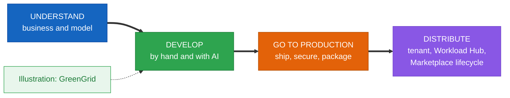
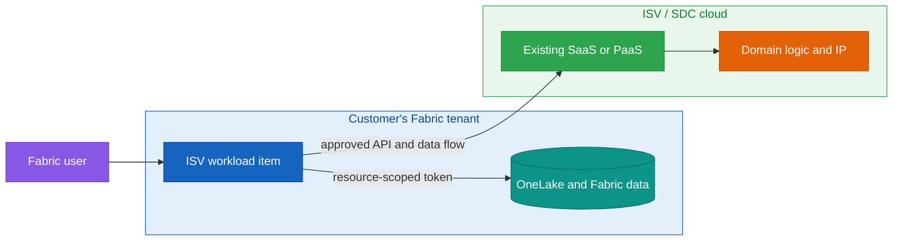
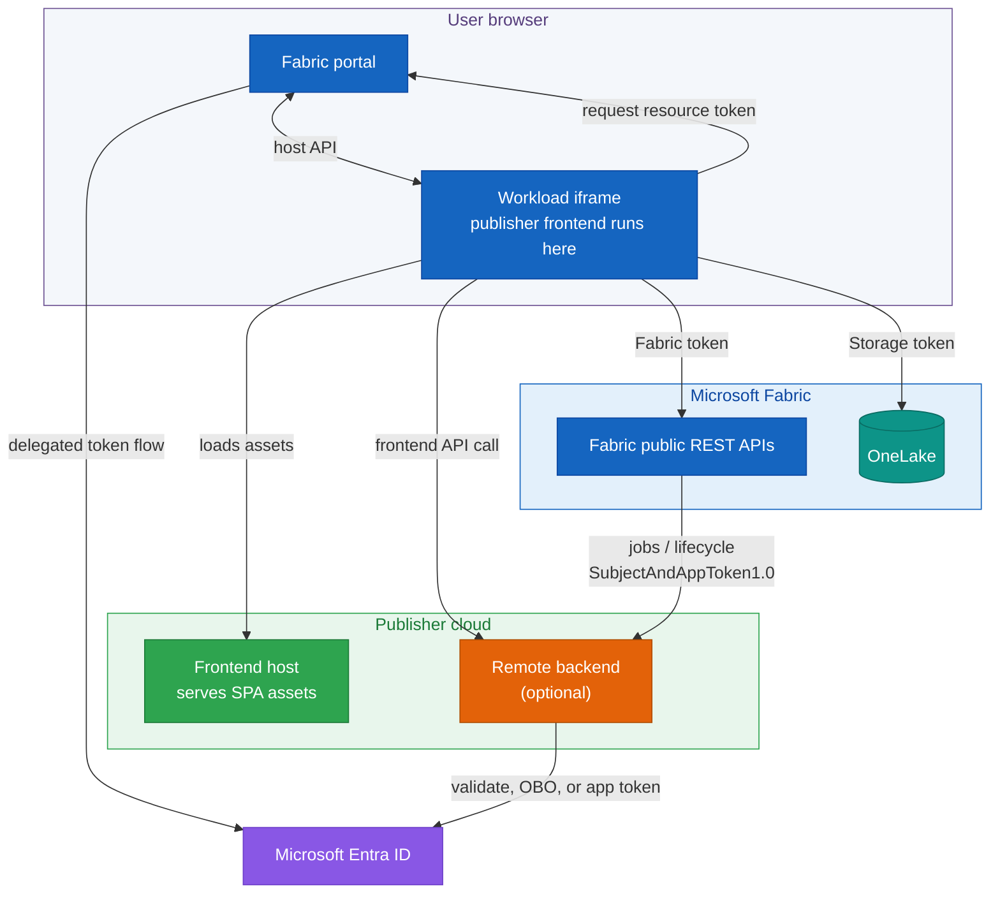
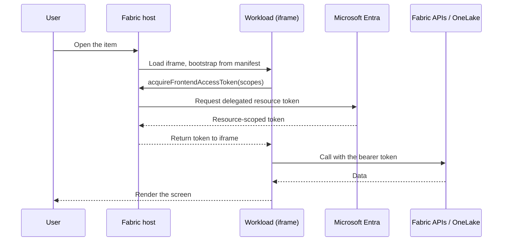
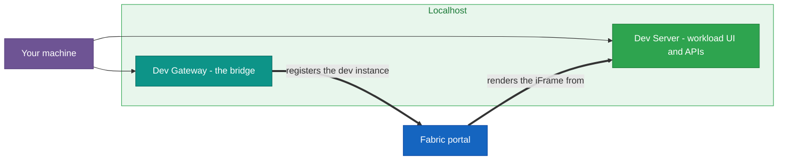
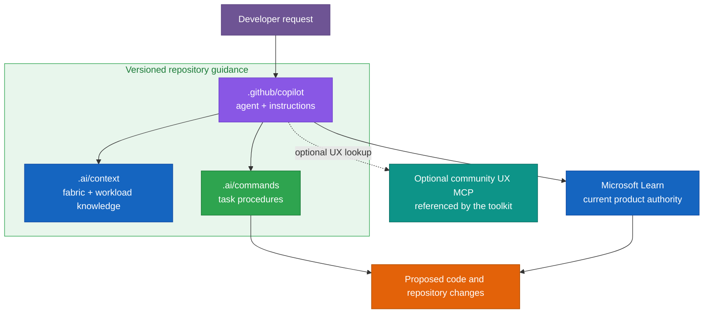
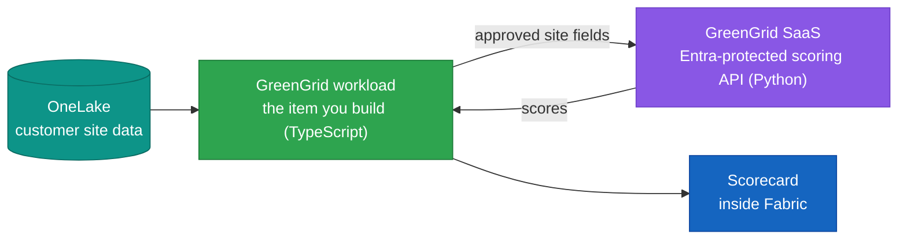
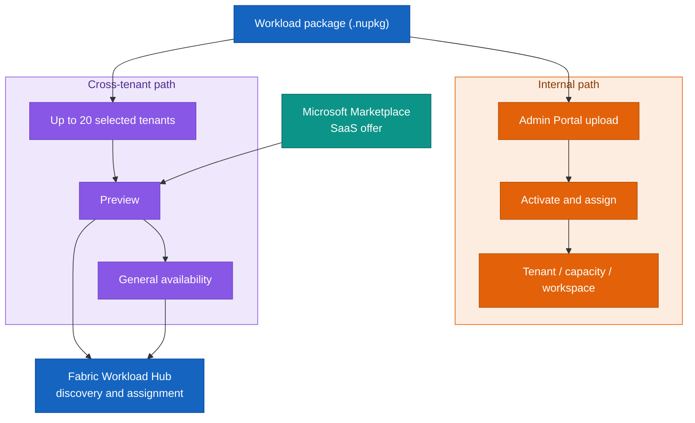

# Building Production-Ready Workloads for Microsoft Fabric

*From the ISV business case and architecture to secure delivery, operations, and distribution*

> Reviewed against Microsoft Learn and the official toolkit repositories on September 17, 2026. This is a documentary and static validation record, not a claim that the procedures were executed in a Fabric tenant.

| Reference baseline | Pinned value |
|---|---|
| Official toolkit implementation | `microsoft/fabric-extensibility-toolkit` at commit [`dacab1b391d03010ba61a0446126d05515c487f0`](https://github.com/microsoft/fabric-extensibility-toolkit/commit/dacab1b391d03010ba61a0446126d05515c487f0) |
| Toolkit release reference | Tag [`v2026.03`](https://github.com/microsoft/fabric-extensibility-toolkit/tree/v2026.03) points to commit [`fbdc891e83d14fbfefd4f7e7e27194fd97f153ed`](https://github.com/microsoft/fabric-extensibility-toolkit/commit/fbdc891e83d14fbfefd4f7e7e27194fd97f153ed). The implementation pin above is five commits ahead |
| Frontend SDK declaration | `@ms-fabric/workload-client` range `^3.1.1`. The toolkit has no dependency lockfile at the pinned commit, so an exact resolved version cannot be proven |
| Publishing validator | `microsoft/fabric-extensibility-toolkit-validator` tag [`v2025.12.1`](https://github.com/microsoft/fabric-extensibility-toolkit-validator/releases/tag/v2025.12.1), commit [`78e17c385ad182f4a293dcab02c2eaa50aa7b361`](https://github.com/microsoft/fabric-extensibility-toolkit-validator/commit/78e17c385ad182f4a293dcab02c2eaa50aa7b361). Source-inspected, not run |
| Technical verification date | September 17, 2026 |
| Editorial revision date | September 17, 2026 |
| Validation scope | Primary-source review, repository inspection, static snippet checks, Mermaid rendering, and artifact generation. No tenant, publishing-validator, or Marketplace lifecycle execution |

## Contents

**[Choose your path](#choose-your-path)**

**[0. Before you begin](#0-before-you-begin)**

- [A source-inspected first-run path](#a-source-inspected-first-run-path)
- [Common pitfalls](#common-pitfalls)

**Understand**

- **[1. What a workload is, and why an ISV would build one](#1-what-a-workload-is-and-why-an-isv-would-build-one)**
  - [1.1 The ISV business case: bring your service to Fabric data](#11-the-isv-business-case-bring-your-service-to-fabric-data)
  - [1.2 What Fabric gives you, and what a workload adds](#12-what-fabric-gives-you-and-what-a-workload-adds)
  - [1.3 The toolkit, when to use it, and its limits](#13-the-toolkit-when-to-use-it-and-its-limits)
- **[2. How a workload runs: architecture, the host, and one request](#2-how-a-workload-runs-architecture-the-host-and-one-request)**
  - [2.1 The Fabric host, your frontend, and an optional backend](#21-the-fabric-host-your-frontend-and-an-optional-backend)
  - [2.2 Items as native artifacts, with explicit integrations](#22-items-as-native-artifacts-with-explicit-integrations)
  - [2.3 A request, step by step](#23-a-request-step-by-step)
- **[3. The manifest package: the contract with Fabric](#3-the-manifest-package-the-contract-with-fabric)**
  - [3.1 Workload, product, and paired item manifests](#31-workload-product-and-paired-item-manifests)
  - [3.2 Identity and naming](#32-identity-and-naming)
- **[4. Identity and access with Microsoft Entra](#4-identity-and-access-with-microsoft-entra)**
  - [4.1 Delegated frontend tokens and backend OBO](#41-delegated-frontend-tokens-and-backend-obo)
  - [4.2 Entra applications, scopes, and service identities](#42-entra-applications-scopes-and-service-identities)

**Develop**

- **[5. The toolkit and the development environment](#5-the-toolkit-and-the-development-environment)**
  - [5.1 The starter kit, setup script, and Entra applications](#51-the-starter-kit-setup-script-and-entra-applications)
  - [5.2 Dev Server, Dev Gateway, and the Hello World checkpoint](#52-dev-server-dev-gateway-and-the-hello-world-checkpoint)
- **[6. Building an item: editor, data, and capabilities](#6-building-an-item-editor-data-and-capabilities)**
  - [6.1 The item, its editor, and how it surfaces](#61-the-item-its-editor-and-how-it-surfaces)
  - [6.2 Separating item definitions from OneLake data](#62-separating-item-definitions-from-onelake-data)
  - [6.3 Remote jobs, lifecycle events, and other capabilities](#63-remote-jobs-lifecycle-events-and-other-capabilities)
- **[7. Developing with AI assistance](#7-developing-with-ai-assistance)**
  - [7.1 Repository guidance: useful, mutable, and versioned](#71-repository-guidance-useful-mutable-and-versioned)
  - [7.2 The Copilot agent and the optional community UX MCP](#72-the-copilot-agent-and-the-optional-community-ux-mcp)
  - [7.3 What it generates, and keeping it honest](#73-what-it-generates-and-keeping-it-honest)
- **[8. Diagnostics and debugging](#8-diagnostics-and-debugging)**
  - [8.1 Reading the chain, and the token and manifest boundaries](#81-reading-the-chain-and-the-token-and-manifest-boundaries)
  - [8.2 The Dev Gateway, the iframe boundary, and correlation](#82-the-dev-gateway-the-iframe-boundary-and-correlation)
- **[9. Illustration: GreenGrid](#9-illustration-greengrid)**
  - [9.1 What GreenGrid is](#91-what-greengrid-is)
  - [9.2 The scoring service, in Python](#92-the-scoring-service-in-python)
  - [9.3 Milestone 1: the workload calls the service](#93-milestone-1-the-workload-calls-the-service)
  - [9.4 Milestones 2 and 3: real data and a native screen](#94-milestones-2-and-3-real-data-and-a-native-screen)

**Go to production**

- **[10. From developer mode to production](#10-from-developer-mode-to-production)**
  - [10.1 What changes](#101-what-changes)
  - [10.2 What to verify across the transition](#102-what-to-verify-across-the-transition)
- **[11. Hosting, domain, and identity](#11-hosting-domain-and-identity)**
  - [11.1 Hosting, the verified domain, and the resource ID](#111-hosting-the-verified-domain-and-the-resource-id)
  - [11.2 User delegation, backend credentials, and managed identities](#112-user-delegation-backend-credentials-and-managed-identities)
- **[12. Security and compliance](#12-security-and-compliance)**
  - [12.1 Data boundaries, labels, and publisher responsibility](#121-data-boundaries-labels-and-publisher-responsibility)
  - [12.2 Secrets, telemetry, monitoring, and support](#122-secrets-telemetry-monitoring-and-support)
- **[13. Packaging, validation, and CI/CD](#13-packaging-validation-and-cicd)**
  - [13.1 Package build, schema checks, and publishing validation](#131-package-build-schema-checks-and-publishing-validation)
  - [13.2 Automating the pipeline](#132-automating-the-pipeline)
- **[14. Patterns and anti-patterns](#14-patterns-and-anti-patterns)**
  - [14.1 Patterns that hold up](#141-patterns-that-hold-up)
  - [14.2 Anti-patterns to avoid](#142-anti-patterns-to-avoid)
**Distribute**

- **[15. Make it available in your tenant](#15-make-it-available-in-your-tenant)**
  - [15.1 Admin Portal upload, activation, and assignment](#151-admin-portal-upload-activation-and-assignment)
  - [15.2 Internal publishing with Org.[Name]](#152-internal-publishing-with-orgname)
- **[16. Publish across tenants: Workload Hub and Microsoft Marketplace](#16-publish-across-tenants-workload-hub-and-microsoft-marketplace)**
  - [16.1 Selected tenants, Preview, and GA](#161-selected-tenants-preview-and-ga)
  - [16.2 Publishing requirements, commerce, and support](#162-publishing-requirements-commerce-and-support)
  - [16.3 Choosing a path](#163-choosing-a-path)
- **[17. The post-publish lifecycle](#17-the-post-publish-lifecycle)**
  - [17.1 Updates, migration, and deprecation](#171-updates-migration-and-deprecation)
  - [17.2 Monitoring, consent, rollback, and feature flags](#172-monitoring-consent-rollback-and-feature-flags)
- **[18. Recap and next steps](#18-recap-and-next-steps)**

**Appendices**

- [Appendix A: Manifest package reference](#appendix-a-manifest-package-reference)
- [Appendix B: Setup, development, package, and validator commands](#appendix-b-setup-development-package-and-validator-commands)
- [Appendix C: AI guidance reference](#appendix-c-ai-guidance-reference)
- [Appendix D: Python service reference](#appendix-d-python-service-reference)
- [Appendix E: Release and compliance checklist, diagnostics quick reference](#appendix-e-release-and-compliance-checklist-diagnostics-quick-reference)
- [Appendix F: Glossary and resources](#appendix-f-glossary-and-resources)
- [Appendix G: Quick reference](#appendix-g-quick-reference)

---

Microsoft Fabric ships with a broad set of items: lakehouses, notebooks, pipelines, reports, and many more. An independent software vendor (ISV) or software development company (SDC) still has a different problem to solve. Its product may already run as SaaS or PaaS, hold years of domain knowledge, and serve customers well, yet remain disconnected from the data those customers manage in Fabric. A workload creates the bridge. It puts the company's experience inside Fabric while the service and intellectual property remain on infrastructure the company operates.

That position can shorten a customer's path from data to product value. The customer works in a familiar Fabric workspace and can keep source data in OneLake. The ISV avoids rebuilding its service separately for every account, while gaining a route to selected tenants and, after the required review and Marketplace setup, broader distribution through the Fabric ecosystem. The opportunity is real, but it is not automatic: the publisher still owns the service, its security, its support model, and every data transfer outside Fabric.

This manuscript teaches the workload model in four movements. First, why an ISV would build one and how Fabric runs it. Second, how to develop an item with the toolkit, including the local loop, definitions, OneLake data, AI guidance, and diagnostics. Third, how to host, secure, package, and operate it. Fourth, how to assign it inside one tenant or publish it across tenants.

GreenGrid appears as a worked illustration at the end of the Develop movement. It is not a reference architecture. Its job is to make the development loop concrete before the chapter returns to product-neutral production and distribution guidance.

The official starter kit uses TypeScript and React for the publisher-hosted frontend that Fabric loads in an iframe. The backend is optional and can use any HTTPS-capable stack. This manuscript uses Python for scoring, token validation, jobs, and operational examples because it is common in data teams. Each snippet states whether it belongs in the browser or on the server.



## Choose your path

The primary audience is an ISV or SDC team deciding whether to build, operate, and distribute a Fabric workload. Product and engineering leads can use the business and architecture sections. Developers can follow the implementation path. Security, operations, and publishing owners can use the production track and appendices.

The manuscript assumes familiarity with web applications, REST and JSON, OAuth concepts, source control, and basic Fabric workspaces and items. TypeScript and React help with the starter kit, while Python is needed only for the optional service examples.

By the end, the reader should be able to decide whether a workload fits the product, explain each browser, Fabric, and publisher boundary, build and diagnose a first item, define a production release unit, and choose an internal or cross-tenant distribution path.

This manuscript supports two reading paths:

| Path | Read | Outcome |
|---|---|---|
| **Fast track** | 0 → 2 → 5 → 6 → 9 | Follow the first-workload path, understand the runtime, build an item, and connect the GreenGrid example |
| **Production track** | Sections 10 through 17 | Turn the prototype into a hosted, secured, packaged, assigned, and supportable product |

Read section 1 first when the decision is commercial rather than technical: it explains why an ISV or SDC would invest in a workload and which parts of the existing SaaS or PaaS stay unchanged.

Two labels separate durable architecture from details that Microsoft may change:

> **Stable concept.** A design rule or boundary that should remain useful across toolkit releases.

> **Current platform behavior, verified September 2026.** A command, limit, schema, tenant setting, publishing stage, or other time-sensitive implementation detail.

---

# 0. Before you begin

The chapter assumes web hosting and HTTPS, REST and JSON, OAuth and OpenID Connect concepts, source control, and basic Fabric workspaces and items. The tools and permissions then depend on the path you follow:

| Scenario | Required environment | Actor or permission | Observable readiness |
|---|---|---|---|
| Common | Entra tenant, Fabric workspace on a supported F, P, or Trial capacity, PowerShell 7, Node.js, .NET SDK, Azure CLI, editor | Rights to use the workspace and sign in through the setup scripts | Repository cloned and tool versions available |
| Local frontend | Tenant settings enabled, personal Fabric Developer Mode, browser Local Network Access | Tenant admin for settings, workspace/capacity admin for access, developer for local mode | Dev Server and Dev Gateway run, and Hello World opens |
| Optional backend | HTTPS-capable runtime and identity configuration | Publisher engineering team | Health endpoint responds and token validation rejects an invalid audience |
| Azure hosting | Azure subscription, target resources, deployment identity | Azure subscription/resource owner | Frontend and backend deploy under the intended verified domain |
| Public publication | Publisher-named workload, verified publisher, support/privacy/terms evidence, Marketplace offer | Fabric publisher, tenant admin, Partner Center roles | Package reaches the intended selected, Preview, or GA stage |

Keep the accounts distinct. Tenant administrators enable settings, capacity or workspace administrators control access and assignment, publishers manage applications and packages, and standard users create and open items for acceptance testing.

Snippet labels have a precise meaning:

- **Teaching example** explains one boundary or decision and omits surrounding production concerns.
- **Production pattern** shows a reusable security or operational shape, but still needs application-specific design.
- **Current reference, verified September 2026** records a command or platform detail that should be rechecked against current documentation.

Install Python dependencies by scenario rather than giving every reader the production stack.

> **Teaching example.** Base API, token-validation, and test dependencies.

```bash
python -m venv .venv
# Windows:  .venv\Scripts\Activate.ps1
# macOS/Linux:  source .venv/bin/activate
pip install fastapi "uvicorn[standard]" pydantic \
            "pyjwt[crypto]" requests pandas pytest
```

> **Production pattern.** Add these packages only for the Azure-hosted identity, Key Vault, and telemetry examples.

```bash
pip install azure-identity azure-keyvault-secrets \
            azure-monitor-opentelemetry
```

A practical note on the snippets: the TypeScript examples run in the browser through the toolkit SDK. The Python examples run in publisher-hosted services called over HTTPS. Each snippet states which side of the boundary it belongs to.

### A source-inspected first-run path

Once the common and local-development prerequisites are satisfied, use the following path. It was checked against the pinned source and documentation, but it was not executed in a Fabric tenant.

| Step | Actor and access | Starting directory | Command or action | Adapt | Expected evidence |
|---|---|---|---|---|---|
| Clone | Developer with Git access | Parent directory for the checkout | `git clone https://github.com/microsoft/fabric-extensibility-toolkit` | Checkout the pinned commit for reproducibility | Repository exists at the expected commit |
| Configure | Developer allowed to create or reuse the required Entra apps and use the target workspace | `fabric-extensibility-toolkit/scripts/Setup` | `pwsh ./SetupWorkload.ps1 -WorkloadName "Org.YourWorkload"` | Workload name, optional display name, app IDs, development workspace, and workload version | Entra/configuration artifacts are created and the script reaches its final package-build step |
| Serve | Developer | `fabric-extensibility-toolkit/scripts/Run` | `pwsh ./StartDevServer.ps1` | No script parameters | Dev Server reports that the SPA and development manifests are available |
| Register | Same developer, with personal Fabric Developer Mode enabled | `fabric-extensibility-toolkit/scripts/Run` in a second terminal | `pwsh ./StartDevGateway.ps1` | Boolean `InteractiveLogin`, default `$true`. Linux requires `-InteractiveLogin $false` at the pinned commit | Dev Gateway reports registration with Fabric |
| Open | Standard test user who can use the development workspace | Fabric portal | Open the starter kit's Hello World item | Workspace on an F, P, or Trial capacity and browser Local Network Access | The item editor loads inside Fabric |

> **Pinned-source warning.** At commit `dacab1b...`, `SetupWorkload.ps1` ends by passing an unsupported `-Force` parameter to `BuildManifestPackage.ps1`. The entry point and its parameters are source-verified, but the sequence is not execution-verified. Recheck the current script before onboarding a developer and record any upstream correction or local disposition.

If Hello World does not load, check the settings, browser Local Network Access, environment files, and both local processes before changing code.

### Common pitfalls

Treat early symptoms as hypotheses, not diagnoses:

| Symptom | First discriminating test | Continue in |
|---|---|---|
| Workload does not appear | Confirm capacity, tenant settings, assignment, and local registration independently | Sections 5 and 15 |
| Blank item surface | Inspect iframe/network loading, browser console, route, and CSP before changing identity | Sections 8 and 10 |
| 401 response | Separate missing authentication, rejected token claims, insufficient authorization, and transport failure | Sections 4 and 8 |
| Unexpected version | Disconnect Dev Gateway, check the active package, and verify assignment scope | Sections 8, 15, and 17 |
| Duplicate-version upload error | Compare the package version with the published-version list | Sections 13 and 17 |

Appendix E expands this into a boundary-based diagnostic reference with expected observations and next steps.

---

# Understand

> **Key takeaways**
>
> - A workload gives an ISV or SDC a product surface inside Fabric while its SaaS, PaaS, and intellectual property stay in the publisher's cloud.
> - It can connect that service to Fabric and OneLake data, but every transfer to publisher-hosted code remains the publisher's responsibility.
> - Native integrations such as catalog, monitoring, Git, and deployment must be configured and validated. They are not inherited automatically.
> - The package contains a workload manifest, a product manifest, and paired XML and JSON definitions for each item type.
> - Reach for a workload when a user would create and open it as their own object, and a lighter extensibility point otherwise.

## 1. What a workload is, and why an ISV would build one

Most ISVs and SDCs do not start from an empty repository. They already have a service, an API, domain logic, support processes, and customers. The question is whether that product should remain a separate destination or become part of the place where Fabric users already work with data. A workload provides the second option.

> **Running example: GreenGrid.** GreenGrid already operates an energy-scoring SaaS. It wants Fabric customers to score approved data from OneLake without moving the scoring logic and intellectual property into the customer's tenant. The example returns throughout the architecture and development sections before becoming the worked implementation in section 9.

### 1.1 The ISV business case: bring your service to Fabric data

A workload changes where the customer meets the product. The user opens an item in a Fabric workspace instead of switching to another portal, exporting data, and rebuilding context in a separate application. The ISV can reuse the service it already operates rather than deploying a dedicated copy for each customer. The workload becomes the product surface inside Fabric. The SaaS or PaaS remains the execution surface behind it.

This creates a practical bridge between two estates:

- Fabric holds the customer's workspaces, items, identity context, and OneLake data.
- The publisher keeps its algorithms, operational services, and product roadmap in its own cloud.
- The workload joins them through declared APIs, scoped tokens, and an item the customer can assign to the right capacities or workspaces.



The model opens a repeatable route to more than one customer. An internal `Org.[Name]` package can serve one organization. A publisher-named workload can be tested with selected tenants, up to the current limit of twenty, before the publisher requests Preview and GA. Public distribution also requires the current Fabric publishing checks and a Microsoft Marketplace SaaS offer in Partner Center. The Workload Hub handles discovery, consent, and assignment inside Fabric. Microsoft Marketplace handles the commercial listing and licensing options.

This route does not remove the normal work of selling and operating software. Customers still assess security, residency, support, pricing, and the data the publisher receives. The business advantage is narrower and more useful: the ISV can bring one maintained service to Fabric customers through a consistent product surface, without surrendering its intellectual property or rebuilding the product inside every tenant.

### 1.2 What Fabric gives you, and what a workload adds

Fabric is organized around workspaces and items, with OneLake as the shared data plane. A workload adds publisher-defined item types and a publisher-hosted web experience to that model. Users can create the item in a workspace, while the publisher connects it to the Fabric capabilities the product needs.

That native behavior is not a blanket inheritance. Each catalog, monitoring, Git, deployment, job, lifecycle, or protection claim needs its own configuration and validation. Sections 2 and 6 separate item definitions from business data. Section 12 covers the publisher's data and protection responsibilities.

### 1.3 The toolkit, when to use it, and its limits

The Extensibility Toolkit is the supported starting point for new workloads. It provides a starter project, the workload client SDK, setup and build scripts, and the local Dev Server and Dev Gateway loop. It is the current evolution of the older Workload Development Kit.

It fits when you need a custom item and a publisher-hosted user experience inside Fabric: a domain-specific authoring tool, a governance console, an industry workflow, or an operational application that works with Fabric data. The baseline architecture is frontend-first. The tagged [v2026.03 release notes](https://github.com/microsoft/fabric-extensibility-toolkit/blob/fbdc891e83d14fbfefd4f7e7e27194fd97f153ed/docs/ReleaseNotes/2026/v2026.03.md#L3-L16) describe production-ready remote hosting, while the current [general publishing requirements](https://github.com/MicrosoftDocs/fabric-docs/blob/5156dc524b5f03f820d4d6b55aa69caeded0cce5/docs/extensibility-toolkit/publishing-requirements-general.md#L113-L122) still contain narrower backend language. Treat remote acceptance as a target-stage verification item before promising the capability.

The toolkit does not run arbitrary server code inside a general-purpose Fabric runtime, bypass capacity quotas, or remove the publisher's responsibility for hosting and support. Development requires a supported F, P, or Trial capacity. Power BI Pro alone is not enough.

Other extensibility points cover narrower needs. A visualization inside a report is a Power BI custom visual. A rule that watches a stream and reacts to a condition belongs in Activator. A scheduled transformation may belong in a pipeline, notebook, or Azure service. Use a workload when the customer should create and open a distinct item with its own editor and lifecycle.

| Option | Choose it when | Ongoing cost |
|---|---|---|
| Fabric workload | Users need a persistent workspace item, dedicated editor, item lifecycle, and a route to multiple Fabric tenants | Frontend and SDK compatibility, identity, publishing review, consent changes, support, and optional backend operations |
| Power BI custom visual | The experience belongs inside a report visual | Visual certification, report compatibility, and visual-specific UX |
| Activator | The need is an event-driven rule, alert, or action | Event model, rule operations, and response handling |
| Pipeline, notebook, or function | The primary job is transformation, orchestration, or scheduled compute | Data and compute operations without a custom item editor |
| Separate SaaS experience | The product does not need a Fabric item or native lifecycle | Separate navigation, identity context, integration, and customer administration |

A workload is justified when the persistent item and Fabric-native workflow create enough value to cover its long-term compatibility, security, publishing, and support costs. If the requirement is only a chart, rule, or background transformation, the lighter option is usually easier to operate.

## 2. How a workload runs: architecture, the host, and one request

### 2.1 The Fabric host, your frontend, and an optional backend

Four boundaries matter when a workload is open. The user's browser runs the Fabric portal. The portal creates an iframe and loads the publisher's frontend from the endpoint declared in the workload manifest. The JavaScript executes inside that iframe and communicates with Fabric through the workload client SDK. Fabric APIs and OneLake remain separate resource endpoints. A publisher backend is optional and runs outside Fabric on infrastructure the publisher operates.



These relationships use different contracts:

| Relationship | Caller | Authentication contract | Typical purpose |
|---|---|---|---|
| Frontend → Fabric or OneLake | Workload iframe | Delegated resource token from `acquireFrontendAccessToken` | User-authorized data and item operations |
| Frontend → publisher API | Workload iframe | Delegated token whose audience is the publisher API | Product-specific frontend request |
| Fabric → publisher remote endpoint | Fabric service | `SubjectAndAppToken1.0`, with a required app token and an operation-dependent subject token | Jobs and item lifecycle callbacks |
| Publisher backend → target resource | Publisher service | OBO, backend application, or managed identity according to the target | Downstream user or service operation |

The [remote authentication contract](https://github.com/MicrosoftDocs/fabric-docs/blob/bd2c3018e8ee6feb445c2868d83123641a58f946/docs/extensibility-toolkit/authentication-remote.md#L31-L47) applies to Fabric-initiated remote endpoint calls. Its documented form is `SubjectAndAppToken1.0 subjectToken="<delegated>", appToken="<app-only>"`. Validate the app token on every call. The subject token can be absent for service-principal calls, deletion, and some scheduled or automated operations, so authorize those paths as explicit app-only operations rather than assuming user context.

Lifecycle requests also carry `ActivityId`, `RequestId`, and `x-ms-client-tenant-id` under the [lifecycle request contract](https://github.com/MicrosoftDocs/fabric-docs/blob/a7bd3bc889b21e925ab40fd9206cd6a7d89a49e3/docs/extensibility-toolkit/how-to-enable-remote-item-lifecycle.md#L91-L132). The remote-auth page contains one sample using `ms-client-tenant-id`, but the lifecycle documentation, generated REST contract, and pinned toolkit use `x-ms-client-tenant-id`. This contract is not the contract for every API the iframe calls.

The manifest tells Fabric where to load the frontend and which item capabilities exist. The SDK provides the supported bridge for theme, navigation, dialogs, notifications, item operations, and token acquisition. Code inside the iframe should use that contract rather than reaching into the portal DOM or assuming internal Fabric routes.

### 2.2 Items as native artifacts, with explicit integrations

An item type gives the workload a durable object in a workspace. Its instances can use Fabric item APIs and workspace permissions, but other integrations depend on explicit declarations and implementation. Appendix A contains the capability matrix and sources. Treat that matrix as part of the product design, not as a blanket promise that every custom item behaves exactly like every built-in item.

> **Stable concept: keep control plane and data plane separate.**

The item definition belongs to the control plane. Current [definition guidance](https://github.com/MicrosoftDocs/fabric-docs/blob/ae59e7adae05c1a99d9c4a9505e382d774859bd0/docs/extensibility-toolkit/how-to-store-item-definition.md#L35-L60) recommends a reasonable number of human-readable text parts, up to five. It does not document five as an enforced API rejection threshold. Fabric does not schema-validate custom part contents for you. Those parts can support Git integration and deployment because they are compact and reviewable. Files, tables, model outputs, and other large data belong in OneLake or another declared data store.

| Concern | Control plane | Data plane |
|---|---|---|
| Purpose | Describe and configure the item | Hold business data and large results |
| Typical content | Small text definition parts, identifiers, settings, schema version | OneLake files and tables, or an explicitly governed publisher store |
| Delivery | Fabric item APIs, Git, and deployment where supported | Data-engineering and application data paths |
| Design rule | Human-readable, reviewable, no secrets | Access, residency, retention, and scale designed explicitly |

That separation also clarifies ownership. Fabric stores and moves the definition through its item APIs. The workload code interprets it. The publisher remains responsible for any external state held by its own service. If a value must follow the item through source control or deployment, it is a candidate for the definition. If it is customer data, a large result set, or shared operational state, it needs an appropriate data-plane design.

### 2.3 A request, step by step

The pieces are easier to hold once you follow a single direct call. A user opens an item. Fabric loads the publisher frontend in the iframe. The frontend asks the SDK for a delegated token for a specific resource and set of scopes. Fabric and Entra return that resource-scoped token, and the frontend calls the matching Fabric or OneLake endpoint. If the frontend sends data or a token to the publisher backend, that is a separate boundary with its own disclosure, retention, and security obligations.



Every later concern (a manifest that must declare the route, a scope the token must carry, a boundary the iframe enforces) is a step in this sequence. The diagnostics section returns to it boundary by boundary: open, bootstrap, token, call, render. Ask which steps produced observable evidence. A blank editor still requires network and browser-console checks. A refused API call can fail at transport, authentication, authorization, or the service itself. A screen with no rows can represent a valid empty result, a failed request, or stale UI state. Section 8 turns those possibilities into discriminating tests.

## 3. The manifest package: the contract with Fabric

### 3.1 Workload, product, and paired item manifests

A workload package contains several declarations with different jobs. `WorkloadManifest.xml` defines the workload identity, hosting mode, Entra applications, and service endpoints. `Product.json` holds product-level presentation and support metadata. Each item type then has two files: an XML platform definition and a JSON frontend definition.

> **Current reference, verified September 2026.** Source layout at the pinned toolkit commit.

```text
Workload/Manifest/
├── WorkloadManifest.xml
├── Product.json
├── ManifestPackage.nuspec
├── *.xsd
├── assets/
│   ├── images/
│   └── locales/
└── items/
    └── ForecastItem/
        ├── ForecastItem.xml
        └── ForecastItem.json
```

The build selects and flattens the manifest files into two package segments:

> **Current reference, verified September 2026.** Built `.nupkg` workload payload. NuGet bookkeeping is omitted.

```text
BE/
├── WorkloadManifest.xml
└── ForecastItem.xml
FE/
├── Product.json
├── ForecastItem.json
└── assets/
    ├── images/
    └── locales/
```

`BE` and `FE` are manifest segments, not hosted backend and frontend binaries. The frontend bundle is built and released separately. The pinned release script copies it to `release/app`. Application source, remote-service code, environment files, XSDs, nested source folders, business data, and item-instance definitions are not workload payloads in the `.nupkg`. The [manifest package contract](https://github.com/MicrosoftDocs/fabric-docs/blob/76887dfc1fd1aab5b6ce571bcddc60d009f5f551/docs/extensibility-toolkit/manifest-overview.md#L22-L55), [pinned nuspec](https://github.com/microsoft/fabric-extensibility-toolkit/blob/dacab1b391d03010ba61a0446126d05515c487f0/Workload/Manifest/ManifestPackage.nuspec#L12-L18), [package build](https://github.com/microsoft/fabric-extensibility-toolkit/blob/dacab1b391d03010ba61a0446126d05515c487f0/scripts/Build/BuildManifestPackage.ps1#L42-L100), and [separate application release](https://github.com/microsoft/fabric-extensibility-toolkit/blob/dacab1b391d03010ba61a0446126d05515c487f0/scripts/Build/BuildRelease.ps1#L37-L95) define the boundary.

The XML and JSON item manifests are a pair, not interchangeable versions of the same file. The XML side describes the item type to Fabric's platform services. The JSON side describes frontend behavior and presentation. The current schema and starter kit remain the authority for exact fields because remote hosting, lifecycle, and publishing support continued to change during 2026.

Do not confuse item-type manifests with an item-instance definition:

| Object | Level | Primary owner | Delivery or storage | Changed when |
|---|---|---|---|---|
| `WorkloadManifest.xml` | Workload release | Publisher | Manifest package | Hosting, identity, endpoints, or workload version changes |
| `Product.json` | Product release | Publisher | Manifest package | Product metadata, support, listing, or presentation changes |
| `{Item}.xml` | Item type | Publisher | Manifest package | Platform capabilities or contracts change |
| `{Item}.json` | Item type | Publisher | Manifest package | Frontend behavior or presentation changes |
| Item definition parts | Item instance | Fabric stores the parts. The publisher defines the schema | Fabric item-definition APIs and supported ALM paths | A user configures an item or the definition schema migrates |

The item-definition API represents one instance as parts with `path`, `payload`, and `payloadType`. Workload-owned parts hold functional state, while Fabric can own platform material such as `.platform`. Those parts are not the XML/JSON item-type manifest pair. See the [item-definition contract](https://github.com/MicrosoftDocs/fabric-docs/blob/ae59e7adae05c1a99d9c4a9505e382d774859bd0/docs/extensibility-toolkit/how-to-store-item-definition.md#L14-L43).

A simplified frontend-hosting manifest looks like this:

> **Teaching example.** The current schema contains more fields. Start from the official starter-kit manifest rather than copying this excerpt as a complete package.

```xml
<WorkloadManifestConfiguration SchemaVersion="2.0.0">
  <Workload WorkloadName="Org.YourWorkload" HostingType="FERemote">
    <Version>1.0.0</Version>
    <RemoteServiceConfiguration>
      <CloudServiceConfiguration>
        <AADFEApp><AppId>00000000-0000-0000-0000-000000000000</AppId></AADFEApp>
        <Endpoints>
          <ServiceEndpoint>
            <Name>Frontend</Name>
            <Url>https://your-frontend.example.com</Url>
          </ServiceEndpoint>
        </Endpoints>
      </CloudServiceConfiguration>
    </RemoteServiceConfiguration>
  </Workload>
</WorkloadManifestConfiguration>
```

The package has hard limits that should shape the product before packaging day:

> **Current platform behavior, verified September 2026.** The following values come from the current [manifest-package documentation](https://learn.microsoft.com/en-us/fabric/extensibility-toolkit/manifest-overview#package-limits) and can change independently of the architectural model.

| Limit | Current maximum |
|---|---:|
| Item types in one package | 10 |
| Total package size | 20 MB |
| Packaged assets | 15 |
| Size per asset | 1.5 MB |
| `Product.json` | 50 KB |

Package assets are currently limited to JPEG, JPG, and PNG by the manifest-package guidance. Item filenames also have length and character restrictions. Check the current manifest documentation before adding item types or assets near these limits.

The package declares what Fabric needs to load and present the workload. It does not contain the running frontend or backend, which remain at the declared publisher endpoints. Every upload needs a package version Fabric has not seen before.

### 3.2 Identity and naming

The workload name is the identifier Fabric uses to register the workload, and its form is a decision about distribution that you make early, because it is baked into the package. The current [publishing overview](https://github.com/MicrosoftDocs/fabric-docs/blob/a929e26060592bc75c59daee88dccd30a47f9d6f/docs/extensibility-toolkit/publishing-overview.md#L15-L73) defines the internal and cross-tenant scenarios.

| Aspect | `Org.[Name]` (internal) | `[Publisher].[Workload]` (cross-tenant) |
|---|---|---|
| Audience | Your own tenant | Other tenants |
| Registration | No separate workload-name registration | Name and publishing tenant reserved permanently on first confirmation |
| Availability | Upload, activate, then assign to tenant, capacity, or workspace | Selected tenants, then Preview, then GA |
| Publishing requirements | General hosting, manifest, identity, and tenant requirements | General, workload, item, attestation, support, and public-review requirements |
| Commercial setup | Not required for an internal workload | Microsoft Marketplace SaaS offer required for Preview and GA |
| Publisher identity | Verified domain | Verified domain plus Microsoft verified publisher requirements |
| Name length | No separate limit established by the cited publishing overview | Workload portion at most 32 characters |

A publisher name is reserved permanently when it is confirmed during the first upload. The publishing tenant is fixed as well. Treat that confirmation as a product decision, not a temporary test value. Moving later from an `Org.*` identity to a publisher identity affects the package, application registrations, endpoints, documentation, and installed tenants, so plan the public naming path before customers depend on the internal one.

## 4. Identity and access with Microsoft Entra

### 4.1 Delegated frontend tokens and backend OBO

The workload client exposes one acquisition method, but it does not produce one universal bearer token. The frontend calls `acquireFrontendAccessToken` with the scopes for a specific resource. The documented result object exposes the bearer value through its `token` property. Fabric APIs, OneLake Storage, Microsoft Graph, and a publisher API have different audiences, so each needs a token requested for its own scopes.

> **Teaching example.** This demonstrates resource-specific acquisition and omits consent handling, token caching, retries, and application authorization.

```ts
import { WorkloadClientAPI } from "@ms-fabric/workload-client";

export async function callResource(
  client: WorkloadClientAPI,
  url: string,
  scopes: string[],
): Promise<unknown> {
  const tokenResult = await client.auth.acquireFrontendAccessToken({ scopes });
  const res = await fetch(url, {
    headers: { Authorization: `Bearer ${tokenResult.token}` },
  });
  if (!res.ok) throw new Error(`Resource call ${res.status}`);
  return res.json();
}
```

That token is a delegated frontend token. It represents the signed-in user for the requested resource and scopes. The frontend does not receive the user's password, but it does receive an access token and can send it to the target service. If the target is a publisher backend, the publisher now handles that token and must protect it accordingly.

On-behalf-of (OBO) has a narrower meaning. It is the backend exchange in which a remote service accepts a user's subject token and obtains a new token for another resource. Do not call the frontend token itself an OBO token, and do not forward a Fabric token to OneLake or another API with a different audience.

### 4.2 Entra applications, scopes, and service identities

Every workload uses Entra application registrations. `Fabric.Extend` remains mandatory. The exact setup then depends on the hosting mode. The current frontend-hosting setup configures the `/close` redirect and workload sign-in redirects for both Fabric and Power BI portal domains. A remote backend adds its own application, exposed scopes, preauthorization, and OBO or service-to-service configuration. Follow the setup script and current authentication guidance rather than copying one redirect list between modes.

Define narrow scopes for a publisher API, such as separate read and write operations, and validate them on the server. The following dependency illustrates a single-tenant internal API. A cross-tenant service also needs an issuer and tenant-validation strategy. Do not reuse a fixed-tenant validator for public distribution.

Token version determines the audience contract. For a v2 access token, `aud` is the client ID of the target API. A v1 token can use a client ID or resource URI according to the resource configuration. Pair the expected audience with the matching issuer and version instead of treating the Application ID URI as a universal audience. See the [Entra access-token claims reference](https://learn.microsoft.com/en-us/entra/identity-platform/access-token-claims-reference).

> **Teaching example.** This demonstrates the trust boundary. A production implementation also needs tenant policy, authorization beyond scopes, key-cache behavior, failure handling, telemetry, and security review.

```python
# auth.py - validate a Fabric/Entra bearer token in a Python backend.
import os
import jwt                      # PyJWT
from jwt import PyJWKClient
from fastapi import Header, HTTPException

TENANT_ID = os.environ["TENANT_ID"]
# For a v2 token issued to this custom API, aud is the API application's client ID.
API_CLIENT_ID = os.environ["API_CLIENT_ID"]
ISSUER = f"https://login.microsoftonline.com/{TENANT_ID}/v2.0"
JWKS_URL = f"https://login.microsoftonline.com/{TENANT_ID}/discovery/v2.0/keys"

_jwks = PyJWKClient(JWKS_URL)                   # caches signing keys

def require_scope(required: str):
    def dependency(authorization: str = Header(...)) -> dict:
        if not authorization.startswith("Bearer "):
            raise HTTPException(401, "Missing bearer token")
        token = authorization.split(" ", 1)[1]
        try:
            signing_key = _jwks.get_signing_key_from_jwt(token).key
            claims = jwt.decode(
                token, signing_key, algorithms=["RS256"],
                audience=API_CLIENT_ID, issuer=ISSUER,
            )
        except jwt.PyJWTError as exc:
            raise HTTPException(401, "Invalid bearer token") from exc
        scopes = claims.get("scp", "").split()
        if claims.get("ver") != "2.0":
            raise HTTPException(401, "Unexpected token version")
        if required not in scopes:
            raise HTTPException(403, "Required scope is missing")
        return claims
    return dependency
```

Used on a route, it makes the access rule explicit at the edge of the service:

> **Teaching example.** Route-level scope enforcement for the validator above.

```python
from fastapi import FastAPI, Depends
from auth import require_scope

app = FastAPI()

@app.get("/forecasts")
def list_forecasts(claims: dict = Depends(require_scope("data.read"))):
    user = claims.get("oid")     # the signed-in user's object id
    return {"user": user, "forecasts": []}
```

Validating the token and scope authenticates the caller and constrains the delegated operation. It does not prove that the caller may access a particular tenant, workspace, item, or publisher-side record. Apply resource authorization after token validation.

Three identities may therefore appear in one product: the signed-in user represented by a delegated token, the backend application used for remote workload and OBO flows, and a managed identity used by the publisher's Azure-hosted service for supported service-to-service calls. They are not interchangeable. Section 11 separates them in the production design, and section 12 covers what happens when data or tokens cross into publisher-operated systems.

| Boundary | Identity represented | Expected audience | Server checks | Resource authorization |
|---|---|---|---|---|
| Frontend → Fabric API | Signed-in user | Fabric resource | Microsoft resource validation | Fabric workspace/item permissions |
| Frontend → OneLake | Signed-in user | Storage / OneLake resource | Microsoft resource validation | OneLake data permissions |
| Frontend → ISV API with v2 token | Signed-in user | ISV API client ID | Signature, v2 issuer, client-ID audience, expiry, scope | Publisher tenant/workspace/item or product policy |
| Fabric → publisher remote endpoint | Fabric app plus operation-dependent subject | Backend endpoint contract | `SubjectAndAppToken1.0`, required app token, optional subject token, operation, tenant and correlation headers where specified | Publisher endpoint and item policy |
| Backend → Fabric or OneLake through OBO | Signed-in user | Downstream target resource | OBO acquisition and downstream validation | Fabric/OneLake permissions |
| Backend → service as application | Backend app or managed identity | Target service | Application token and credential/identity validation | Application permissions or RBAC |

---

# Develop

> **Key takeaways**
>
> - The Dev Server serves the workload from localhost and the Dev Gateway lets the Fabric portal render it.
> - An item combines a control-plane definition, a frontend experience, and explicit integrations with Fabric and data services.
> - The repository's AI guidance can scaffold repeatable work, but it is versioned project guidance rather than a product CLI or a source of truth.
> - Diagnose by reading one boundary at a time: token, manifest, gateway, iframe.

## 5. The toolkit and the development environment

### 5.1 The starter kit, setup script, and Entra applications

Development starts by cloning the toolkit's starter kit, which includes the web application, manifest package, and setup scripts. Microsoft Learn documents `Setup.ps1` from the repository root. The pinned repository marks that file as a compatibility wrapper and names `SetupWorkload.ps1` as the implementation entry point. Record which source and commit a team follows.

> **Current platform behavior, verified September 2026.** [`SetupWorkload.ps1`](https://github.com/microsoft/fabric-extensibility-toolkit/blob/dacab1b391d03010ba61a0446126d05515c487f0/scripts/Setup/SetupWorkload.ps1#L39-L61) accepts `WorkloadName`, `WorkloadDisplayName`, `FrontendAppId`, `BackendAppId`, `DevWorkspaceId`, Boolean `Force`, and `WorkloadVersion`. At the pinned commit, its [final build handoff](https://github.com/microsoft/fabric-extensibility-toolkit/blob/dacab1b391d03010ba61a0446126d05515c487f0/scripts/Setup/SetupWorkload.ps1#L287-L294) passes `-Force` to a [build script](https://github.com/microsoft/fabric-extensibility-toolkit/blob/dacab1b391d03010ba61a0446126d05515c487f0/scripts/Build/BuildManifestPackage.ps1#L1-L5) that does not declare that parameter. The command is source-inspected, not execution-verified.

> **Current reference, verified September 2026.** Workload setup command.

```powershell
git clone https://github.com/microsoft/fabric-extensibility-toolkit
cd fabric-extensibility-toolkit/scripts/Setup
pwsh ./SetupWorkload.ps1 -WorkloadName "Org.YourWorkload"
```

An Entra app is created even though development is local because the Dev Gateway handles routing, not identity. The workload still requests real delegated tokens for the signed-in developer. Only the frontend hosting location is local.

The script is intended to write environment files for the workspace, workload, and Entra applications, then prepare the local gateway and manifest package. When the portal does not show the workload, compare those files with the active workspace and app registrations before changing application code. Resolve the pinned final-build mismatch before treating setup as successful.

### 5.2 Dev Server, Dev Gateway, and the Hello World checkpoint

Two long-running processes drive local development. Dev Server hosts the SPA, assets, and development manifest endpoints. Dev Gateway registers the local instance and points Fabric to Dev Server. It does not host the application or provide identity.

> **Current reference, verified September 2026.** Terminal 1 starts Dev Server.

```powershell
cd scripts/Run
pwsh ./StartDevServer.ps1
```

> **Current reference, verified September 2026.** Terminal 2 starts Dev Gateway.

```powershell
cd scripts/Run
pwsh ./StartDevGateway.ps1
```

`StartDevServer.ps1` declares no parameters. `StartDevGateway.ps1` declares Boolean `InteractiveLogin`, defaulting to `$true`, and always rebuilds the `dev` manifest. At the pinned commit, ordinary Linux use needs `-InteractiveLogin $false` so the script obtains an Azure CLI token. Appendix B records the source links and platform caveats.



Current setup guidance names three tenant settings:

> **Current platform behavior, verified September 2026.** Tenant-setting names and browser local-network behavior are operational details. Recheck them when onboarding a new development tenant.

1. **Capacity admins and contributors can add and remove additional workloads**
2. **Workspace admins can develop partner workloads**
3. **Users can see and work with additional workloads not validated by Microsoft**

Each developer also enables personal **Fabric Developer Mode**. The workspace must use a supported F, P, or Trial capacity. In current Chromium-based browsers, Local Network Access can block the portal-to-localhost call, so check that permission when both processes are healthy but the item stays blank.

Prove the environment with the Hello World item before adding your own type. If Hello World opens, the gateway and portal path works. If it does not, inspect the tenant settings, personal developer mode, browser local-network permission, capacity, environment files, and both terminal processes.

## 6. Building an item: editor, data, and capabilities

### 6.1 The item, its editor, and how it surfaces

A new item type starts from the pinned generator in `scripts/Setup`. `ItemName` is required unless the script prompts for it. The optional `srcItemName` selects the item to copy and defaults to `HelloWorld`.

> **Current reference, verified September 2026.** Run from `scripts/Setup`. The exact parameter name is `srcItemName`, with that casing.

```powershell
cd scripts/Setup
pwsh ./CreateNewItem.ps1 -ItemName "Forecast" -srcItemName "HelloWorld"
```

The generator copies the item structure, but it does not finish the integration. Update `ITEM_NAMES`, `Product.json`, the locale entries, and `App.tsx` before expecting the type to appear and route correctly. The pinned [script signature](https://github.com/microsoft/fabric-extensibility-toolkit/blob/dacab1b391d03010ba61a0446126d05515c487f0/scripts/Setup/CreateNewItem.ps1#L1-L20), [manual follow-up](https://github.com/microsoft/fabric-extensibility-toolkit/blob/dacab1b391d03010ba61a0446126d05515c487f0/scripts/Setup/CreateNewItem.ps1#L157-L192), and [official item tutorial](https://github.com/MicrosoftDocs/fabric-docs/blob/5156dc524b5f03f820d4d6b55aa69caeded0cce5/docs/extensibility-toolkit/tutorial-create-new-fabric-item.md#L165-L181) define this path.

The starter kit normally gives you a definition model, an editor, empty and default views, and ribbon actions. The definition holds compact control-plane configuration, not the item's large business data:

> **Teaching example.** Small definition model only. Serialization and validation remain application-specific.

```ts
// ForecastItemDefinition.ts - compact, human-readable control-plane configuration.
export interface ForecastItemDefinition {
  horizonDays: number;
  sourceItemId?: string;
  schemaVersion: number;
}

export const DEFAULT_FORECAST: ForecastItemDefinition = {
  horizonDays: 14,
  schemaVersion: 1,
};
```

Fabric provides the item creation surface, and your package declares how the type appears there. The editor route then maps the Fabric item identifier to your component:

> **Teaching example.** Route shape only. Use the router and controller structure from the installed starter kit.

```tsx
// App.tsx - register the editor route so the host's navigation matches a component.
<Route path="/forecast-editor/:itemObjectId">
  <ForecastItemEditor workloadClient={workloadClient} />
</Route>
```

The current starter kit updates definition parts through the item CRUD API. Keep the serialized parts small, textual, and suitable for review in Git:

> **Teaching example.** Verify the exact method and definition-part types in the installed SDK. The pinned repository declares the range `^3.1.1` but does not lock one resolved version.

```ts
import { WorkloadClientAPI } from "@ms-fabric/workload-client";
import { ForecastItemDefinition } from "./ForecastItemDefinition";

export async function saveForecast(
  client: WorkloadClientAPI, itemId: string, def: ForecastItemDefinition,
) {
  const parts = serializeDefinition(def);
  await client.itemCrud.updateItemDefinition(itemId, parts);
}
```

The exact argument shape belongs to the installed SDK. The example shows the boundary rather than replacing that typed contract. For the type to appear in the portal, the item XML, item JSON, product metadata, locale entries, routes, and packaged assets must agree. A sensitivity label is not automatically applied simply because the item uses the standard creation surface.

Keep one development item open while Dev Server watches the frontend. That gives you a short edit-and-refresh loop without creating a new item for every UI change.

### 6.2 Separating item definitions from OneLake data

A workload often needs data from OneLake. Keep the data source behind a function so the screen does not care whether development uses seed data or a real file. Request a Storage-scoped delegated token for OneLake. Do not reuse a Fabric API token with a different audience.

In the browser, the frontend reads a OneLake file with the user's token:

> **Teaching example.** Direct OneLake read after acquiring a Storage-scoped delegated token.

```ts
// Read a CSV from OneLake in the frontend, as the signed-in user.
export async function readSitesCsv(
  client: WorkloadClientAPI, workspaceId: string, lakehouseId: string,
): Promise<string> {
  const tokenResult = await client.auth.acquireFrontendAccessToken({
    scopes: ONELAKE_STORAGE_SCOPES,
  });
  const url =
    `https://onelake.dfs.fabric.microsoft.com/${workspaceId}/` +
    `${lakehouseId}/Files/sites.csv`;
  const res = await fetch(url, {
    headers: { Authorization: `Bearer ${tokenResult.token}` },
  });
  if (!res.ok) throw new Error(`OneLake ${res.status}`);
  return res.text();
}
```

When the work belongs on a server, the backend must obtain a OneLake token with the correct audience. In a user-delegated flow that normally means an OBO exchange, not forwarding the incoming publisher-API token directly to Storage. The resulting OneLake token can then be used by a Python reader:

> **Teaching example.** The caller supplies an already acquired OneLake token. OBO, retries, streaming, and large-file handling are outside this function.

```python
# onelake.py - read a OneLake CSV in a Python backend, as the calling user.
import io
import pandas as pd
import requests

ONELAKE = "https://onelake.dfs.fabric.microsoft.com"

def read_sites(onelake_token: str, workspace_id: str, lakehouse_id: str) -> pd.DataFrame:
    url = f"{ONELAKE}/{workspace_id}/{lakehouse_id}/Files/sites.csv"
    resp = requests.get(url, headers={"Authorization": f"Bearer {onelake_token}"}, timeout=30)
    resp.raise_for_status()
    return pd.read_csv(io.StringIO(resp.text))
```

The item definition can hold small settings such as a horizon, a source item identifier, and a schema version. It should not contain copied table data, large results, secrets, or opaque binary state. Those belong in OneLake or a publisher store with an explicit data-governance model.

### 6.3 Remote jobs, lifecycle events, and other capabilities

A settings dialog, About page, localization, catalog metadata, and monitoring integration each require their own manifest or frontend work. Add only the capabilities you implement and test.

A remote job is declared through the item manifest. Fabric schedules and monitors the job, while the publisher endpoint performs the work and reports status. Configured jobs appear in Monitoring Hub. Filter integration, cancellation, retry, detail views, and Recent Runs need additional declarations or handlers. The current repository provides `SwitchToRemoteHosting.ps1` to change the base frontend-hosting project to the remote schema.

Current first-party sources expose different job route shapes, and the generic remote-endpoint page still contains an incomplete specification. Treat the exact job URL contract as unresolved until the generated API specification, active validator, or Fabric publishing team confirms it for the target stage. The capability matrix in Appendix A links the conflicting sources. Remote-hosting implementation and publication acceptance are also separate questions.

> **Current platform behavior, verified September 2026.** The pinned `SwitchToRemoteHosting.ps1` accepts `WorkloadRoot`, `BackendAppId`, `BackendAudience`, `BackendUrl`, `TenantId`, `EnableOneLakeLogging`, `BackendClientSecret`, and switch `Force`. Static inspection found that it updates `.env.dev` and `.env.test` but not `.env.prod`, writes the backend secret in plaintext to those local files, and migrates only `HelloWorldItem.xml` to schema `2.100.0`. Review every generated change, keep the environment files out of source control, and migrate each item manifest explicitly. See the [signature](https://github.com/microsoft/fabric-extensibility-toolkit/blob/dacab1b391d03010ba61a0446126d05515c487f0/scripts/Setup/SwitchToRemoteHosting.ps1#L65-L82), [environment updates](https://github.com/microsoft/fabric-extensibility-toolkit/blob/dacab1b391d03010ba61a0446126d05515c487f0/scripts/Setup/SwitchToRemoteHosting.ps1#L699-L805), and [item migration](https://github.com/microsoft/fabric-extensibility-toolkit/blob/dacab1b391d03010ba61a0446126d05515c487f0/scripts/Setup/SwitchToRemoteHosting.ps1#L326-L342).

The Python below shows execution logic only. It is not the Fabric remote-job protocol, and its in-memory status store is unsuitable for production:

> **Teaching example.** Local execution shape only, not a production job service.

```python
# jobs.py - a server-side job the workload starts and polls.
from fastapi import FastAPI, BackgroundTasks
from uuid import uuid4

app = FastAPI()
_status: dict[str, dict] = {}

def run_forecast(job_id: str, horizon_days: int) -> None:
    _status[job_id] = {"state": "running", "progress": 0}
    for step in range(horizon_days):
        ...  # compute one day of the forecast
        _status[job_id] = {"state": "running",
                           "progress": round((step + 1) / horizon_days * 100)}
    _status[job_id] = {"state": "succeeded", "progress": 100}

@app.post("/jobs/forecast")
def start(horizon_days: int, tasks: BackgroundTasks) -> dict:
    job_id = str(uuid4())
    _status[job_id] = {"state": "queued", "progress": 0}
    tasks.add_task(run_forecast, job_id, horizon_days)
    return {"jobId": job_id}

@app.get("/jobs/{job_id}")
def status(job_id: str) -> dict:
    return _status.get(job_id, {"state": "unknown"})
```

Remote lifecycle notifications extend beyond create, update, and delete. Current guidance covers soft delete, hard delete, and restore. If `OnDelete` is enabled, the publisher must also implement restoration handling, and delete notifications may arrive without a subject token. Create, update, or restore can be rejected in documented cases. Deletion cannot be blocked. Treat these operations as a durable service contract, not a frontend callback.

## 7. Developing with AI assistance

The toolkit repository includes AI-oriented context, procedures, Copilot instructions, and a custom `@fabric` agent. These files can speed up scaffolding and explain repository conventions. They are also versioned documentation, and some currently lag behind Microsoft Learn or describe commands the repository does not ship. Use them as project guidance, then verify the result against the code, current Learn pages, and the build scripts present in the pinned repository.

> **Stable concept: AI output is a proposal, not platform truth.**

Use the assistant through a repeatable developer workflow:

| Step | Developer action | Expected result |
|---|---|---|
| Frame | State the item, user task, affected boundary, and non-goals | A bounded implementation task |
| Ground | Point to repository instructions, current SDK types, scripts, and Microsoft Learn | The agent names the contracts it will use |
| Bound | Limit files, tools, permissions, and allowed side effects | A reviewable change rather than a repository-wide rewrite |
| Review | Inspect the diff, data flows, scopes, error behavior, and generated assumptions | Product and security decisions remain human-owned |
| Verify | Run the four gates below and record the evidence | A result that can be accepted or rejected |

Validate agent-authored work through four gates:

| Gate | Check |
|---|---|
| **SDK** | The method and type exist in the installed package version |
| **Manifests** | Workload, product, item XML, item JSON, locale, routes, and assets agree |
| **Build** | The real repository scripts build the frontend and package with local schema checks |
| **Runtime** | The item opens in Fabric, requests the intended token audience, and handles errors correctly |

> The repository's `.ai` publishing guidance still contains older tenant limits and registration steps. Treat Microsoft Learn as the authority when the two disagree.



### 7.1 Repository guidance: useful, mutable, and versioned

The `.ai/` folder is plain Markdown. Its `context/` files explain Fabric and the project, while `commands/` describe repeatable item and workload tasks. An assistant can read those files in any environment that exposes the repository, but support for custom agents, automatic instructions, and tool calls still depends on the host.

> **Current reference, verified September 2026.** AI-oriented folders present in the audited toolkit repository.

```text
.ai/
├── context/
│   ├── fabric.md            # the platform: OneLake, items, capacities, APIs
│   └── fabric-workload.md   # this project: structure and conventions
└── commands/
    ├── item/                # createItem, deleteItem, renameItem
    └── workload/            # runWorkload, updateWorkload, deployWorkload,
                             # publishWorkload, cleanWorkload
```

The procedures are useful because they name the files and checks a task should touch. They are not executable product commands. If an instruction says to run a `fabric ...` command that is not present in the repository or current CLI documentation, stop and use the actual PowerShell scripts or documented API instead.

### 7.2 The Copilot agent and the optional community UX MCP

The GitHub layer adds `copilot-instructions.md`, scoped instruction files, and the *Microsoft Fabric Development Assistant* exposed as `@fabric`. The agent is useful for navigating the starter kit and applying its conventions. It does not turn every sentence in `.ai/` into a supported platform command.

Ask for a bounded repository change and make the expected verification explicit:

> **Teaching example.** Prompt structure for a repository task, not a guarantee about generated output.

```text
@fabric create a Forecast item type with a horizon setting.
Use the current item generator and manifest pair, update localization and routes,
then run Dev Server and Dev Gateway and verify the item opens in Fabric.
```

The request leaves product decisions with the developer. The agent can scaffold and wire the item, but it should not invent the data contract, permission model, or user experience.

The toolkit repository also references a Fabric UX MCP implementation that can index UX material and expose an `askFabricDocs` tool. That implementation lives in a community GitHub repository, not the Microsoft organization, and it is not a Microsoft-hosted Fabric service. Review its code, data source, local dependencies, and update cadence before adding it to a development environment.

> **Teaching example.** Placeholder MCP configuration. Replace it only after reviewing the referenced community implementation.

```json
{
  "mcpServers": {
    "fabric-ux-community": {
      "command": "<local command from the reviewed community repository>",
      "args": []
    }
  }
}
```

The MCP server can help retrieve UX guidance. It does not certify generated UI or replace accessibility, manifest, and runtime testing.

### 7.3 What it generates, and keeping it honest

The agent can scaffold the paired item manifests, editor, views, ribbon, routes, locale entries, and product metadata. It can also draft resource-scoped token calls and follow existing Fluent UI patterns. Review every generated API name against the installed SDK types and every publishing claim against current Microsoft Learn.

Generation does not change the definition of done. The item must open through Dev Gateway, the manifest package must pass local schema checks, the frontend must request the right token audience, and any published workload must pass the separate publishing validation and review. Use the agent for mechanical work. Keep product scope, data boundaries, permissions, and release approval with people who own them.

## 8. Diagnostics and debugging

A workload is a chain of boundaries, and most of the work of getting one running is confirming each is sound, by understanding what each carries, not by memorizing symptoms.

### 8.1 Reading the chain, and the token and manifest boundaries

The reference path is the one Hello World proved: Dev Server, Dev Gateway, the Fabric host, and the iframe. Use it as a comparison, not a verdict. If Hello World opens, the local path is more likely to be healthy, but the new item can still fail in routing, manifests, JavaScript, identity, authorization, transport, or data access.

The token boundary starts with the target resource. Confirm the requested scopes, token audience, tenant and issuer policy, expiry, and the identity represented by the token. Then check the hosting-mode-specific redirects and application registrations, including `Fabric.Extend`. Log the precise validation failure on the server, but return a generic authentication error to the caller:

> **Teaching example.** Boundary-aware diagnostics. Production logging must avoid token contents and personal data.

```python
# Log validation detail server-side; return a generic error to the caller.
import logging

logger = logging.getLogger("workload.auth")

try:
    claims = jwt.decode(token, signing_key, algorithms=["RS256"],
                        audience=AUDIENCE, issuer=ISSUER)
except jwt.ExpiredSignatureError:
    logger.info("token expired")
    raise HTTPException(401, "Invalid bearer token")
except jwt.InvalidAudienceError:
    logger.warning("token audience mismatch")
    raise HTTPException(401, "Invalid bearer token")
except jwt.InvalidIssuerError:
    logger.warning("token issuer rejected")
    raise HTTPException(401, "Invalid bearer token")
```

The manifest boundary turns on declarations agreeing across `WorkloadManifest.xml`, `Product.json`, the paired item files, locale entries, routes, and assets. `BuildManifestPackage.ps1 -ValidateFiles $true` performs local XML and XSD checks while building the package. The separate publishing validator runs against a workload already published to a tenant and does not guarantee Microsoft approval. Treat these as two different gates.

Use one discriminating test at a time:

1. Record the observable signal: HTTP status, console error, missing request, empty response, or stale UI state.
2. List the boundaries that can produce that signal.
3. Choose a test that changes one hypothesis and define the expected observation.
4. Use the result to select the next boundary instead of changing several layers together.

Appendix E provides the symptom, plausible causes, first test, expected observation, and next step for the common paths.

### 8.2 The Dev Gateway, the iframe boundary, and correlation

Dev Gateway registers the local workload and points Fabric at Dev Server. It does not provide identity. While it is connected, the local workload can take precedence over an uploaded version for the configured workspaces. A blocked browser local-network permission can look like a stopped gateway, so test both before changing application code.

The iframe boundary is a security feature. Use the host SDK and provide clear loading, empty, and error states when a call fails:

> **Production pattern.** Distinct loading, empty, and error states for an item view.

```tsx
// Keep loading, empty, and failed requests distinct.
if (error)   return <MessageBar intent="error">Could not load: {error}</MessageBar>;
if (!data)   return <Spinner label="Loading..." />;
if (data.length === 0) return <EmptyState title="Nothing here yet" />;
return <DataGrid rows={data} />;
```

Fabric-initiated operations can carry `ActivityId` and `RequestId`. Propagate them through publisher services when they are present. A browser call created directly by workload code does not automatically gain Fabric correlation headers, so create or forward correlation deliberately for that path.

> **Production pattern.** Correlation middleware without request payload or token logging.

```python
# Propagate documented Fabric correlation IDs without logging request data.
import logging
from fastapi import Request

logger = logging.getLogger("workload")

@app.middleware("http")
async def correlate(request: Request, call_next):
    activity_id = request.headers.get("ActivityId", "-")
    request_id = request.headers.get("RequestId", "-")
    logger.info("request start", extra={"activity_id": activity_id, "request_id": request_id})
    response = await call_next(request)
    logger.info("request end status=%s", response.status_code,
                extra={"activity_id": activity_id, "request_id": request_id})
    return response
```

## 9. Illustration: GreenGrid

This is a teaching sample. It isolates the development concepts and deliberately skips production concerns such as a verified domain, a managed identity, and a release pipeline. Read it as a way to see the previous sections in motion, not as a blueprint to copy into production.

### 9.1 What GreenGrid is

GreenGrid Analytics is a fictional ISV and software development company. Its product scores the sustainability of customer sites from energy use and renewable mix. The source data lives in the customer's OneLake, while GreenGrid's scoring logic remains in an Entra-protected SaaS API. The workload reads the approved fields, sends them to that API, and renders the returned scores inside Fabric.

That API call is a real publisher boundary. Selected site data leaves Fabric and reaches GreenGrid's service, so the product must document the fields it sends, where they are processed, how long they are retained, and which subprocessors are involved. The example keeps the payload small, but it does not pretend that an external scoring call leaves all data inside the tenant.



The split of languages is deliberate. The algorithm is GreenGrid's product and stays on its server. The TypeScript and React frontend runs in the workload iframe. Source data remains in OneLake, while the approved request payload crosses to the scoring service.

The result is the GreenGrid Scorecard item shown below, open in a Fabric workspace and scoring five sites for the fictional customer Contoso Energy.


*Figure 9.1 · The GreenGrid Scorecard, a custom workload item, rendered natively in the Fabric portal. The breadcrumb, the chrome, and the theme belong to Fabric. The screen belongs to GreenGrid.*

The numbers on that screen come from the Python service and the seed data used in section 9.3. The portfolio averages 60 out of 100. Helsinki scores 80 and lands in Tier A on an 88 percent renewable mix. Warsaw scores 19 and falls to Tier C on 24 percent. The strip across the top makes the boundary visible: OneLake supplies the approved fields, GreenGrid scores them, and the item renders the result. The experience sits inside Fabric even though the algorithm remains in the publisher's service.

### 9.2 The scoring service, in Python

The SaaS is a small FastAPI service protected by the `require_scope` dependency from section 4.2. It takes a list of sites and returns a score, tier, and portfolio summary. The formula is deliberately simple. The useful part is the authenticated API boundary.

> **Teaching example.** The scoring formula and route are intentionally small. Production adds tenant authorization, rate limits, resilient storage, operational controls, and a complete threat model.

```python
# greengrid_saas.py - the scoring algorithm, owned by GreenGrid, hosted by GreenGrid.
from fastapi import Depends, FastAPI
from pydantic import BaseModel, Field
from auth import require_scope

app = FastAPI(title="GreenGrid Scoring")

class Site(BaseModel):
    siteId: str
    name: str
    city: str
    energyKwh: float = Field(gt=0)
    renewablePct: float = Field(ge=0, le=100)

class Portfolio(BaseModel):
    sites: list[Site]

def score_one(site: Site) -> dict:
    # Efficiency rewards low energy; the green score blends it with renewable share.
    efficiency = max(0.0, 100.0 - site.energyKwh / 10.0)
    green = round(0.4 * efficiency + 0.6 * site.renewablePct)
    tier = "A" if green >= 75 else "B" if green >= 50 else "C"
    tip = ("Strong renewable mix" if site.renewablePct >= 80
           else "Shift load to renewables" if site.renewablePct < 50
           else "Trim peak consumption")
    return {**site.model_dump(), "efficiency": round(efficiency),
            "greenScore": green, "tier": tier, "tip": tip}

@app.get("/health")
def health() -> dict:
    return {"status": "ok"}

@app.post("/score")
def score(
    body: Portfolio,
    _claims: dict = Depends(require_scope("score.run")),
) -> dict:
    scored = [score_one(s) for s in body.sites]
    avg = round(sum(s["greenScore"] for s in scored) / len(scored)) if scored else 0
    best = max(scored, key=lambda s: s["greenScore"], default=None)
    worst = min(scored, key=lambda s: s["greenScore"], default=None)
    return {"sites": scored,
            "summary": {"totalSites": len(scored), "avgScore": avg,
                        "best": best, "worst": worst}}
```

Run it locally with `uvicorn greengrid_saas:app --port 8787`. The health route confirms that the process is running:

> **Teaching example.** Local health check only.

```bash
curl -s http://localhost:8787/health
```

The `/score` route needs a real token for GreenGrid's API scope. The workload supplies that token in the next milestone. Unit tests can exercise the pure scoring function without weakening the API:

> **Teaching example.** Unit tests for the deterministic scoring function.

```python
# test_scoring.py
from greengrid_saas import Site, score_one

def test_high_renewable_site_scores_tier_a():
    s = Site(siteId="s1", name="Helsinki DC", city="Helsinki",
             energyKwh=320, renewablePct=88)
    result = score_one(s)
    assert result["greenScore"] == 80
    assert result["tier"] == "A"

def test_low_renewable_site_is_warned():
    s = Site(siteId="s2", name="Warsaw Plant", city="Warsaw",
             energyKwh=880, renewablePct=24)
    result = score_one(s)
    assert result["tier"] == "C"
    assert "renewables" in result["tip"].lower()
```

Because GreenGrid hosts this service itself, it ships as a small container. The workload needs the service URL and the Entra configuration for its delegated API scope, not the scoring source code.

> **Teaching example.** Minimal container packaging. Production also needs a non-root runtime, image scanning, health probes, patching, and deployment policy.

```dockerfile
# Dockerfile - GreenGrid packages and hosts its own scoring service.
FROM python:3.12-slim
WORKDIR /app
COPY requirements.txt .
RUN pip install --no-cache-dir -r requirements.txt
COPY greengrid_saas.py auth.py ./
EXPOSE 8787
CMD ["uvicorn", "greengrid_saas:app", "--host", "0.0.0.0", "--port", "8787"]
```

### 9.3 Milestone 1: the workload calls the service

With the algorithm running, the workload is the join. Milestone 1 puts a working scorecard on screen using seed data for the sites but a real call to the SaaS for the scores, the shapes that cross the boundary, a client with one responsibility, and a screen that takes a `getSites` function rather than a fixed source:

> **Teaching example.** Shared contracts and an authenticated publisher-API client.

```ts
import { WorkloadClientAPI } from "@ms-fabric/workload-client";

// contracts.ts - the shapes shared with the Python service.
export type SiteRecord = { siteId: string; name: string; city: string; energyKwh: number; renewablePct: number; };
export type ScoredSite = SiteRecord & { greenScore: number; tier: "A" | "B" | "C"; tip: string; };
export type ScoreResponse = { sites: ScoredSite[]; summary: { totalSites: number; avgScore: number } };

// greengridClient.ts - acquire a delegated token for the GreenGrid API.
// GREEN_GRID_API_SCOPES comes from the GreenGrid Entra app registration.
export async function scorePortfolio(
  client: WorkloadClientAPI,
  sites: SiteRecord[],
): Promise<ScoreResponse> {
  const token = await client.auth.acquireFrontendAccessToken({
    scopes: GREEN_GRID_API_SCOPES,
  });
  const res = await fetch(`${SAAS_URL}/score`, {
    method: "POST",
    headers: {
      "Content-Type": "application/json",
      Authorization: `Bearer ${token}`,
    },
    body: JSON.stringify({ sites }),
  });
  if (!res.ok) throw new Error(`GreenGrid SaaS error ${res.status}`);
  return res.json();
}
```

> **Teaching example.** UI state and dependency injection around the authenticated scoring client.

```tsx
// Scorecard.tsx - driven by getSites, so the data source can change later.
export function Scorecard({
  client,
  getSites,
}: {
  client: WorkloadClientAPI;
  getSites: () => Promise<SiteRecord[]>;
}) {
  const [data, setData] = useState<ScoreResponse | null>(null);
  const [error, setError] = useState<string | null>(null);
  useEffect(() => {
    getSites()
      .then((sites) => scorePortfolio(client, sites))
      .then(setData)
      .catch((e) => setError(String(e)));
  }, [client, getSites]);
  if (error) return <MessageBar intent="error">Failed: {error}</MessageBar>;
  if (!data) return <Spinner label="Scoring sites…" />;
  return <PortfolioView data={data} />;   // average score, then a card per site
}
```

The default view renders the screen with seed data, while the scores come from an authenticated call to GreenGrid's service. Stopping that service makes the screen report the failure. The browser holds a short-lived delegated token, not a publisher API key.

### 9.4 Milestones 2 and 3: real data and a native screen

The seed array stood in for customer data stored in a Lakehouse CSV at `Files/sites.csv`. The frontend requests a separate OneLake Storage token to read that file. Because the screen depends on `getSites`, the component and scoring client do not change.

> **Teaching example.** Seed-data binding.

```tsx
<Scorecard
  client={client}
  getSites={() => Promise.resolve(seedSites)}
/>
```

> **Teaching example.** OneLake binding using the same component contract.

```tsx
<Scorecard
  client={client}
  getSites={() =>
    readSitesCsv(client, workspaceId, lakehouseId).then(parseCsv)
  }
/>
```

The third milestone adds Fluent UI components and follows the theme supplied by Fabric. GreenGrid stops there: no remote workload jobs, no lifecycle endpoint, and no production release pipeline. The scoring SaaS remains a real external data boundary that a production publisher would document and operate.

The same scored portfolio reads differently as a map. Figure 9.2 is a second view of the item, the five sites placed geographically and colored by tier, with the Tier C plant in Warsaw standing out in red against the greener sites to the west.


*Figure 9.2 · The third milestone, the scorecard turned graphical. The data behind the markers is identical to Figure 9.1, read from OneLake and scored by the same service. Only the rendering changed, which is exactly what keeping the data behind a function buys you.*

---

# Go to production

> **Key takeaways**
>
> - Some development conveniences become production configuration, but authorization, isolation, migration, support, and rollback require design and evidence.
> - Host the frontend under a verified domain and separate user delegation, backend application credentials, and managed identities.
> - Treat data sent to publisher-hosted code as a disclosed external boundary. Custom items do not receive sensitivity protection automatically.
> - Build the package with local schema checks, then use the separate publishing validator at the correct stage.

## 10. From developer mode to production

### 10.1 What changes

The Dev Gateway is a development tool. In production, Fabric loads the frontend directly from the HTTPS endpoint declared in the manifest. The code changes less than the environment around it: localhost becomes a verified publisher domain, development credentials become production identity flows, console output becomes monitored telemetry, and a personal dev instance becomes an uploaded and assigned workload or a cross-tenant publication.

| Concern | Developer mode | Production |
|---|---|---|
| Delivery to Fabric | Dev Gateway bridges localhost | Fabric loads your hosted URL directly |
| Frontend host | localhost (Dev Server) | Your cloud, HTTPS, on a verified domain |
| Backend identity | Development app and local credentials | Backend app credential for remote flows, managed identity where supported |
| Telemetry | Console and local logs | Application Insights, correlation IDs retained |
| Reaching users | You, in your dev workspace | Upload, activate, assign, or publish across tenants |

The table captures configuration substitutions. It does not cover the design and operational work added by production:

| Change type | Examples | Exit evidence |
|---|---|---|
| Configuration | URLs, domains, CORS, CSP, app IDs, environment values | Reviewed configuration and successful deployment |
| Design | Authorization, tenant isolation, data retention, definition migration, permission evolution | Architecture decision, threat model, compatibility tests |
| Operations | Monitoring, support, incident response, release recovery, capacity and service ownership | Dashboards, alerts, runbooks, support contacts, recovery exercise |

Domain and hosting come first because application registrations and manifest endpoints depend on them. Identity comes next: configure delegated frontend scopes, the backend application and its rotated credential where remote OBO is used, and managed identity for supported service calls. Telemetry and packaging wrap a workload that already runs.

### 10.2 What to verify across the transition

A handful of things change together. The frontend uses HTTPS under the verified domain. Its framing policy must allow the supported Fabric and Power BI portal families. The backend permits the frontend origin through CORS. Each token must match its target resource, audience, and scopes. Every package upload uses a new version. The frontend acquires fresh tokens through the SDK rather than caching them past expiry.

Two of these are header settings, and getting them wrong produces the confusing "works everywhere but not in Fabric" symptom. The frontend host has to allow framing by the portal, which is a Content-Security-Policy on the static site:

> **Production pattern.** Start from the current publishing requirements and test both portal domain families.

```text
Content-Security-Policy: frame-ancestors https://*.fabric.microsoft.com https://*.powerbi.com;
```

And a backend the frontend calls has to allow that origin, which in a FastAPI service is one middleware:

> **Production pattern.** Restrict CORS to the actual production frontend origin and required methods.

```python
from fastapi.middleware.cors import CORSMiddleware

app.add_middleware(
    CORSMiddleware,
    allow_origins=["https://your-frontend.example.com"],   # your verified frontend
    allow_methods=["GET", "POST"],
    allow_headers=["Authorization", "Content-Type"],
)
```

Treat the header as an example, not a permanent allow-list. Check the current publishing requirements and test item creation under both portal domain families before release.

## 11. Hosting, domain, and identity

### 11.1 Hosting, the verified domain, and the resource ID

A workload's frontend is the part Fabric loads in the iframe, served from your cloud over HTTPS. If the workload does server-side work, a backend runs alongside it, holding the logic and the privileged access while the frontend gets a token from the host and calls it. Publishing carries general requirements, and the first is a verified custom domain: the frontend must be a subdomain of a domain verified in your Entra tenant, and an `*.onmicrosoft.com` subdomain is not allowed. The verified domain drives the resource ID, which ties the frontend, backend, and identity together:

> **Current reference, verified September 2026.** Resource-ID shape from the current hosting and authentication guidance.

```text
https://<verified-domain>/<frontend>/<backend>/<workload-id>/<optional>
```

The frontend and backend URLs are subdomains of that resource ID, the reply URL matches the frontend host, the redirect URI is the frontend with `/close`, and every endpoint uses HTTPS, the rules that let Fabric and Entra prove the iframe, the API, and the identity belong to the same verified owner. These constraints feel fussy until a security review asks you to prove that the thing in the iframe and the thing it calls are the same product from the same owner. Then the resource-ID shape is exactly the proof.

A worked example makes the shape concrete. For a workload published from a verified `contoso.com`:

> **Teaching example.** Fictional Contoso domain and workload identifiers.

```text
Resource ID:  https://datafactory.contoso.com/feserver/beserver/Contoso.SalesInsights/1
Frontend:     https://feserver.datafactory.contoso.com
Backend:      https://beserver.datafactory.contoso.com/workload
Redirect URI: https://feserver.datafactory.contoso.com/close
```

Each URL is a subdomain of the verified domain, the reply URL matches the frontend host, and every endpoint uses HTTPS. That is the pattern a production workload follows.

### 11.2 User delegation, backend credentials, and managed identities

Production identity is a set of flows, not one credential. The frontend requests delegated resource tokens for the signed-in user. The current remote-hosting reference uses a backend Entra application credential for OBO and service-to-service workload control. That credential stays on the server, belongs in Key Vault or an equivalent secret store, and must be rotated. Public distribution also requires a multitenant setup and verified-publisher prerequisites.

Managed identity remains useful for supported Azure and Fabric API calls made as the publisher service. It is not a documented drop-in replacement for every backend application credential in the current remote workload flow. `DefaultAzureCredential` lets the same service use a developer identity locally and a managed identity in Azure:

> **Production pattern.** Managed identity for a target API that supports application access.

```python
# backend_identity.py - service access where managed identity is supported.
from azure.identity import DefaultAzureCredential

# Locally: your az login / VS Code identity. In Azure: the managed identity.
_credential = DefaultAzureCredential()

def fabric_token() -> str:
    # ".default" asks for the app's configured permissions; the platform rotates it.
    token = _credential.get_token("https://api.fabric.microsoft.com/.default")
    return token.token

def call_fabric(path: str) -> dict:
    import requests
    resp = requests.get(
        f"https://api.fabric.microsoft.com/v1/{path}",
        headers={"Authorization": f"Bearer {fabric_token()}"}, timeout=30,
    )
    resp.raise_for_status()
    return resp.json()
```

Decide whose authority each call needs. A call made for the user uses delegation and, when the backend needs another resource, OBO. A publisher operation may use the backend application or a managed identity where the target API supports it. Document application permissions separately from delegated permissions and do not use a broad service identity as a shortcut around user authorization.

## 12. Security and compliance

### 12.1 Data boundaries, labels, and publisher responsibility

A workload can read Fabric data in place, but that does not mean all data stays in the tenant. Microsoft warns administrators that workload interactions can send user data and access tokens, including identity information, to the publisher. Any call from the iframe to a publisher API creates that boundary. The publisher must document what crosses it, where processing occurs, how long data is retained, how tenants are isolated, and which subprocessors receive it.

> **Stable concept: Fabric owns the platform boundary. The publisher owns what crosses it.**

| Risk or boundary | Expected control | Responsible party | Evidence before release |
|---|---|---|---|
| Cross-tenant data mix | Tenant-aware keys, authorization, storage, cache, and tests | Publisher | Isolation test results and architecture record |
| User access to workspace/item data | Resource authorization after token validation | Fabric and publisher | Permission matrix and negative access tests |
| Data sent to publisher | Minimized payload, documented purpose, residency, retention, and subprocessors | Publisher | Data-flow inventory, privacy material, attestation |
| Logs and telemetry | No tokens or customer payloads, controlled retention and access | Publisher | Logging schema, sample records, retention policy |
| Backend credentials | Server-side storage, least privilege, rotation, alerting | Publisher | Secret-store policy and rotation evidence |
| New permissions | Versioned consent change with customer communication | Publisher and customer admin | Permission diff, release notes, consent test |
| Platform incident escalation | Correlation identifiers propagated where available | Fabric and publisher | Trace showing `ActivityId` / `RequestId` propagation |

Microsoft's [additional-workloads warning](https://github.com/MicrosoftDocs/fabric-docs/blob/92d282ec2be7621803b252f430b48406be845027/docs/admin/service-admin-portal-additional-workloads.md#L16-L34) states that sensitivity labels and protection settings, including encryption, are not applied to items created with workloads. The workload still has to respect controls on source data and prevent unauthorized export. It cannot claim that the custom item inherits encryption or DLP behavior without implementing and validating that behavior. The publishing attestation and privacy material must describe what the product provides.

Design for the smallest useful transfer. If a scoring service needs site identifier, energy use, and renewable percentage, send those fields rather than the whole table. Do not write customer rows to logs, shared caches, or analytics stores unless the product contract explicitly requires it and the customer has accepted the residency, retention, and access model.

Current public publishing requirements also include security and privacy assessments, Conditional Access support, SDK-based Entra token acquisition, no third-party cookies, and only essential same-origin HTTP-only cookies after authentication. These are release criteria, not optional polish.

### 12.2 Secrets, telemetry, monitoring, and support

Nothing sensitive belongs in the frontend bundle or a URL. The current remote reference uses a backend application credential for some OBO and service-to-service flows, so store that credential in Key Vault or an equivalent server-side secret store and rotate it. Use managed identity for supported service calls where it removes a separate credential.

> **Production pattern.** Server-side secret retrieval with rotation and access policy.

```python
# secrets.py - fetch a rotated secret from Key Vault with the managed identity.
from azure.identity import DefaultAzureCredential
from azure.keyvault.secrets import SecretClient

_client = SecretClient(
    vault_url="https://your-vault.vault.azure.net",
    credential=DefaultAzureCredential(),
)

def backend_client_secret() -> str:
    return _client.get_secret("workload-backend-client-secret").value
```

Design observability with the service. Where a Fabric path provides `ActivityId` or `RequestId`, carry those values into publisher logs, as the middleware in section 8 did. For Azure-hosted workloads, Application Insights can capture service telemetry and correlation fields:

> **Production pattern.** Telemetry configuration without customer payloads or access tokens.

```python
# telemetry.py - send traces and metrics to Application Insights.
from azure.monitor.opentelemetry import configure_azure_monitor
import logging
import os

configure_azure_monitor(
    connection_string=os.environ["APPLICATIONINSIGHTS_CONNECTION_STRING"]
)
logger = logging.getLogger("workload")

def record_scoring(site_count: int, activity_id: str | None) -> None:
    logger.info(
        "scored portfolio",
        extra={"site_count": site_count, "activity_id": activity_id},
    )
```

Use the identifiers available on a request to correlate publisher telemetry with Fabric activity. Alert on failed requests, job failures, and authentication errors without logging tokens or customer payloads.

Support remains the publisher's responsibility. Public publishing requires working help and support links, documented contact methods and service expectations, and a livesite contact at GA. Microsoft can investigate platform requests when you provide the relevant request identifiers. It does not operate the publisher's SaaS or customer support process.

## 13. Packaging, validation, and CI/CD

### 13.1 Package build, schema checks, and publishing validation

A workload is delivered as a `.nupkg`, the NuGet archive format reused for the Fabric manifest package. It contains declarations, assets, and locale files, not the running frontend or backend. Every upload needs a unique version.

Treat a release as a compatibility set, even though its components are deployed through different channels:

| Component | Version source | Delivery | Compatibility evidence |
|---|---|---|---|
| Manifest package | Release tag and `WorkloadManifest.xml` version | `.nupkg` upload | Version match, XML/XSD checks, package hash |
| Hosted frontend | Immutable artifact or image digest | Frontend hosting platform | Item smoke tests against target package/backend |
| Hosted backend | Immutable artifact or image digest | Backend hosting platform | API/OBO contract tests and health evidence |
| Item-definition schema | `schemaVersion` in definition parts | Read/write through item APIs | Migration and backward-compatibility tests |
| Permission set | Entra configuration plus package requirements | Admin consent | Permission diff and consent-path test |

Changing only the package does not roll back a separately deployed frontend or backend. Record all component versions in the release evidence and define which combinations are supported.

The toolkit build script can run local XML and XSD checks while creating the package:

> **Current platform behavior, verified September 2026.** The command below replaces the nonexistent `scripts/Validate.ps1` path used by older drafts.

> **Current reference, verified September 2026.** Build the package and enable local XML/XSD checks.

```powershell
pwsh ./scripts/Build/BuildManifestPackage.ps1 `
  -Environment prod `
  -ValidateFiles $true
```

At the pinned commit, the script does not check the native NuGet or Mono exit codes before printing its success message and cleaning the temporary directory. The pipeline must verify that the expected `.nupkg` exists, can be opened, has the expected hash and version, and follows a successful native pack exit. See the [native pack path](https://github.com/microsoft/fabric-extensibility-toolkit/blob/dacab1b391d03010ba61a0446126d05515c487f0/scripts/Build/BuildManifestPackage.ps1#L181-L205).

The local checks validate manifest files. They are not the separate publishing validator. The source-verified validator baseline is tag `v2025.12.1`, commit `78e17c3...`. Its README says Node.js 14 or later, but its locked Commander dependency requires Node.js 20 or later. Treat Node.js 20 as the effective minimum. The validator also needs Chrome or Chromium, a Fabric account with Workload Hub access, and a workload already published and accessible in the signed-in tenant.

> **Current reference, verified September 2026.** Run the publishing validator against the published stage.

```powershell
cd fabric-extensibility-toolkit-validator/validator
npm install
node index.js --workload-name "Contoso.MyWorkload" --workload-stage "Preview"
```

`--workload-name` is required. `--workload-stage` defaults to canonical `Preview`. Use `GeneralAvailability` for GA. Optional flags print test cases, skip interactive tests, skip passed tests, or skip update checks. Results are written below `Results/<workload>/<stage>/<validation-id>/` with Markdown and HTML reports enabled by default. PDF output is configuration-dependent. See the pinned [validator CLI](https://github.com/microsoft/fabric-extensibility-toolkit-validator/blob/78e17c385ad182f4a293dcab02c2eaa50aa7b361/validator/index.js#L41-L82), [prerequisites and output](https://github.com/microsoft/fabric-extensibility-toolkit-validator/blob/78e17c385ad182f4a293dcab02c2eaa50aa7b361/README.md#L15-L106), and [Node requirement conflict](https://github.com/microsoft/fabric-extensibility-toolkit-validator/blob/78e17c385ad182f4a293dcab02c2eaa50aa7b361/validator/package-lock.json#L1090-L1097).

A successful self-validation does not guarantee approval. It is evidence to bring into the publishing review. Use one version source of truth and verify that the manifest agrees with it:

> **Production pattern.** The release tag is the source of truth. The build verifies the manifest instead of rewriting tracked source.

```python
# verify_version.py - fail the build if the release tag and manifest disagree.
import os
import pathlib
import re

manifest = pathlib.Path("Workload/Manifest/WorkloadManifest.xml")
text = manifest.read_text(encoding="utf-8")
manifest_version = re.search(r"<Version>([^<]+)</Version>", text).group(1)
release_version = os.environ["RELEASE_VERSION"].removeprefix("v")

if manifest_version != release_version:
    raise SystemExit(
        f"Manifest version {manifest_version} does not match release {release_version}"
    )

print(f"verified {release_version}")
```

### 13.2 Automating the pipeline

The pipeline should reproduce the publisher-hosted environment, build the frontend, update the package version, create the `.nupkg`, and enable local schema checks. Infrastructure as code can provision the frontend host, backend, secret store, and a managed identity for the service calls that support it:

> **Teaching example.** Hosting excerpt only, not a complete production landing zone.

```bicep
// hosting.bicep - publisher hosting, with managed identity for supported service access.
param location string = resourceGroup().location

resource identity 'Microsoft.ManagedIdentity/userAssignedIdentities@2023-01-31' = {
  name: 'id-workload-backend'
  location: location
}

resource plan 'Microsoft.Web/serverfarms@2023-12-01' = {
  name: 'plan-workload'
  location: location
  sku: { name: 'P1v3' }
}

resource backend 'Microsoft.Web/sites@2023-12-01' = {
  name: 'beserver-yourworkload'
  location: location
  identity: { type: 'UserAssigned', userAssignedIdentities: { '${identity.id}': {} } }
  properties: { serverFarmId: plan.id, httpsOnly: true }
}
```

The toolkit scripts are PowerShell-based, so a Windows runner keeps this example direct. The pinned toolkit declares no JavaScript lockfile. A production repository should pin its dependency policy and commit a lockfile before using `npm ci`. Its [current package scripts](https://github.com/microsoft/fabric-extensibility-toolkit/blob/dacab1b391d03010ba61a0446126d05515c487f0/Workload/package.json#L5-L11) expose `build:prod`, not a generic `build`.

> **Teaching example.** Pipeline skeleton. Production adds permissions, environment promotion, artifact integrity, approvals, rollback, and platform-specific deployment.

```yaml
# .github/workflows/release.yml
name: release-workload
on:
  push:
    tags: ["v*"]
jobs:
  build:
    runs-on: windows-latest
    steps:
      - uses: actions/checkout@v4
      - uses: actions/setup-node@v4
        with: { node-version: "20" }
      - uses: actions/setup-python@v5
        with: { python-version: "3.12" }
      - name: Build frontend
        run: npm ci && npm run build:prod
        working-directory: Workload
      - name: Verify release and manifest versions
        run: python build/verify_version.py
        env:
          RELEASE_VERSION: ${{ github.ref_name }}
      - name: Build package and validate XML/XSD
        shell: pwsh
        run: >
          ./scripts/Build/BuildManifestPackage.ps1
          -Environment prod
          -ValidateFiles $true
      - name: Upload artifact
        uses: actions/upload-artifact@v4
        with:
          name: workload-package
          path: "**/*.nupkg"
```

Current public documentation keeps package upload in the Admin Portal. Fabric Admin Workloads APIs can list published workloads and automate assignment to a tenant, capacity, or workspace, but they do not expose a package-upload operation. The documented [list workloads](https://learn.microsoft.com/en-us/rest/api/fabric/admin/workloads/list-workloads), [list assignments](https://learn.microsoft.com/en-us/rest/api/fabric/admin/workloads/list-workload-assignments), [create assignment](https://learn.microsoft.com/en-us/rest/api/fabric/admin/workloads/create-workload-assignment), and [delete assignment](https://learn.microsoft.com/en-us/rest/api/fabric/admin/workloads/delete-workload-assignment) operations each state a maximum of 200 requests per hour and `PrivateLinksUnsupported`. The documentation does not define whether the limit is partitioned by caller, tenant, service principal, or operation.

> **Current platform behavior, verified September 2026.** The API limit, Private Link restriction, and lack of a documented upload endpoint can change without altering the release model.

Deploy the frontend and backend with the supported mechanism for the chosen hosting platform. If the pipeline targets Azure, OpenID Connect through `azure/login` avoids a long-lived pipeline credential. Keep package upload as an explicit release step until Microsoft documents an upload API, then automate activation and assignment separately where it helps.

| Validation stage | Input | Output | Responsible party | Release evidence |
|---|---|---|---|---|
| Build and local schema checks | Source, release version, manifest package | Frontend/backend artifacts and `.nupkg` | Engineering pipeline | Logs, hashes, version match |
| Item behavior | Deployed services plus development or test package | Verified create/open/save/error flows | Engineering and QA | Test run with item/workspace IDs |
| Publishing validator | Workload published to the target stage | Automated and manual findings | Publisher | Validator report and issue disposition |
| Stage review and activation | Package, evidence, support/compliance material | Selected, Preview, or GA availability | Publisher and Fabric administrators | Approval, activation, assignment, consent record |

## 14. Patterns and anti-patterns

### 14.1 Patterns that hold up

| Decision | Pattern | Consequence |
|---|---|---|
| Let the data source evolve without rewriting the view | Put data access behind a typed function | Seed, OneLake, and publisher sources can change behind one UI contract |
| Keep item state reviewable and recoverable | Store compact configuration in the item definition and business data in the data plane | Git, migration, and data recovery have separate contracts |
| Preserve identity boundaries | Request a token for the called resource, use OBO only for a downstream resource, and use managed identity only where supported | A bearer cannot drift between audiences or replace item authorization |
| Claim only configured integrations | Validate catalog, jobs, monitoring, Git, deployment, labels, and remote operations separately | Product documentation matches the behavior customers can observe |
| Make failures operable | Provide loading, empty, and error states, then propagate available correlation identifiers | Support can distinguish UI state, transport, identity, and service failures |
| Limit the publisher boundary | Transfer only required fields and document publisher processing | Security, residency, retention, and support ownership stays explicit |

### 14.2 Anti-patterns to avoid

| Anti-pattern | Failure it creates |
|---|---|
| Secret in the frontend or URL | Any user or intermediary that can inspect the request can recover it |
| Token sent to the wrong audience | The target rejects it, or an API accepts a bearer it was not designed to trust |
| Service identity used instead of user and item authorization | The backend can cross the caller's intended resource boundary |
| Customer payload written to shared logs or caches | Tenant isolation and retention become harder to prove |
| Built-in integration claimed without configuration and a test | Product documentation promises behavior the item might not provide |
| Local schema check treated as publishing approval | A technically valid package reaches review without satisfying the target stage |
| Package version reused | The upload is rejected and the release cannot be traced cleanly |
| Existing item assumed to match the latest definition schema | Older items fail to open or lose configuration during migration |

---

# Distribute

> **Key takeaways**
>
> - Upload through the Admin Portal, then activate and assign the workload at tenant, capacity, or workspace scope.
> - Workload Hub handles Fabric discovery, consent, and assignment. Microsoft Marketplace provides the required public commercial listing.
> - The naming form follows the audience: `Org.[Name]` is internal, while `[Publisher].[Workload]` supports cross-tenant publication.
> - A published workload has a life: updates, item migration, deprecation, and cross-tenant consent.
> - Selected-tenant testing, Preview, and GA are distinct stages with different requirements.

## 15. Make it available in your tenant

### 15.1 Admin Portal upload, activation, and assignment

Package upload happens in the Admin Portal on the Workloads page. The *Publish* tab accepts a new `.nupkg` version. *Manage my tenant* is for workloads the organization can activate, consent to, and assign. Upload alone does not expose the item type to every workspace.

After upload, activate the version and assign the workload at the required scope: tenant, capacity, or workspace. Current Fabric Admin Workloads APIs can list published workloads and automate assignment, but the public API does not upload the package itself. An active version must be deactivated before it can be deleted.

### 15.2 Internal publishing with Org.[Name]

An `Org.[Name]` workload needs no separate workload-name registration and is intended for the publishing tenant. General hosting, identity, manifest, security, and tenant requirements still apply. Assign it only where it is needed rather than enabling it across the organization by default.

While Dev Gateway is connected, a local workload can take precedence over the uploaded version for the configured workspaces. Check the gateway before diagnosing an apparent version rollback.

## 16. Publish across tenants: Workload Hub and Microsoft Marketplace

### 16.1 Selected tenants, Preview, and GA

Cross-tenant publication uses a `[Publisher].[Workload]` name. The name and publishing tenant are reserved permanently when the publisher confirms the first upload.

The rollout has three distinct stages. First, the publisher can nominate up to twenty selected tenant IDs for customer testing. The current [publishing overview](https://learn.microsoft.com/en-us/fabric/extensibility-toolkit/publishing-overview) states that propagation can take up to ten minutes, and each target tenant must allow users to work with additional workloads not validated by Microsoft. Preview and GA each require a publishing request and review.

> **Current platform behavior, verified September 2026.** The selected-tenant limit is 20 and propagation can take up to 10 minutes.

| Stage | Audience | Identity and naming | Prerequisites | Actor | Validation | Observable result | Source |
|---|---|---|---|---|---|---|---|
| Internal | Publishing tenant | `Org.[Name]`, publisher tenant apps | Package, tenant settings, admin rights | Publisher tenant admin | Local checks and item behavior | Version active and assigned to intended scope | [Publish tutorial](https://learn.microsoft.com/en-us/fabric/extensibility-toolkit/tutorial-publish-workload) |
| Selected tenants | Up to 20 nominated tenants | `[Publisher].[Workload]`, permanent publishing tenant | Confirmed name, tenant IDs, target setting enabled | Publisher administrator plus each target-tenant administrator | Publishing requirements are not validated at this stage. Use a publisher-defined customer test plan | Workload visible in nominated tenants with a preview indication after propagation | [Selected-tenant flow](https://github.com/MicrosoftDocs/fabric-docs/blob/a929e26060592bc75c59daee88dccd30a47f9d6f/docs/extensibility-toolkit/publishing-overview.md#L51-L73) |
| Preview | All Fabric tenants, with a Preview indication | Publisher identity and verified publisher | Published Marketplace SaaS offer, attestation, support/privacy/terms evidence | Publisher and Fabric workload team | Publishing validator evidence and Preview request | Workload listed to all Fabric tenants with a Preview indication | [Preview flow](https://github.com/MicrosoftDocs/fabric-docs/blob/cdcf04be973347c30555d514eb17993ef29bc4cc/docs/workload-development-kit/publish-workload-flow.md#L35-L39) |
| GA | All Fabric tenants, without a Preview indication | Same permanent publisher identity | GA evidence, livesite/support readiness, and the active requirement set | Publisher and Fabric workload team | GA request and operational evidence | Preview indication removed across tenants. Customer administrators can then consent and assign | [GA flow](https://github.com/MicrosoftDocs/fabric-docs/blob/cdcf04be973347c30555d514eb17993ef29bc4cc/docs/workload-development-kit/publish-workload-flow.md#L41-L45) |

The actions are separate:

- **Publish** registers a package version in the publishing tenant.
- **Activate** makes a published version eligible for use.
- **Consent** records the customer administrator's acceptance of permissions and workload access.
- **Assign** makes the workload available at the selected tenant, capacity, or workspace scope.



Selected tenants let the ISV test installation, consent, capacity assignment, support, and real customer data boundaries before public distribution. Current source sequencing does not establish a standalone Marketplace requirement for this stage. Confirm the intended commercial setup before customer onboarding.

### 16.2 Publishing requirements, commerce, and support

Preview and GA require general, workload, and item validation, publisher attestation, privacy and terms links, support documentation, and a verified publisher. Verified publisher status confirms the publisher's identity. It is not a security certification. Current Entra guidance also requires an associated work or school tenant, matching verified domain, appropriate Entra and Partner Center roles, MFA, and identity-platform terms. Publisher verification is unavailable in national clouds. Recheck the [publisher verification requirements](https://github.com/MicrosoftDocs/entra-docs/blob/a4be4ac419c4e857b1c4de7dee22c9f7e0c750f9/docs/identity-platform/publisher-verification-overview.md#L42-L83) before a public request.

Current first-party pages give three trial answers. The split [item requirements](https://github.com/MicrosoftDocs/fabric-docs/blob/bd2c3018e8ee6feb445c2868d83123641a58f946/docs/extensibility-toolkit/publishing-requirements-item.md#L936-L944) mark a trial optional for Preview and GA. One [legacy business row](https://github.com/MicrosoftDocs/fabric-docs/blob/fb19ffac3f53b90a7da31cebb045bfe066e05ff9/docs/workload-development-kit/publish-workload-requirements.md#L31-L38) marks it required for both. A [legacy design row](https://github.com/MicrosoftDocs/fabric-docs/blob/fb19ffac3f53b90a7da31cebb045bfe066e05ff9/docs/workload-development-kit/publish-workload-requirements.md#L65-L73) says optional for Preview and required for GA. Confirm the intended-stage rule with the active validator and publishing team.

Fabric Workload Hub and Microsoft Marketplace serve different roles. Workload Hub is where Fabric administrators discover, consent to, and assign the workload. Preview and GA currently require a Microsoft Marketplace SaaS offer in Partner Center, including nontransactable offers.

The current [SaaS listing options](https://learn.microsoft.com/en-us/partner-center/marketplace-offers/plan-saas-offer) are **Contact me**, **Free trial**, **Get it now (Free)**, and **Sell through Microsoft**. Only the transactable option uses Microsoft-facilitated billing. Existing licensing or publisher-managed sales can use a nontransactable listing, but the Marketplace offer remains part of the public Fabric publishing requirements.

> **Current platform behavior, verified September 2026.** Listing names, trial requirements, and fulfillment behavior belong to the active Partner Center and Fabric publishing programs.

Transactable offers use the SaaS Fulfillment APIs v2 and continuously available landing-page and connection-webhook endpoints. Validate the Marketplace authorization header and keep secrets out of URLs:

> **Teaching example.** Webhook dispatch skeleton, not a complete fulfillment implementation.

```python
# marketplace_webhook.py - react to Microsoft Marketplace SaaS subscription events.
from fastapi import FastAPI, Header, HTTPException, Request

app = FastAPI()

@app.post("/marketplace/webhook")
async def webhook(
    request: Request,
    authorization: str = Header(default=""),
) -> dict:
    if not validate_marketplace_token(authorization):
        raise HTTPException(401, "Invalid Marketplace token")
    event = await request.json()
    action = event.get("action")
    sub_id = event.get("subscriptionId")
    if action == "Subscribe":
        grant_access(sub_id, event["planId"])
    elif action in ("Unsubscribe", "Suspend"):
        revoke_access(sub_id)
    elif action == "ChangePlan":
        update_plan(sub_id, event["planId"])
    return {"status": "accepted"}
```

The exact activation flow depends on the offer configuration. Auto-activated plans receive a `Subscribe` webhook and do not use the older explicit activation sequence in the same way. Build from the current Partner Center technical documentation rather than copying an older fulfillment sample.

### 16.3 Choosing a path

First apply the product-fit criteria from section 1.3. If a workload is justified, choose distribution according to audience and operating commitment:

| Path | Choose it when | Durable cost | Hard-to-change decision |
|---|---|---|---|
| Internal `Org.[Name]` | One organization needs the item and public discovery adds no value | Tenant administration, compatibility, support | Later migration to a publisher identity |
| Selected tenants | The publisher needs real customer validation before a public program | Multi-tenant operations, consent, support, customer onboarding | Publisher name and publishing tenant |
| Preview | Product, support, security evidence, and Marketplace setup are ready for a broader audience | Review findings, Marketplace operations, public support | Public product and permission contract |
| GA | The service can sustain production customers and livesite obligations | Ongoing compatibility, support, commerce, monitoring, incident response | Long-lived item types, migrations, and deprecation policy |

The channel can widen the addressable audience, but it does not guarantee adoption or sales. Confirm the permanent publisher name and tenant only after the product and operating model can support the chosen path.

## 17. The post-publish lifecycle

### 17.1 Updates, migration, and deprecation

Every release uses a new package version. If the control-plane definition shape changes, the frontend must read older definition parts and upgrade them safely. Version the definition explicitly so an item created by an earlier release can still open:

> **Teaching example.** Definition migration logic after a definition part has been decoded.

```python
# migrate.py - bring an item definition forward across versions on load.
def migrate(definition: dict) -> dict:
    version = definition.get("schemaVersion", 1)
    if version < 2:
        definition["source"] = definition.get("source", "seed")  # field added in v2
        definition["schemaVersion"] = 2
    if version < 3:
        definition["horizonDays"] = definition.get("horizonDays", 14)  # added in v3
        definition["schemaVersion"] = 3
    return definition
```

Retiring a version or item type is a managed step. Existing items still need to open or migrate, and an active workload version must be deactivated before deletion. Keep customer data separate from the definition so a frontend release does not become the only way to recover it.

### 17.2 Monitoring, consent, rollback, and feature flags

Telemetry can measure adoption and failures without collecting customer payloads. A release that adds permissions changes the tenant consent contract, so announce it and expect rollout to wait for administrators.

Do not plan to re-upload an old package version as rollback. Fabric requires a version it has not seen before. Keep the previous code and manifests so you can package that known behavior under a new forward version. Where practical, put risky functionality behind remotely controlled flags so it can be disabled without changing the package. Test the exact activation, deactivation, and rollback procedure for the current publication stage because preview tooling can remain one-directional.

## 18. Recap and next steps

A workload is a publisher-hosted web product that Fabric loads inside an iframe and exposes as one or more item types. The manifest package tells Fabric what to load and how each item behaves. Delegated frontend tokens, backend OBO, application credentials, and managed identities cover different calls and must remain separate.

A release is ready when the frontend and optional backend use approved HTTPS endpoints, portal framing works under both domain families, resource scopes and token audiences are correct, and secrets remain server-side. Item definitions are compact control-plane parts, while customer data uses an explicit data-plane design. The package builds with local schema checks, has a new version, and has been exercised through Dev Gateway. Public distribution adds the publishing validator, security and privacy material, verified-publisher requirements, support obligations, and a Microsoft Marketplace SaaS offer.

For an ISV or SDC, the result is a bridge rather than a product rewrite. Customers can use the service from Fabric, the publisher can keep operating its existing SaaS or PaaS and intellectual property, and the same workload can move from an internal tenant to selected customers and public distribution. That reach comes with clear responsibility for every token, data field, API, and support promise that crosses into the publisher's environment.

Continue with the action that matches your role:

| Role | Next action | Use |
|---|---|---|
| Product owner / ISV lead | Complete the workload-versus-alternative decision and choose the intended distribution stage | Sections 1.3 and 16.3 |
| Architect / security lead | Approve the boundary, identity, data-transfer, and evidence models | Sections 2, 4, 11, and 12 |
| Developer | Follow the Fast track and record the first successful and failed item flows | Sections 0, 2, 5, 6, 8, and 9 |
| Release engineer | Define the release version source, component compatibility set, and validation evidence | Sections 10, 13, and 17 |
| Publisher / operations owner | Prepare assignment, consent, support, Marketplace, monitoring, and recovery processes | Sections 15 through 17 and Appendices E through G |

---

## Appendices

### Appendix A: Manifest package reference

| File | Scope | Review before release |
|---|---|---|
| `WorkloadManifest.xml` | Workload identity, version, hosting mode, Entra applications, service endpoints | Workload name, schema, app IDs, URLs, version |
| `Product.json` | Product presentation, support, privacy, terms, certification, license links | Working URLs, publisher metadata, localization |
| `{Item}.xml` | Platform definition for one item type | Item name, capabilities, jobs, lifecycle, catalog integration |
| `{Item}.json` | Frontend presentation and behavior for the same item type | Editor route, create experience, settings, operations |

Source-to-package map:

| Source input | Built package location | Packaging note |
|---|---|---|
| `WorkloadManifest.xml` | `BE/WorkloadManifest.xml` | Workload-level XML |
| `items/<Item>/<Item>.xml` | `BE/<Item>.xml` | Selected item XML files are flattened |
| `Product.json` | `FE/Product.json` | Product and support metadata |
| `items/<Item>/<Item>.json` | `FE/<Item>.json` | Selected item JSON files are flattened |
| `assets/images`, `assets/locales` | `FE/assets/...` | Only packaged assets and locale material |
| XSDs and `ManifestPackage.nuspec` | Build input and NuGet metadata | Not hosted application code |
| Frontend bundle, backend code, environment files, business data, item-instance definitions | Not included | Deploy or store through their own runtime and data-plane paths |

> **Current platform behavior, verified September 2026.**

| Package limit | Maximum |
|---|---:|
| Item types | 10 |
| Package size | 20 MB |
| Packaged assets | 15 |
| Size per asset | 1.5 MB |
| `Product.json` | 50 KB |

Other current thresholds:

| Area | Current value | Qualification and source |
|---|---|---|
| Cross-tenant workload name | Workload portion at most 32 characters | [Publishing naming rule](https://github.com/MicrosoftDocs/fabric-docs/blob/a929e26060592bc75c59daee88dccd30a47f9d6f/docs/extensibility-toolkit/publishing-overview.md#L57-L68). The same source does not establish a separate `Org.*` length limit |
| Item manifest filenames | At most 32 English alphanumeric or hyphen characters, unique in the package | [Manifest package limits](https://github.com/MicrosoftDocs/fabric-docs/blob/76887dfc1fd1aab5b6ce571bcddc60d009f5f551/docs/extensibility-toolkit/manifest-overview.md#L43-L55) |
| OneLake Catalog categories | Maximum two per item | [Catalog configuration](https://github.com/MicrosoftDocs/fabric-docs/blob/5156dc524b5f03f820d4d6b55aa69caeded0cce5/docs/extensibility-toolkit/how-to-integrate-with-onelake-catalog.md#L26-L50) |
| Item-definition files | Guidance says a reasonable number, up to five | [Definition guidance](https://github.com/MicrosoftDocs/fabric-docs/blob/ae59e7adae05c1a99d9c4a9505e382d774859bd0/docs/extensibility-toolkit/how-to-store-item-definition.md#L35-L43). Not documented as a hard API threshold |
| Publisher hosting | Publishing text requires a 99.9 percent uptime SLA and page load under three seconds | [General requirements](https://github.com/MicrosoftDocs/fabric-docs/blob/5156dc524b5f03f820d4d6b55aa69caeded0cce5/docs/extensibility-toolkit/publishing-requirements-general.md#L98-L105). Measurement method is not specified |
| Lifecycle response | Thirty seconds recommended | [Lifecycle endpoint guidance](https://github.com/MicrosoftDocs/fabric-docs/blob/a7bd3bc889b21e925ab40fd9206cd6a7d89a49e3/docs/extensibility-toolkit/how-to-enable-remote-item-lifecycle.md#L199-L209). Not stated as a hard timeout |

Use `Org.[Name]` for the publishing tenant. Use `[Publisher].[Workload]` for selected tenants, Preview, and GA. The publisher name and publishing tenant become permanent when the first publisher-named upload is confirmed.

Capability matrix:

| Capability | Mechanism or declaration | Publisher work | Conditions and limits | Source | Implementation section |
|---|---|---|---|---|---|
| Workspace item and permissions | Workload/item manifests plus Fabric item APIs | Define the item type and test authorization | Does not imply every built-in integration | [Architecture](https://learn.microsoft.com/en-us/fabric/extensibility-toolkit/architecture) | 2.2, 6.1 |
| OneLake Catalog | `oneLakeCatalogCategory` and separate `supportedInDatahubL1` flag | Select accurate categories and test both discovery surfaces | At least one category is required for catalog appearance. Maximum two categories | [Catalog configuration](https://github.com/MicrosoftDocs/fabric-docs/blob/5156dc524b5f03f820d4d6b55aa69caeded0cce5/docs/extensibility-toolkit/how-to-integrate-with-onelake-catalog.md#L15-L63) | 2.2, 6.3 |
| Item definitions, Git, deployment | Human-readable definition parts | Define schema, serialization, compatibility, and migrations | Guidance says a reasonable number of files, up to five. It is not documented as an enforced API quota | [Definition structure and Git](https://github.com/MicrosoftDocs/fabric-docs/blob/ae59e7adae05c1a99d9c4a9505e382d774859bd0/docs/extensibility-toolkit/how-to-store-item-definition.md#L35-L60) | 2.2, 6.1, 6.2, 17 |
| Jobs | `<JobScheduler>` plus publisher remote endpoint | Execute jobs and implement the selected status, cancel, retry, or detail paths | Fabric schedules and monitors. Execution stays with the publisher. Deduplication settings are not a numeric concurrency quota | [Remote jobs](https://github.com/MicrosoftDocs/fabric-docs/blob/bd2c3018e8ee6feb445c2868d83123641a58f946/docs/extensibility-toolkit/how-to-enable-remote-jobs.md#L27-L77) | 6.3 |
| Monitoring | Configured jobs plus optional `supportedInMonitoringHub`, `itemJobActionConfig`, handlers, and Recent Runs settings | Verify base listing, filters, actions, and Recent Runs separately | Configured jobs appear in Monitoring Hub. The extra integrations require their own declarations and handlers | [Monitoring and actions](https://github.com/MicrosoftDocs/fabric-docs/blob/bd2c3018e8ee6feb445c2868d83123641a58f946/docs/extensibility-toolkit/how-to-enable-remote-jobs.md#L169-L221), [Recent Runs](https://github.com/MicrosoftDocs/fabric-docs/blob/bd2c3018e8ee6feb445c2868d83123641a58f946/docs/extensibility-toolkit/how-to-enable-remote-jobs.md#L241-L271) | 6.3 |
| Item lifecycle | Remote lifecycle declarations and endpoint | Handle create/update, soft delete, hard delete, and restore | Delete may lack a subject token and cannot be blocked. Enabling `OnDelete` also requires restore handling | [Lifecycle behavior](https://github.com/MicrosoftDocs/fabric-docs/blob/a7bd3bc889b21e925ab40fd9206cd6a7d89a49e3/docs/extensibility-toolkit/how-to-enable-remote-item-lifecycle.md#L59-L101), [restore requirement](https://github.com/MicrosoftDocs/fabric-docs/blob/a7bd3bc889b21e925ab40fd9206cd6a7d89a49e3/docs/extensibility-toolkit/how-to-enable-remote-item-lifecycle.md#L175-L197) | 6.3, 17 |
| Remote backend/endpoints | Remote hosting configuration and Entra backend app | Implement `SubjectAndAppToken1.0`, operation authorization, availability, and support | Lifecycle REST contracts are published. Generic remote-endpoint material and official job-route samples remain inconsistent, so validate the target stage | [Remote authentication](https://learn.microsoft.com/en-us/fabric/extensibility-toolkit/authentication-remote), [incomplete endpoint specification](https://github.com/MicrosoftDocs/fabric-docs/blob/bd2c3018e8ee6feb445c2868d83123641a58f946/docs/extensibility-toolkit/how-to-enable-remote-endpoint.md#L31-L50) | 2.1, 4, 11 |
| Sensitivity labels and protection | Source-data policy plus publisher controls and attestation | Prevent unauthorized transfer and document the behavior the product provides | Microsoft states that sensitivity labels and protection settings, including encryption, are not applied to items created with workloads | [Additional-workloads warning](https://github.com/MicrosoftDocs/fabric-docs/blob/92d282ec2be7621803b252f430b48406be845027/docs/admin/service-admin-portal-additional-workloads.md#L16-L34) | 12 |

### Appendix B: Setup, development, package, and validator commands

> **Current reference, verified September 2026.**

| Task | Actor and prerequisite | Start directory | Command or action | Parameters to adapt | Expected output | Versioned source and status |
|---|---|---|---|---|---|---|
| Direct setup | Developer with Entra app and development-workspace rights | `scripts/Setup` | `pwsh ./SetupWorkload.ps1 -WorkloadName "Org.YourWorkload"` | `WorkloadName`, optional display name, frontend/backend app IDs, development workspace, Boolean `Force`, workload version | Environment and app configuration, then a package-build attempt | [Signature](https://github.com/microsoft/fabric-extensibility-toolkit/blob/dacab1b391d03010ba61a0446126d05515c487f0/scripts/Setup/SetupWorkload.ps1#L39-L61). Source-inspected only. The [final handoff](https://github.com/microsoft/fabric-extensibility-toolkit/blob/dacab1b391d03010ba61a0446126d05515c487f0/scripts/Setup/SetupWorkload.ps1#L287-L294) passes an unsupported `-Force` |
| Compatibility setup | Same as direct setup | Repository root, following Microsoft Learn | `pwsh ./scripts/Setup/Setup.ps1` | Forwarded setup parameters | Same intended result as direct setup | [Wrapper](https://github.com/microsoft/fabric-extensibility-toolkit/blob/dacab1b391d03010ba61a0446126d05515c487f0/scripts/Setup/Setup.ps1#L1-L32), [Learn command](https://github.com/MicrosoftDocs/fabric-docs/blob/5156dc524b5f03f820d4d6b55aa69caeded0cce5/docs/extensibility-toolkit/setup-guide.md#L17-L32). Same pinned build warning |
| Create item type | Developer after setup | `scripts/Setup` | `pwsh ./CreateNewItem.ps1 -ItemName "Forecast" -srcItemName "HelloWorld"` | Required `ItemName`, optional `srcItemName` defaulting to `HelloWorld` | Copied item files, followed by manual wiring | [Signature](https://github.com/microsoft/fabric-extensibility-toolkit/blob/dacab1b391d03010ba61a0446126d05515c487f0/scripts/Setup/CreateNewItem.ps1#L1-L20), [follow-up](https://github.com/microsoft/fabric-extensibility-toolkit/blob/dacab1b391d03010ba61a0446126d05515c487f0/scripts/Setup/CreateNewItem.ps1#L157-L192) |
| Serve local frontend | Developer with generated environment files | `scripts/Run` or repository root with the root-relative path | `pwsh ./StartDevServer.ps1` | No parameters | Local SPA, assets, and development manifest endpoints | [Signature](https://github.com/microsoft/fabric-extensibility-toolkit/blob/dacab1b391d03010ba61a0446126d05515c487f0/scripts/Run/StartDevServer.ps1#L1-L20), [documented invocations](https://github.com/microsoft/fabric-extensibility-toolkit/blob/dacab1b391d03010ba61a0446126d05515c487f0/docs/Project_Setup.md#L49-L53). Source-inspected, not run |
| Register local workload | Developer with personal Fabric Developer Mode | `scripts/Run` or repository root with the root-relative path, second terminal | `pwsh ./StartDevGateway.ps1` | Boolean `InteractiveLogin`, default `$true`. On Linux use `-InteractiveLogin $false` | Local workload registration pointing Fabric to Dev Server | [Signature](https://github.com/microsoft/fabric-extensibility-toolkit/blob/dacab1b391d03010ba61a0446126d05515c487f0/scripts/Run/StartDevGateway.ps1#L1-L16), [platform branches](https://github.com/microsoft/fabric-extensibility-toolkit/blob/dacab1b391d03010ba61a0446126d05515c487f0/scripts/Run/StartDevGateway.ps1#L33-L82). It always rebuilds the `dev` manifest |
| Switch to remote hosting | Developer preparing remote endpoints | `scripts/Setup` or repository root with the root-relative path | `pwsh ./SwitchToRemoteHosting.ps1 ...` | `WorkloadRoot`, `BackendAppId`, `BackendAudience`, `BackendUrl`, `TenantId`, `EnableOneLakeLogging`, `BackendClientSecret`, switch `Force` | Remote hosting manifest, app, and environment changes | [Signature and examples](https://github.com/microsoft/fabric-extensibility-toolkit/blob/dacab1b391d03010ba61a0446126d05515c487f0/scripts/Setup/SwitchToRemoteHosting.ps1#L43-L82). Source-inspected caveats follow in section 6.3 |
| Build manifest package | Release engineer | Repository root or any directory when using the root-relative path | `pwsh ./scripts/Build/BuildManifestPackage.ps1 -Environment prod -ValidateFiles $true` | Boolean `ValidateFiles`, default `$false`. `Environment`, default `dev`, with no `ValidateSet`. Use a matching environment file | Versioned `.nupkg` plus local XML/XSD findings | [Signature](https://github.com/microsoft/fabric-extensibility-toolkit/blob/dacab1b391d03010ba61a0446126d05515c487f0/scripts/Build/BuildManifestPackage.ps1#L1-L14), [build logic](https://github.com/microsoft/fabric-extensibility-toolkit/blob/dacab1b391d03010ba61a0446126d05515c487f0/scripts/Build/BuildManifestPackage.ps1#L41-L205). No `Force` parameter. Verify the artifact because native pack exit codes are not checked |
| Validate publication | Publisher with Node.js 20 or later, Chrome/Chromium, Workload Hub access, and a workload published in the signed-in tenant | `fabric-extensibility-toolkit-validator/validator` | `npm install`, then `node ./index.js --workload-name "Contoso.MyWorkload" --workload-stage "Preview"` | Required workload name. Canonical stage `Preview` or `GeneralAvailability`. Optional `--print-testcases`, `--skipInteractiveTests`, `--skipPassedTests`, `--skipUpdates` | Automated and guided manual tests plus result files under `Results/<workload>/<stage>/<validation-id>/`. Not Microsoft approval | Validator tag `v2025.12.1`, commit [`78e17c3...`](https://github.com/microsoft/fabric-extensibility-toolkit-validator/commit/78e17c385ad182f4a293dcab02c2eaa50aa7b361), [CLI](https://github.com/microsoft/fabric-extensibility-toolkit-validator/blob/78e17c385ad182f4a293dcab02c2eaa50aa7b361/README.md#L39-L106). Source-inspected, not run |

Package upload remains an Admin Portal action in current public documentation. Fabric Admin Workloads APIs automate listing and assignment of an already published workload, not package upload.

### Appendix C: AI guidance reference

| Source | Purpose | Authority level |
|---|---|---|
| Microsoft Learn | Current platform behavior and publishing requirements | Product authority |
| Repository scripts and installed SDK types | Commands and APIs present in the checked-out version | Executable truth for that version |
| `.ai/context` and `.ai/commands` | Repository knowledge and task procedures | Useful guidance, may become stale |
| `copilot-instructions.md`, scoped instructions, `@fabric` | Copilot-specific routing and conventions | Host-specific guidance |
| Community UX MCP referenced by the toolkit | Optional retrieval over UX material | Community dependency, review before use |

Apply the same four gates to every agent-authored change:

1. **SDK:** the method and type exist.
2. **Manifests:** all package declarations agree.
3. **Build:** the real scripts succeed.
4. **Runtime:** the item opens in Fabric with the intended identity and failure behavior.

### Appendix D: Python service reference

| Example and location | Dependencies | Label | Boundary demonstrated | Production work still required |
|---|---|---|---|---|
| `auth.py`, section 4.2 | FastAPI, PyJWT, Entra JWKS | Teaching example | Signature, issuer, version, audience, scope | Multitenant issuer policy, resource authorization, key cache, telemetry |
| `onelake.py`, section 6.2 | `requests`, `pandas`, acquired OneLake token | Teaching example | Read with a resource token | OBO acquisition, streaming, retries, large files |
| `jobs.py`, section 6.3 | FastAPI background task | Teaching example | Long-running execution shape | Fabric remote-job contract, durable state, cancellation, scale |
| `greengrid_saas.py`, section 9.2 | FastAPI, Pydantic, `auth.py` | Teaching example | Entra-protected publisher API | Tenant isolation, rate limits, threat model, operational controls |
| `backend_identity.py`, section 11.2 | `azure-identity` | Production pattern | Managed identity for a supported target API | RBAC, resource scopes, environment policy |
| `secrets.py`, section 12.2 | `azure-identity`, `azure-keyvault-secrets` | Production pattern | Server-side Key Vault access | Rotation, alerting, break-glass process |
| `telemetry.py`, section 12.2 | `azure-monitor-opentelemetry` | Production pattern | Correlated publisher telemetry | Sampling, retention, privacy, customer-facing monitoring |
| `verify_version.py`, section 13.1 | Python standard library, release version env | Production pattern | Release tag and manifest concordance | Immutable artifacts and component compatibility record |
| `migrate.py`, section 17.1 | Definition decoder/encoder | Teaching example | Definition schema migration | Backups, idempotency, failure recovery, compatibility tests |
| Marketplace webhook, section 16.2 | FastAPI, Marketplace token validation and fulfillment client | Teaching example | Subscription-event dispatch | Fulfillment v2, retries, idempotency, 24/7 operations |

### Appendix E: Release and compliance checklist, diagnostics quick reference

Release sign-off:

| Control | Responsible | Expected evidence | Status |
|---|---|---|---|
| Distribution name and publishing tenant match the intended path | Product owner / publisher | Naming decision and tenant record | [ ] |
| Frontend/backend use HTTPS under the verified domain | Platform engineering | DNS, certificate, and endpoint evidence | [ ] |
| Fabric and Power BI portal framing works | Frontend / QA | Test results from both portal families | [ ] |
| Delegation, audiences, OBO, backend credentials, and managed identities are separated | Identity / security | Identity-flow diagram and permission matrix | [ ] |
| Definition parts are small, readable, and free of secrets/customer data | Item owner | Definition sample and schema review | [ ] |
| Publisher data transfers have residency, retention, isolation, and subprocessor evidence | Security / privacy | Data-flow inventory, privacy material, attestation | [ ] |
| Package limits and support/privacy/terms/certification/license links pass | Release owner | Package report and link check | [ ] |
| Package version matches the release source and local XML/XSD checks pass | Release engineering | Version check, logs, artifact hash | [ ] |
| Item behavior passes in Fabric | Engineering / QA | Create, open, save, error, and migration test record | [ ] |
| Target stage passes the separate publishing validator | Publisher | Validator report and finding disposition | [ ] |
| Activation, assignment, consent, monitoring, support, and recovery are exercised | Operations / publisher | Runbooks and exercise records | [ ] |

Diagnostics quick reference:

| Symptom | Plausible causes | First discriminating test | Expected observation | Next step |
|---|---|---|---|---|
| Workload does not appear | Tenant setting, capacity, assignment, registration, Dev Gateway | Check published/assigned state separately from local registration | One missing state identifies the administration boundary | Correct that state, then reload the discovery surface |
| Blank iframe | Local Network Access, DNS/TLS, CSP, route, asset load, JavaScript failure | Inspect iframe request and browser console | Failed network request or first runtime error identifies the next boundary | Fix network/policy first, then route or code |
| 401 from publisher API | Missing bearer token, signature, issuer, version, audience, scope, resource authorization | Log the failed validation category without token contents | Authentication failure is separated from a later authorization denial | Correct token contract or resource policy |
| 401 from Fabric or OneLake | Token requested for the wrong resource, missing scope, failed OBO | Compare token audience/scopes with the called endpoint | Audience mismatch or downstream denial becomes visible | Request the correct resource token or fix permissions |
| Item shows no data | Valid empty response, failed request, stale component state, wrong source item/path | Inspect HTTP status/body and UI state transition | Distinguishes empty data from transport or rendering failure | Follow data, authorization, or UI branch |
| Job never starts | Missing scheduler declaration, endpoint resolution, remote authentication, queue failure | Check whether Fabric called the publisher endpoint | Callback absent points to manifest or endpoint. Callback present points to service | Continue at the identified side |
| Wrong version appears | Local precedence, inactive version, different assignment, cache | Disconnect Dev Gateway and inspect active version/assignment | Version source becomes identifiable | Correct activation/assignment or local session |
| Publishing review fails | Validator finding, missing evidence, broken support link, offer/publisher mismatch | Map each finding to its requirement and evidence owner | Each finding has a reproducible rule or an explicit open question | Fix, document, or escalate the specific rule |

### Appendix F: Glossary and resources

#### Reference record

| Field | Recorded value |
|---|---|
| Toolkit repository | `microsoft/fabric-extensibility-toolkit` |
| Pinned commit | [`dacab1b391d03010ba61a0446126d05515c487f0`](https://github.com/microsoft/fabric-extensibility-toolkit/commit/dacab1b391d03010ba61a0446126d05515c487f0) |
| Latest observed tag | `v2026.03` at commit [`fbdc891e83d14fbfefd4f7e7e27194fd97f153ed`](https://github.com/microsoft/fabric-extensibility-toolkit/commit/fbdc891e83d14fbfefd4f7e7e27194fd97f153ed), five commits behind the implementation pin |
| Frontend SDK declaration | `@ms-fabric/workload-client` range `^3.1.1`. No lockfile proves the resolved version |
| Publishing validator | Tag `v2025.12.1`, commit [`78e17c385ad182f4a293dcab02c2eaa50aa7b361`](https://github.com/microsoft/fabric-extensibility-toolkit-validator/commit/78e17c385ad182f4a293dcab02c2eaa50aa7b361). Source-inspected, not run |
| Technical verification | September 17, 2026 |
| Editorial revision | September 17, 2026 |
| Scope checked | Primary documentation, repository structure and types, Markdown structure, static snippet checks, Mermaid rendering, HTML generation, and PDF generation |
| Scope not executed | Fabric tenant setup, remote endpoint calls, package upload, publishing validator, consent or assignment, and Marketplace fulfillment |

#### Provenance register

| Rule | Scope | Exact source | Version or date | Status | Documentary decision |
|---|---|---|---|---|---|
| New projects use Extensibility Toolkit terminology | Product naming | [Toolkit overview](https://learn.microsoft.com/en-us/fabric/extensibility-toolkit/extensibility-toolkit-overview), [pinned README](https://github.com/microsoft/fabric-extensibility-toolkit/blob/dacab1b391d03010ba61a0446126d05515c487f0/README.md#L1-L6) | Commit `dacab1b...`, checked Sep. 17, 2026 | Established | Use Extensibility Toolkit. Refer to WDK only for legacy or still-current pages |
| `acquireFrontendAccessToken` returns an object whose bearer is in `token` | Frontend SDK examples | [Declared interface](https://github.com/MicrosoftDocs/fabric-docs/blob/5156dc524b5f03f820d4d6b55aa69caeded0cce5/docs/extensibility-toolkit/authentication-javascript-api.md#L17-L28), [toolkit return type](https://github.com/microsoft/fabric-extensibility-toolkit/blob/dacab1b391d03010ba61a0446126d05515c487f0/Workload/app/controller/AuthenticationController.ts#L1-L13), [toolkit usage](https://github.com/microsoft/fabric-extensibility-toolkit/blob/dacab1b391d03010ba61a0446126d05515c487f0/Workload/app/playground/ClientSDKPlayground/ApiAuthenticationFrontend.tsx#L33-L38) | Declared range `^3.1.1`, no resolved lock | Established | Use `tokenResult.token`. Do not copy stale `acquireAccessToken` examples |
| v2 custom-API `aud` is the API client ID. v1 rules differ | Publisher API validation | [Entra access-token claims](https://learn.microsoft.com/en-us/entra/identity-platform/access-token-claims-reference) | Checked Sep. 17, 2026 | Established, scenario-dependent | Keep the teaching validator single-tenant and v2-specific. State the v1 distinction |
| Fabric-initiated remote calls use `SubjectAndAppToken1.0` | Jobs and lifecycle endpoints | [Remote authentication](https://learn.microsoft.com/en-us/fabric/extensibility-toolkit/authentication-remote) | Checked Sep. 17, 2026 | Established | Do not apply this contract to browser calls into a publisher API |
| Remote hosting exists in the tagged toolkit, while general publishing text remains narrower | Hosting and publication | [v2026.03 release notes](https://github.com/microsoft/fabric-extensibility-toolkit/blob/fbdc891e83d14fbfefd4f7e7e27194fd97f153ed/docs/ReleaseNotes/2026/v2026.03.md#L3-L16), [general requirements](https://github.com/MicrosoftDocs/fabric-docs/blob/5156dc524b5f03f820d4d6b55aa69caeded0cce5/docs/extensibility-toolkit/publishing-requirements-general.md#L113-L122) | Tag `v2026.03`, checked Sep. 17, 2026 | First-party inconsistency | Describe the current architecture and require target-stage confirmation before a publication promise |
| The package contains manifest material under `BE` and `FE`, not the hosted application binaries | Package output | [Manifest overview](https://learn.microsoft.com/en-us/fabric/extensibility-toolkit/manifest-overview) | Checked Sep. 17, 2026 | Established | Show source and built-package trees separately |
| An item definition is control-plane state, separate from business data | Item persistence and ALM | [Store an item definition](https://learn.microsoft.com/en-us/fabric/extensibility-toolkit/how-to-store-item-definition) | Checked Sep. 17, 2026 | Established | Keep compact text parts in the definition and place business data in OneLake or an explicit publisher store |
| Current setup uses `SetupWorkload.ps1`. `Setup.ps1` is a compatibility wrapper | Local setup | [Setup wrapper](https://github.com/microsoft/fabric-extensibility-toolkit/blob/dacab1b391d03010ba61a0446126d05515c487f0/scripts/Setup/Setup.ps1#L1-L32), [implementation signature](https://github.com/microsoft/fabric-extensibility-toolkit/blob/dacab1b391d03010ba61a0446126d05515c487f0/scripts/Setup/SetupWorkload.ps1#L39-L61), [invalid final handoff](https://github.com/microsoft/fabric-extensibility-toolkit/blob/dacab1b391d03010ba61a0446126d05515c487f0/scripts/Setup/SetupWorkload.ps1#L287-L294) | Commit `dacab1b...` | Source contract established, execution status qualified | Record the working directory and parameters. Do not call the pinned path execution-verified |
| Selected tenants, Preview, and GA are distinct distribution stages | Distribution and naming | [Publishing overview](https://learn.microsoft.com/en-us/fabric/extensibility-toolkit/publishing-overview) | Checked Sep. 17, 2026 | Current platform behavior | Keep actor, prerequisite, validation, and result separate for each stage |
| Public pages give three different trial answers | Public publication | [Optional for both stages](https://github.com/MicrosoftDocs/fabric-docs/blob/bd2c3018e8ee6feb445c2868d83123641a58f946/docs/extensibility-toolkit/publishing-requirements-item.md#L936-L944), [required for both](https://github.com/MicrosoftDocs/fabric-docs/blob/fb19ffac3f53b90a7da31cebb045bfe066e05ff9/docs/workload-development-kit/publish-workload-requirements.md#L31-L38), [optional then required](https://github.com/MicrosoftDocs/fabric-docs/blob/fb19ffac3f53b90a7da31cebb045bfe066e05ff9/docs/workload-development-kit/publish-workload-requirements.md#L65-L73) | Checked Sep. 17, 2026 | First-party inconsistency | Do not invent a universal rule. Confirm against the active validator and publishing team |
| Publishing self-validation uses the separate validator repository | Publication evidence | [Validator README](https://github.com/microsoft/fabric-extensibility-toolkit-validator/blob/78e17c385ad182f4a293dcab02c2eaa50aa7b361/README.md#L39-L106), [CLI options](https://github.com/microsoft/fabric-extensibility-toolkit-validator/blob/78e17c385ad182f4a293dcab02c2eaa50aa7b361/validator/index.js#L41-L82) | Tag `v2025.12.1` | Source contract established, execution not performed | Use canonical `Preview` or `GeneralAvailability` and retain the generated evidence. Do not present self-validation as Microsoft approval |
| Public Admin Workloads APIs list and assign but do not document package upload | Release automation | [Admin Workloads API](https://learn.microsoft.com/en-us/rest/api/fabric/admin/workloads) | Checked Sep. 17, 2026 | Current public API surface | Keep package upload as a documented Admin Portal step |

#### Documented first-party contradictions

| Conflict | Exact evidence | Practical decision |
|---|---|---|
| The authentication page defines `acquireFrontendAccessToken` and `AccessToken.token`, then later uses stale `acquireAccessToken` and `expiresOn` examples | [Declared API](https://github.com/MicrosoftDocs/fabric-docs/blob/5156dc524b5f03f820d4d6b55aa69caeded0cce5/docs/extensibility-toolkit/authentication-javascript-api.md#L17-L28), [stale call](https://github.com/MicrosoftDocs/fabric-docs/blob/5156dc524b5f03f820d4d6b55aa69caeded0cce5/docs/extensibility-toolkit/authentication-javascript-api.md#L199-L214), [undeclared expiry](https://github.com/MicrosoftDocs/fabric-docs/blob/5156dc524b5f03f820d4d6b55aa69caeded0cce5/docs/extensibility-toolkit/authentication-javascript-api.md#L239-L250) | Follow the declared interface and pinned toolkit usage: `acquireFrontendAccessToken(...).token` |
| Entra's version-specific claims reference says v2 `aud` is the client ID, while a broader article says APIs must accept an App ID URI | [Claims reference](https://github.com/MicrosoftDocs/entra-docs/blob/d22109cb4be37407375d2d7efd44066f411cf351/docs/identity-platform/access-token-claims-reference.md#L42-L46), [broader sentence](https://github.com/MicrosoftDocs/entra-docs/blob/5389cde10e56c2d65e380e7e047f702d2a940ee0/docs/identity-platform/access-tokens.md#L70-L87) | Use the version-specific rule: v2 client ID, v1 client ID or resource URI |
| One remote-auth sample reads `ms-client-tenant-id`, while lifecycle docs, REST contracts, and toolkit code use `x-ms-client-tenant-id` | [Remote sample](https://github.com/MicrosoftDocs/fabric-docs/blob/bd2c3018e8ee6feb445c2868d83123641a58f946/docs/extensibility-toolkit/authentication-remote.md#L284-L289), [lifecycle contract](https://github.com/MicrosoftDocs/fabric-docs/blob/a7bd3bc889b21e925ab40fd9206cd6a7d89a49e3/docs/extensibility-toolkit/how-to-enable-remote-item-lifecycle.md#L114-L125), [toolkit code](https://github.com/microsoft/fabric-extensibility-toolkit/blob/dacab1b391d03010ba61a0446126d05515c487f0/scripts/Setup/remote/authentication.js#L267-L274) | Use `x-ms-client-tenant-id` |
| Remote guidance allows operations without a subject token, while pinned job handlers use authentication that requires one by default | [Absence cases](https://github.com/MicrosoftDocs/fabric-docs/blob/bd2c3018e8ee6feb445c2868d83123641a58f946/docs/extensibility-toolkit/authentication-remote.md#L41-L47), [pinned default](https://github.com/microsoft/fabric-extensibility-toolkit/blob/dacab1b391d03010ba61a0446126d05515c487f0/scripts/Setup/remote/authentication.js#L205-L218) | Define explicit app-only authorization for operations that legitimately lack user context |
| Official repositories expose different job route shapes | [Toolkit routes](https://github.com/microsoft/fabric-extensibility-toolkit/blob/dacab1b391d03010ba61a0446126d05515c487f0/scripts/Setup/remote/jobsApi.js#L19-L35), [Python sample create route](https://github.com/microsoft/Microsoft-Fabric-workload-development-sample/blob/bfb75b15fbd0caf492163fb3f8bf711689a7dbad/Backend/python/src/fabric_api/apis/jobs_api.py#L85-L111) | Treat the exact job URL contract as unresolved and confirm it for the target stage |
| Setup guidance points to a wrapper, the pinned repository prefers the implementation, and that implementation calls an unsupported build parameter | [Learn setup](https://github.com/MicrosoftDocs/fabric-docs/blob/5156dc524b5f03f820d4d6b55aa69caeded0cce5/docs/extensibility-toolkit/setup-guide.md#L17-L32), [wrapper](https://github.com/microsoft/fabric-extensibility-toolkit/blob/dacab1b391d03010ba61a0446126d05515c487f0/scripts/Setup/Setup.ps1#L1-L32), [invalid handoff](https://github.com/microsoft/fabric-extensibility-toolkit/blob/dacab1b391d03010ba61a0446126d05515c487f0/scripts/Setup/SetupWorkload.ps1#L287-L294) | Mark the commands source-inspected and recheck upstream before execution |
| Validator README says Node.js 14 or later, while its locked Commander dependency requires Node.js 20 or later | [README prerequisite](https://github.com/microsoft/fabric-extensibility-toolkit-validator/blob/78e17c385ad182f4a293dcab02c2eaa50aa7b361/README.md#L15-L23), [locked engine](https://github.com/microsoft/fabric-extensibility-toolkit-validator/blob/78e17c385ad182f4a293dcab02c2eaa50aa7b361/validator/package-lock.json#L1090-L1097) | Use Node.js 20 or later for the pinned validator |
| Fabric publishing text overstates verified publisher status compared with the owning Entra definition | [Fabric statement](https://github.com/MicrosoftDocs/fabric-docs/blob/e03d8d938bcc3db2d9d92c803cf43fb14431b9a9/docs/extensibility-toolkit/publishing-requirements-overview.md#L33-L42), [Entra definition](https://github.com/MicrosoftDocs/entra-docs/blob/a4be4ac419c4e857b1c4de7dee22c9f7e0c750f9/docs/identity-platform/publisher-verification-overview.md#L77-L83) | Treat publisher verification as organizational identity, not security or compliance certification |
| Legacy and split Preview/GA requirement matrices disagree on ALM, Private Links, Data Hub, labels, and Monitoring Hub | [Legacy matrix](https://github.com/MicrosoftDocs/fabric-docs/blob/fb19ffac3f53b90a7da31cebb045bfe066e05ff9/docs/workload-development-kit/publish-workload-requirements.md#L104-L112), [split workload matrix](https://github.com/MicrosoftDocs/fabric-docs/blob/5e656ad02e4f1c7ed83363f727785c1b4a08522c/docs/extensibility-toolkit/publishing-requirements-workload.md#L1472-L1480), [split item matrix](https://github.com/MicrosoftDocs/fabric-docs/blob/bd2c3018e8ee6feb445c2868d83123641a58f946/docs/extensibility-toolkit/publishing-requirements-item.md#L902-L910) | Do not synthesize a universal matrix. Confirm the active validator and publishing-team rule for the target stage |

#### Glossary

| Term | Definition and relationship |
|---|---|
| Workload | Publisher product registered with Fabric, containing one or more item types and publisher-hosted experiences |
| Item type | Release-time contract declared by paired platform and frontend manifests |
| Item instance | Workspace object created by a user from an item type |
| Manifest package | Versioned `.nupkg` containing workload, product, item-type declarations, assets, and locale material |
| Item definition | Small control-plane parts describing one item instance, separate from business data |
| Data plane | OneLake or another explicitly governed store holding files, tables, and large results |
| Delegated token | Resource-specific token representing the signed-in user |
| OBO | Backend exchange of a subject token for a token targeting another resource |
| Application token | Token representing a backend application or managed identity rather than a user |
| `Fabric.Extend` | Permission required for the workload integration flow |
| Workload Hub | Fabric discovery, consent, installation, and assignment surface |
| Microsoft Marketplace | SaaS listing, licensing, and commercial surface used by public publishing |
| `ActivityId` / `RequestId` | Correlation identifiers available on documented Fabric paths and propagated by the publisher where present |

#### Primary references

Toolkit and item model:

- [Extensibility Toolkit overview](https://learn.microsoft.com/en-us/fabric/extensibility-toolkit/extensibility-toolkit-overview)
- [Architecture](https://learn.microsoft.com/en-us/fabric/extensibility-toolkit/architecture)
- [Manifest package overview and limits](https://learn.microsoft.com/en-us/fabric/extensibility-toolkit/manifest-overview)
- [Store an item definition](https://learn.microsoft.com/en-us/fabric/extensibility-toolkit/how-to-store-item-definition)
- [Official toolkit repository](https://github.com/microsoft/fabric-extensibility-toolkit)

Development and identity:

- [Setup guide](https://learn.microsoft.com/en-us/fabric/extensibility-toolkit/setup-guide)
- [Frontend authentication API](https://learn.microsoft.com/en-us/fabric/extensibility-toolkit/authentication-javascript-api)
- [Remote authentication](https://learn.microsoft.com/en-us/fabric/extensibility-toolkit/authentication-remote)
- [Entra access-token claims](https://learn.microsoft.com/en-us/entra/identity-platform/access-token-claims-reference)

Publishing and administration:

- [Publishing overview](https://learn.microsoft.com/en-us/fabric/extensibility-toolkit/publishing-overview)
- [Workload publishing requirements](https://learn.microsoft.com/en-us/fabric/extensibility-toolkit/publishing-requirements-workload)
- [Publish a workload to a tenant](https://learn.microsoft.com/en-us/fabric/extensibility-toolkit/tutorial-publish-workload)
- [Publishing validator](https://learn.microsoft.com/en-us/fabric/extensibility-toolkit/tutorial-validate-workload)
- [Official validator repository](https://github.com/microsoft/fabric-extensibility-toolkit-validator)
- [Fabric Admin Workloads APIs](https://learn.microsoft.com/en-us/rest/api/fabric/admin/workloads)
- [Entra publisher verification](https://learn.microsoft.com/en-us/entra/identity-platform/publisher-verification-overview)

Commerce:

- [Microsoft Marketplace SaaS offer options](https://learn.microsoft.com/en-us/partner-center/marketplace-offers/plan-saas-offer)

#### Maintenance rule

- Revalidate the toolkit commit/tag, SDK package, manifest schemas, setup/build scripts, tenant settings, publishing requirements, validator, and Marketplace rules whenever any of those dependencies changes.
- Record the **editorial modification date** separately from the **technical verification date**.
- State whether a claim was checked through documentation, source inspection, compilation, rendering, a local test, a Fabric tenant test, or an official publishing review.
- Treat an unresolved first-party discrepancy as a localized open question with a practical constraint, not as permission to choose the more convenient rule.

### Appendix G: Quick reference

A scannable summary of the manuscript.

Core commands:

> **Current reference, verified September 2026.** These are source-inspected locations and signatures, not an executed sequence. The pinned `SetupWorkload.ps1` build-handoff warning is documented in section 5 and Appendix B.

```powershell
pwsh ./scripts/Setup/SetupWorkload.ps1 -WorkloadName "Org.YourWorkload"
pwsh ./scripts/Setup/CreateNewItem.ps1 -ItemName "Forecast" -srcItemName "HelloWorld"
pwsh ./scripts/Run/StartDevServer.ps1
pwsh ./scripts/Run/StartDevGateway.ps1
pwsh ./scripts/Build/BuildManifestPackage.ps1 `
  -Environment prod `
  -ValidateFiles $true
```

Verify the `.nupkg` file, archive contents, version, and hash. At the pinned commit, the build script's success message is not proof that the native pack command succeeded.

The manifest package:

| File | Declares |
|------|----------|
| `WorkloadManifest.xml` | workload identity, hosting mode, Entra applications, endpoints |
| `Product.json` | product presentation, support, privacy, terms, and listing metadata |
| `{Item}.xml` | platform definition for one item type |
| `{Item}.json` | frontend behavior and presentation for the same item type |

The identity split. Use a delegated frontend token for its requested resource. Use backend OBO when the service must exchange the subject token for another resource. Use a backend application credential for the documented remote flows that require it, stored and rotated server-side. Use managed identity for supported publisher service calls.

Developer mode to production, the swaps:

| Development | Production |
|-------------|------------|
| Dev Gateway from localhost | frontend hosted under a verified domain |
| developer-mode dev instance | `.nupkg` uploaded, activated, and assigned |
| development app configuration | production frontend and backend app registrations |
| local developer identity | delegated user, backend application, and managed-identity flows |
| local manifest build | package build with XML/XSD checks plus publishing validation |

Diagnostics use observations, not symptom shortcuts. For a 401, separate authentication, authorization, token audience, and transport. For a blank iframe, inspect network loading and the browser console before selecting a boundary. Propagate `ActivityId` and `RequestId` only on paths where they are present. Use the full table in Appendix E.

The naming fork. `Org.[Name]` is for the publishing tenant. `[Publisher].[Workload]` supports selected tenants, Preview, and GA. Public stages require the Fabric publishing review and a Microsoft Marketplace SaaS offer.

The four movements. Understand the business and technical model, develop it by hand and with repository-guided assistance, take it to production, then distribute it through tenant assignment, Workload Hub, and Microsoft Marketplace.
