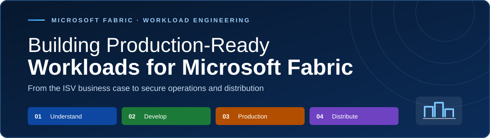
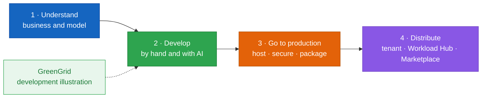

  

  <a href="https://fredgis.github.io/BookWorkload/"><b>Read online</b></a>
  &nbsp;·&nbsp;
  <a href="Building%20Production-Ready%20Workloads%20for%20Microsoft%20Fabric.pdf">PDF</a>
  &nbsp;·&nbsp;
  <a href="Building%20Production-Ready%20Workloads%20for%20Microsoft%20Fabric.md">Markdown</a>

# Building Production-Ready Workloads for Microsoft Fabric

> From the ISV business case and architecture to secure delivery, operations, and distribution.

This repository contains the Workload manuscript for a developer-focused Microsoft Fabric book. It is written for ISVs, software development companies, developers, and architects who want to bring an existing SaaS or PaaS into Fabric without moving their product logic into the customer's tenant.

The manuscript starts with the business case, then follows the workload lifecycle from local development to tenant assignment and public distribution. GreenGrid is the worked development illustration. Production and distribution stay product-neutral.

The official starter kit uses TypeScript and React for the publisher-hosted frontend. The server examples use Python.

> Content reviewed against Microsoft Learn and the official toolkit repositories on September 17, 2026. The review includes source inspection and static checks, not Fabric tenant or publishing execution.

## Read the manuscript

| Format | Where | What you get |
|--------|-------|--------------|
| Online (HTML) | https://fredgis.github.io/BookWorkload/ | Two tabs, the outline and the manuscript. Self-contained, syntax-highlighted, diagrams inline. |
| PDF | [Building Production-Ready Workloads for Microsoft Fabric.pdf](Building%20Production-Ready%20Workloads%20for%20Microsoft%20Fabric.pdf) | Cover page, colored Contents, PDF bookmarks, clickable links. |
| Markdown | [Building Production-Ready Workloads for Microsoft Fabric.md](Building%20Production-Ready%20Workloads%20for%20Microsoft%20Fabric.md) | The reviewed manuscript and code examples. |
| Outline | [Building Production-Ready Workloads for Microsoft Fabric - Outline.md](Building%20Production-Ready%20Workloads%20for%20Microsoft%20Fabric%20-%20Outline.md) | The detailed plan. |
| V1.0.0 rework log | [Building Production-Ready Workloads for Microsoft Fabric - Rework Log.md](Building%20Production-Ready%20Workloads%20for%20Microsoft%20Fabric%20-%20Rework%20Log.md) | T01 through T15 traceability, source decisions, validation scope, and residual maintenance rules. |

## How the manuscript is organized

Four movements follow the workload lifecycle. The first also explains why the model matters to an ISV or SDC: the workload becomes the Fabric-facing product surface, while the existing service and intellectual property remain in the publisher's cloud.

| Reading path | Sections | Outcome |
|---|---|---|
| **Fast track** | 0 → 2 → 5 → 6 → 9 | Follow the first workload path and connect the GreenGrid example |
| **Production track** | 10 through 17 | Turn the prototype into a hosted, secured, packaged, assigned, and supportable product |

GreenGrid is a small sustainability scorecard item. It shows the Dev Server and Dev Gateway loop, item definitions, separate OneLake data access, and an authenticated call to a publisher-hosted scoring service.

Three distinctions drive the current revision:

- Item definitions are control-plane parts. OneLake is the data plane.
- Frontend tokens are delegated and resource-specific. OBO happens in the backend.
- Workload Hub handles Fabric discovery and assignment, while Microsoft Marketplace provides the required public commercial listing.

## Chapter outline

### 0 · Before you begin

Scenario-specific prerequisites, a source-inspected first-run path with an explicit setup-script warning, and the common environmental failures to test before changing code.

### Understand

1. What a workload is, and why an ISV would build one
2. How a workload runs: architecture, the host, and one request
3. The manifest package: the contract with Fabric
4. Identity and access with Microsoft Entra

### Develop

5. The toolkit and the development environment
6. Building an item: editor, data, and capabilities
7. Developing with AI assistance
8. Diagnostics and debugging
9. Illustration: GreenGrid (development sample)

### Go to production

10. From developer mode to production
11. Hosting, domain, and identity
12. Security and compliance
13. Packaging, validation, and CI/CD
14. Patterns and anti-patterns

### Distribute

15. Make it available in your tenant
16. Publish across tenants: Workload Hub and Microsoft Marketplace
17. The post-publish lifecycle
18. Recap and next steps

### Appendices

Manifest-package limits, current setup and validation commands, AI guidance, Python service examples, release checks, primary references, and a quick reference.

## Files

- `index.html`: the manuscript served at the GitHub Pages site root (a copy of the named HTML file).
- `Building Production-Ready Workloads for Microsoft Fabric.html`: the self-contained web version, with the outline and manuscript as two tabs.
- `Building Production-Ready Workloads for Microsoft Fabric.pdf`: the print version with a cover, colored Contents, and bookmarks.
- `Building Production-Ready Workloads for Microsoft Fabric.md` and its `- Outline.md` companion: the manuscript and its outline.
- `Building Production-Ready Workloads for Microsoft Fabric - Rework Log.md`: the T01 through T15 audit trace and validation record for V1.0.0.
- `assets/`: the compact README banner and the GreenGrid screenshots.