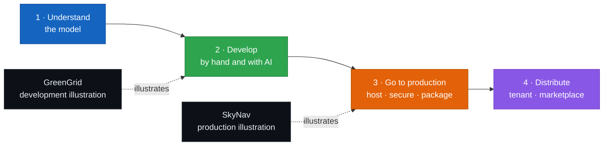

  

  <a href="https://fredgis.github.io/BookWorkload/"><b>Read online</b></a>
  &nbsp;·&nbsp;
  <a href="workload-chapter.pdf">PDF</a>
  &nbsp;·&nbsp;
  <a href="workload-chapter-full.md">Markdown</a>

# Building Microsoft Fabric Workloads with the Extensibility Toolkit

> Understand the model, develop a workload (with AI assistance), take it to production, and distribute it.

This repository holds one book chapter on building custom workloads for Microsoft Fabric with the Extensibility Toolkit. It follows a single workload through its whole life, from the first prototype running on your machine to a package published in a tenant and offered on the marketplace. The generic model is the spine of the chapter, and two real workloads, GreenGrid and SkyNav, illustrate the development and production phases and are explained where they appear.

The frontend code is TypeScript and React, because that is what Fabric loads in the iframe. The example services are written in Python.

## Read the chapter

| Format | Where | What you get |
|--------|-------|--------------|
| Online (HTML) | https://fredgis.github.io/BookWorkload/ | Two tabs, the plan and the full chapter. Self-contained, syntax-highlighted, diagrams inline. |
| PDF | [workload-chapter.pdf](workload-chapter.pdf) | Cover page, colored Contents, PDF bookmarks, clickable links. |
| Markdown | [workload-chapter-full.md](workload-chapter-full.md) | The full text, about 110,000 characters. |
| Outline | [workload-chapter-outline.md](workload-chapter-outline.md) | The detailed plan. |

## The plan, and how the samples fit

The chapter is four movements that mirror a workload's real life cycle. The general concepts carry the chapter, and each sample is dropped into the movement it illustrates, so the lesson and the illustration stay separate.

- GreenGrid is a small sustainability scorecard item. It illustrates Develop: the local Dev Server and Dev Gateway loop, an item editor, reading data from OneLake, and calling a scoring service.
- SkyNav is a balloon-fleet workload. It illustrates Go to production: cloud hosting, a verified domain, a secret-free production identity, and packaging. Repo: [github.com/fredgis/SkyNav](https://github.com/fredgis/SkyNav).

## Chapter outline

**0 · Before you begin**

**Understand**
1. What a workload is, and why you would build one
2. How a workload runs: architecture, the host, and one request
3. The manifest: the contract with Fabric
4. Identity and access with Microsoft Entra

**Develop**
5. The toolkit and the development environment
6. Building an item: editor, data, and capabilities
7. Developing with AI assistance
8. Diagnostics and debugging
9. Illustration: GreenGrid `← development sample`

**Go to production**
10. From developer mode to production
11. Hosting, domain, and identity
12. Security and compliance
13. Packaging, validation, and CI/CD
14. Patterns and anti-patterns
15. Illustration: SkyNav `← production sample`

**Distribute**
16. Make it available in your tenant
17. Publish to the marketplace for distribution
18. The post-publish lifecycle
19. Recap and next steps

**Appendices**: environment, manifest reference, token flows, and a release checklist.

## Files

- `index.html`: redirects the GitHub Pages site to the chapter.
- `workload-chapter.html`: the self-contained web version, with the plan and the full text as two tabs.
- `workload-chapter.pdf`: the print version with a cover, colored Contents, and bookmarks.
- `workload-chapter-full.md` and `workload-chapter-outline.md`: the chapter and its outline.
- `assets/`: the animated NFO banner and the GreenGrid and SkyNav screenshots.