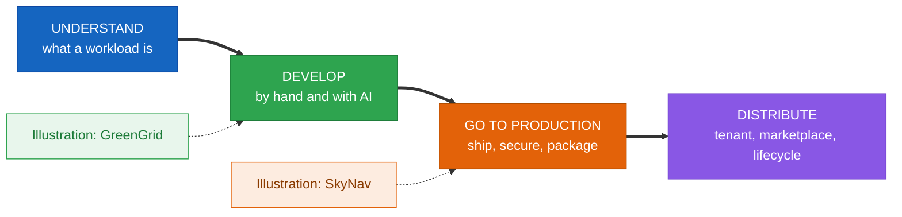
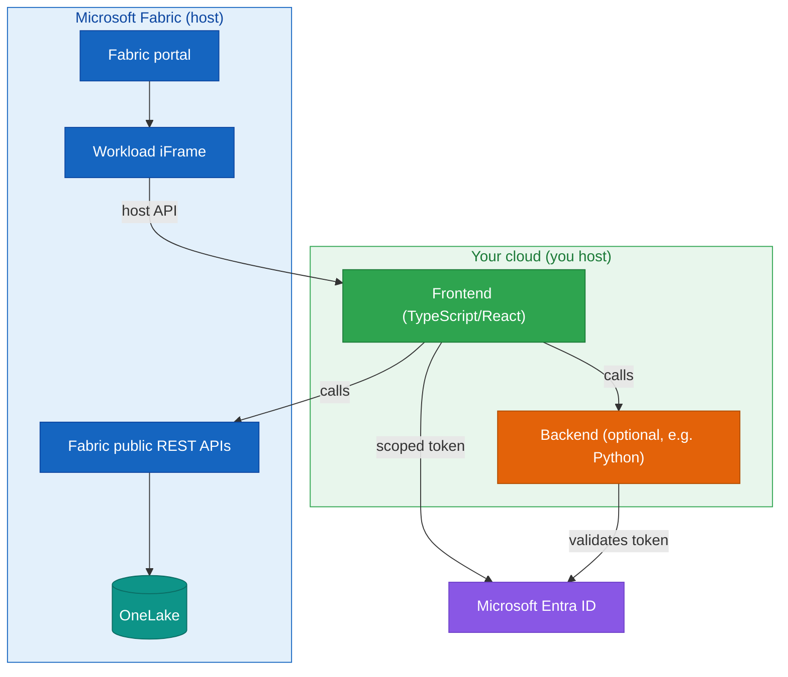
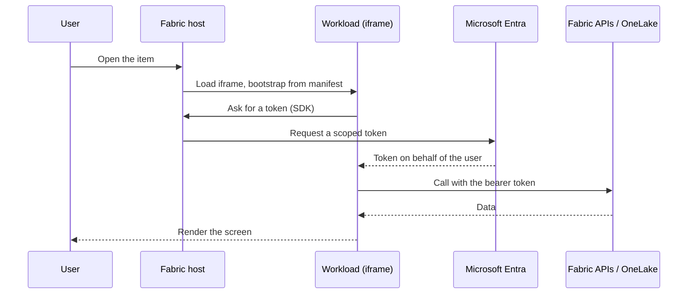
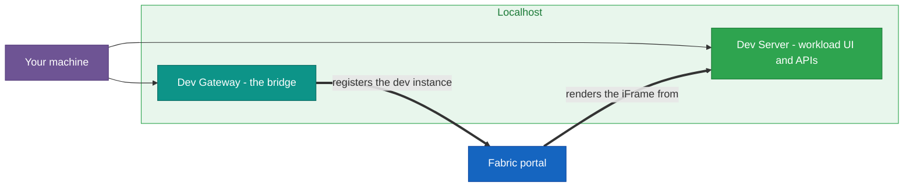
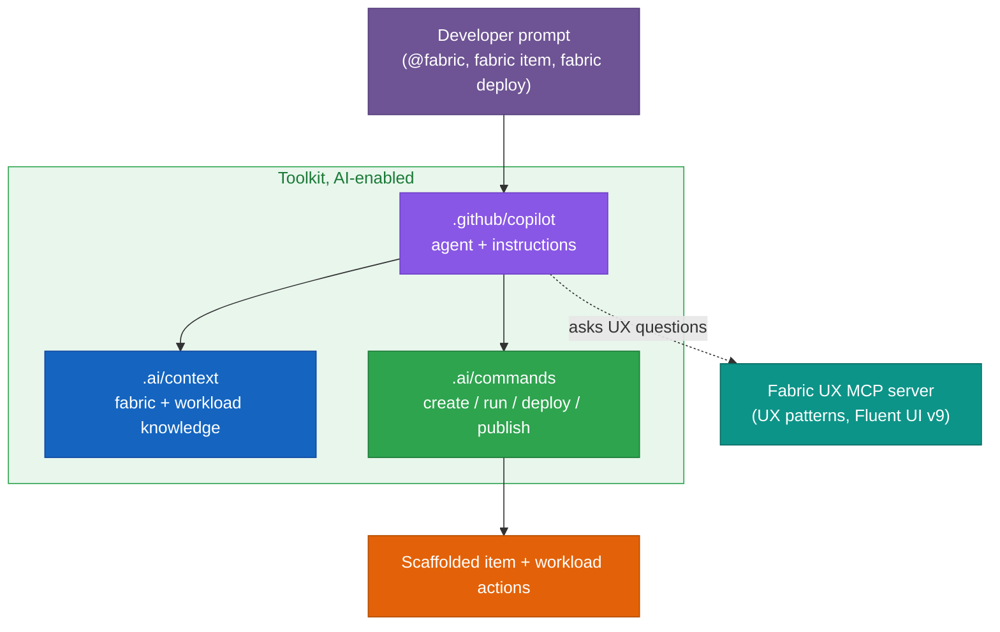
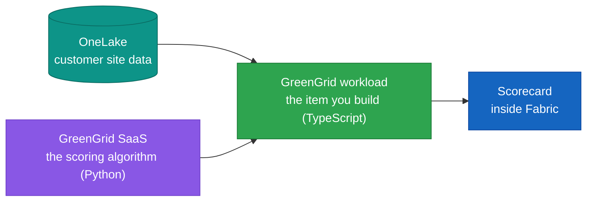
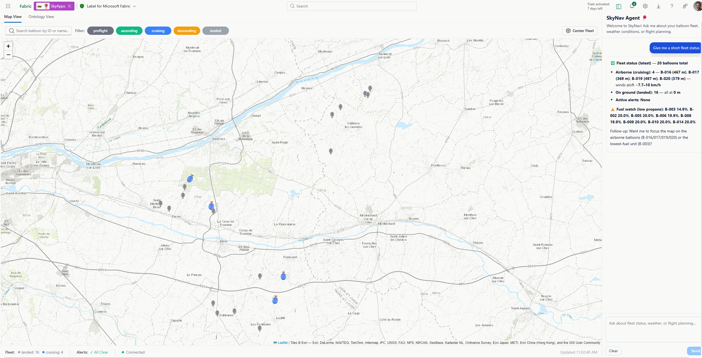
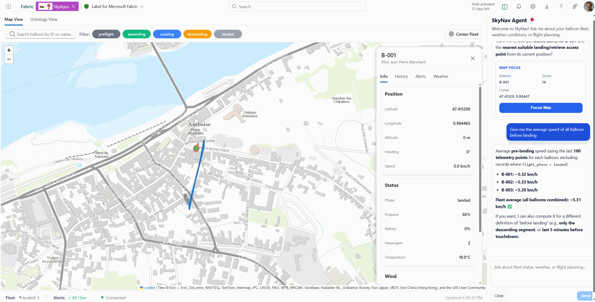
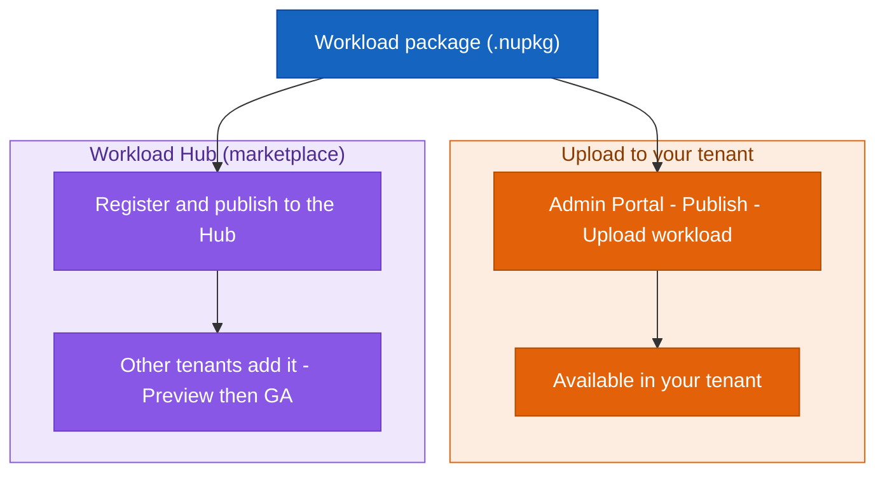

# Building Microsoft Fabric Workloads with the Extensibility Toolkit

### Understand the model, develop a workload (with AI assistance), take it to production, and distribute it

## Contents

**[0. Before you begin](#0-before-you-begin)**

- [A five-minute first run](#a-five-minute-first-run)

**Understand**

- **[1. What a workload is, and why you would build one](#1-what-a-workload-is-and-why-you-would-build-one)**
  - [1.1 What Fabric gives you, and what a workload adds](#11-what-fabric-gives-you-and-what-a-workload-adds)
  - [1.2 The toolkit, when to use it, and its limits](#12-the-toolkit-when-to-use-it-and-its-limits)
- **[2. How a workload runs: architecture, the host, and one request](#2-how-a-workload-runs-architecture-the-host-and-one-request)**
  - [2.1 The three parties and the host](#21-the-three-parties-and-the-host)
  - [2.2 Items as native artifacts](#22-items-as-native-artifacts)
  - [2.3 A request, step by step](#23-a-request-step-by-step)
- **[3. The manifest: the contract with Fabric](#3-the-manifest-the-contract-with-fabric)**
  - [3.1 Three manifests, one contract](#31-three-manifests-one-contract)
  - [3.2 Identity and naming](#32-identity-and-naming)
- **[4. Identity and access with Microsoft Entra](#4-identity-and-access-with-microsoft-entra)**
  - [4.1 The frontend-only model and the on-behalf-of token](#41-the-frontend-only-model-and-the-on-behalf-of-token)
  - [4.2 The Entra application and calling services](#42-the-entra-application-and-calling-services)

**Develop**

- **[5. The toolkit and the development environment](#5-the-toolkit-and-the-development-environment)**
  - [5.1 The Starter-Kit, the setup script, and the Entra app](#51-the-starter-kit-the-setup-script-and-the-entra-app)
  - [5.2 Dev Server, Dev Gateway, and the Hello World checkpoint](#52-dev-server-dev-gateway-and-the-hello-world-checkpoint)
- **[6. Building an item: editor, data, and capabilities](#6-building-an-item-editor-data-and-capabilities)**
  - [6.1 The item, its editor, and how it surfaces](#61-the-item-its-editor-and-how-it-surfaces)
  - [6.2 Reading data and storing state in OneLake](#62-reading-data-and-storing-state-in-onelake)
  - [6.3 Capabilities that make it feel native, and when to add a backend](#63-capabilities-that-make-it-feel-native-and-when-to-add-a-backend)
- **[7. Developing with AI assistance](#7-developing-with-ai-assistance)**
  - [7.1 The AI-enabled repository: shared context and runnable commands](#71-the-ai-enabled-repository-shared-context-and-runnable-commands)
  - [7.2 The Copilot agent, instructions, and the Fabric UX MCP server](#72-the-copilot-agent-instructions-and-the-fabric-ux-mcp-server)
  - [7.3 What it generates, and keeping it honest](#73-what-it-generates-and-keeping-it-honest)
- **[8. Diagnostics and debugging](#8-diagnostics-and-debugging)**
  - [8.1 Reading the chain, and the token and manifest boundaries](#81-reading-the-chain-and-the-token-and-manifest-boundaries)
  - [8.2 The Dev Gateway, the iframe boundary, and correlation](#82-the-dev-gateway-the-iframe-boundary-and-correlation)
- **[9. Illustration: GreenGrid](#9-illustration-greengrid)**
  - [9.1 What GreenGrid is](#91-what-greengrid-is)
  - [9.2 The scoring service, in Python](#92-the-scoring-service-in-python)
  - [9.3 Milestone 1: the workload calls the service](#93-milestone-1-the-workload-calls-the-service)
  - [9.4 Milestones 2 and 3: real data and a native screen](#94-milestones-2-and-3-real-data-and-a-native-screen)

**Go to production**

- **[10. From developer mode to production](#10-from-developer-mode-to-production)**
  - [10.1 What changes](#101-what-changes)
  - [10.2 What to verify across the transition](#102-what-to-verify-across-the-transition)
- **[11. Hosting, domain, and identity](#11-hosting-domain-and-identity)**
  - [11.1 Hosting, the verified domain, and the resource ID](#111-hosting-the-verified-domain-and-the-resource-id)
  - [11.2 A production identity without secrets](#112-a-production-identity-without-secrets)
- **[12. Security and compliance](#12-security-and-compliance)**
  - [12.1 Data stays in the tenant. Labels, DLP, and personal data](#121-data-stays-in-the-tenant-labels-dlp-and-personal-data)
  - [12.2 Secrets, telemetry, and monitoring](#122-secrets-telemetry-and-monitoring)
- **[13. Packaging, validation, and CI/CD](#13-packaging-validation-and-cicd)**
  - [13.1 The package and validation](#131-the-package-and-validation)
  - [13.2 Automating the pipeline](#132-automating-the-pipeline)
- **[14. Patterns and anti-patterns](#14-patterns-and-anti-patterns)**
  - [14.1 Patterns that hold up](#141-patterns-that-hold-up)
  - [14.2 Anti-patterns to avoid](#142-anti-patterns-to-avoid)
- **[15. Illustration: SkyNav](#15-illustration-skynav)**
  - [15.1 What SkyNav is, and how it is hosted](#151-what-skynav-is-and-how-it-is-hosted)
  - [15.2 SkyNav's production identity and path to a tenant](#152-skynavs-production-identity-and-path-to-a-tenant)

**Distribute**

- **[16. Make it available in your tenant](#16-make-it-available-in-your-tenant)**
  - [16.1 The Admin Portal versus the Workload Hub, and uploading](#161-the-admin-portal-versus-the-workload-hub-and-uploading)
  - [16.2 Internal publishing with Org.[Name]](#162-internal-publishing-with-orgname)
- **[17. Publish to the marketplace for distribution](#17-publish-to-the-marketplace-for-distribution)**
  - [17.1 The Workload Hub and the cross-tenant path](#171-the-workload-hub-and-the-cross-tenant-path)
  - [17.2 Review, compliance, and monetization](#172-review-compliance-and-monetization)
  - [17.3 Choosing a path](#173-choosing-a-path)
- **[18. The post-publish lifecycle](#18-the-post-publish-lifecycle)**
  - [18.1 Updates, migration, and deprecation](#181-updates-migration-and-deprecation)
  - [18.2 Monitoring, consent, rollback, and feature flags](#182-monitoring-consent-rollback-and-feature-flags)
- **[19. Recap and next steps](#19-recap-and-next-steps)**

**Appendices**

- [Appendix A: Manifest field reference](#appendix-a-manifest-field-reference)
- [Appendix B: Dev Server, Dev Gateway, and Workload Validator commands](#appendix-b-dev-server-dev-gateway-and-workload-validator-commands)
- [Appendix C: AI assistant reference](#appendix-c-ai-assistant-reference)
- [Appendix D: Python service reference](#appendix-d-python-service-reference)
- [Appendix E: Release and compliance checklist, diagnostics quick reference](#appendix-e-release-and-compliance-checklist-diagnostics-quick-reference)
- [Appendix F: Glossary and resources](#appendix-f-glossary-and-resources)
- [Appendix G: One-page cheat sheet](#appendix-g-one-page-cheat-sheet)

---

Microsoft Fabric ships with a fixed set of items: lakehouses, notebooks, pipelines, reports, and a few dozen more. For most analytics work that set is enough. It stops being enough the moment a team has a capability that belongs next to the data but has no home in the portal: a scoring service, a domain-specific authoring tool, an operational console wired to a particular industry. The Extensibility Toolkit closes that gap. It lets you add your own item types to Fabric so they behave like the built-in ones, while the code runs in your own cloud.

This chapter teaches the workload model in four steps, after a short list of prerequisites. First, what a workload is and how Fabric runs it. Second, how you build one: the toolkit, the local development loop, items, data, state, the AI assistant the toolkit ships with, and the diagnostics that keep all of it honest. Third, how you take a finished workload to production: what changes from developer mode, how you secure it, how you package and automate it. Fourth, how you put it in front of users and keep it running.

Two real workloads appear along the way, but only as illustrations. **GreenGrid** shows the development steps in practice, at the end of the Develop movement. **SkyNav** shows a production deployment, at the end of the Go to production movement. Neither is a reference architecture. Each isolates one concept per phase, and the chapter keeps the lesson and the illustration apart.

A word on languages before the first line of code. A workload's frontend is a web application, and in the toolkit that frontend is TypeScript and React, there is no way around it, because the frontend is what Fabric loads in the iframe and talks to through a browser host API. The interesting code is not all in the browser, though. The services a workload calls, a scoring engine, a token-validating backend, an ingestion job, a deployment script, run on your own infrastructure, and there the language is your choice. This chapter uses **Python** for those services wherever Python is the natural fit, because a great deal of the analytics and data tooling a Fabric team already owns is written in it. So you will see TypeScript in the browser and Python on the server, each where it belongs, and the chapter says which is which every time.



---

# 0. Before you begin

The chapter assumes a working environment and a little background, and naming them up front keeps the later sections from stopping to backfill.

> Note on freshness. The Extensibility Toolkit moves quickly, and parts of it are in preview. Command names, manifest fields, and documentation links shift between releases. Where this chapter gives a specific name or URL, read it as correct at the time of writing, and check it against the current toolkit repository and the Microsoft Learn documentation when something does not match.

You need an Azure subscription and a Microsoft Entra tenant where you can register an application, because every workload authenticates through an Entra app. You need a Fabric capacity, a paid one or a Trial, with a workspace to build in, and you need Fabric administrator access, because the developer settings and the package upload both live in the Admin Portal. On your machine you need Node.js for the frontend and the toolkit scripts, a recent Python for the services and tooling this chapter writes in it, PowerShell, and a code editor.

The chapter also assumes a few concepts rather than teaching them: web hosting and HTTPS, REST and JSON, OAuth and OpenID Connect tokens, iframe messaging through `postMessage`, and OneLake paths, the `Files` and `Tables` of a Lakehouse. Two roles run through the chapter, and they are different accounts: an administrator turns on developer mode and uploads the package, and a regular user creates and opens items. Keeping them straight saves confusion when a step that needs one is attempted as the other.

If you want to follow the Python examples, a single environment file covers them. None of the packages are exotic. They are the standard Azure, web, and data libraries.

```bash
python -m venv .venv
# Windows:  .venv\Scripts\Activate.ps1
# macOS/Linux:  source .venv/bin/activate
pip install fastapi "uvicorn[standard]" pydantic \
            pyjwt[crypto] requests \
            azure-identity azure-storage-file-datalake \
            pandas pytest
```

`fastapi` and `uvicorn` run the small services, `pydantic` validates their inputs, `pyjwt[crypto]` validates Fabric tokens, `azure-identity` and `azure-storage-file-datalake` reach Azure and OneLake, `pandas` parses tabular data, and `pytest` tests the algorithm. Each is introduced where it is first used.

A practical note on the snippets: the TypeScript ones run in the browser through the toolkit SDK, and the Python ones run in a service you host and is called over HTTPS. The chapter labels each at the point of use, so you never have to guess which side of the iframe a piece of code lives on.

### A five-minute first run

If you would rather see something on screen before reading the model, this is the shortest path from an empty folder to a working item open inside Fabric. It is the same Hello World the rest of the chapter builds on, and section 5 explains every step it runs through here.

```bash
# 1. clone the Starter-Kit and install the frontend
git clone https://github.com/microsoft/fabric-extensibility-toolkit
cd fabric-extensibility-toolkit

# 2. one-time setup: registers the Entra app and writes your config
cd scripts/Setup
./Setup.ps1 -WorkloadName "Org.YourWorkload"

# 3. two terminals: serve the workload, then bridge Fabric to it
cd ../Run
./StartDevServer.ps1     # terminal 1: the frontend and its dev APIs
./StartDevGateway.ps1    # terminal 2: the bridge from the portal to localhost
```

In the portal, an administrator turns on developer mode in the Admin Portal, and you switch your workspace to a Fabric or Trial capacity and enable Fabric Developer Mode. Open New item, create the Hello World the kit ships, and its editor opens inside Fabric, served from your machine. When that screen renders, the whole chain works and you are ready for the rest of the chapter. If it does not, section 8 turns the blank screen into a specific cause.

---

# Understand

## 1. What a workload is, and why you would build one

Most teams meet Fabric with a tool they already rely on: a scoring model, an authoring screen, an operational console the business runs on. The question is rarely whether Fabric can hold the data, it already can, but whether that tool should stay a separate website users log into on the side, or become something that lives inside Fabric like any other item. A workload is how you choose the second answer. The rest of this section is about what that buys you, and about the test that tells you when a lighter extensibility point is the better fit.

### 1.1 What Fabric gives you, and what a workload adds

Fabric is built around OneLake, a single storage layer shared by every workspace in a tenant. Data written by a pipeline is readable by a notebook, a report, or a SQL endpoint without copying it anywhere. Around OneLake sit *items*, the lakehouses, warehouses, and reports that users create inside *workspaces*, which carry the permissions and the capacity that pays for compute. Every item is governed the same way, appears in the same lineage view, and is shared with the same controls. That consistency is the thing a workload plugs into. You are not building an island next to Fabric. You are adding a room to a house whose plumbing, locks, and address book already work.

A workload extends that model rather than sitting beside it. It is a web application that you host, which Fabric renders inside the portal in an iframe, loaded according to a manifest and handed Microsoft Entra tokens through a host API. The capability you add becomes a new kind of *item*: it lives in a workspace, inherits the workspace's access control, appears in search and lineage, and takes part in deployment pipelines, exactly like a built-in item. Its data is stored in OneLake and its metadata flows through Fabric's public APIs. An embedded website gives you none of that. A workload gives you all of it for the price of declaring it correctly.

The difference changes how you scope a project. An embedded website that happens to live in an iframe inside Fabric still has its own identity system, its own storage, its own sharing model, and its own audit story, and every one of those is a thing you build, operate, and defend in a security review. A workload inherits the platform's answers to all four. When a customer's security team asks who can see the data, the answer is "the workspace's access control, the same as every other item." When they ask where the data lives, the answer is "OneLake, in the customer's own capacity." When they ask how it is shared, the answer is "Fabric sharing." You did not build those answers, and you do not maintain them. That is the real return on declaring an item correctly: you trade a pile of undifferentiated infrastructure for a manifest.

### 1.2 The toolkit, when to use it, and its limits

The Extensibility Toolkit is the supported way to build these workloads. It provides a Starter-Kit you clone to get a working project in minutes, an SDK that hides the mechanics of talking to the host, and a local development environment that lets Fabric render code running on your laptop. It is the current evolution of the older Workload Development Kit, and it lowers the entry cost: most of what used to require bespoke infrastructure now comes from a script and a couple of long-running processes.

It fits when you want a custom item and experience that uses Fabric's identity, governance, storage, and APIs, domain-specific authoring tools, governance consoles, integrations, operational dashboards. Knowing its edges saves you from fighting it. The toolkit does not run your server code inside the Fabric runtime. Your backend, if you have one, runs in your own cloud and Fabric calls it over the network. It does not modify the Fabric runtime or let a workload reach past the iframe, and it does not bypass capacity quotas. And it is not available on Power BI Pro capacities.

When a need falls outside the model, other extensibility points exist, and reaching for the right one is part of designing well. A custom visualization inside an existing report is a Power BI custom visual, not a workload. A rule that watches a stream and reacts when a threshold is crossed is a job for Data Activator. Serverless processing in the data plane, transforming files as they land, enriching a table on a schedule, is better served by Azure Functions behind a Data Pipeline than by a workload backend. A workload is the answer when you need a *custom item and experience in the portal*, with its own editor and its own lifecycle, and not when you need one of those other things. A quick test: if the thing you are building would still make sense as a tile in someone else's report, it is probably a visual. If it would make sense as a scheduled transformation, it is probably a function. If a user would *create and open it* as their own object in a workspace, it is a workload.

That test is not academic. Teams routinely start to build a workload for something that wants to be a visual or a function, and discover halfway in that they are fighting the model, reimplementing a chart framework, or hand-rolling a scheduler the platform already runs. Spending the first hour deciding which extensibility point fits saves the next month.

## 2. How a workload runs: architecture, the host, and one request

### 2.1 The three parties and the host

Three parties are in play whenever a workload is open. The Fabric frontend is the *host*: it renders the workload as an iframe and exposes a secure host API into that iframe so the workload can work with the platform while staying isolated. Your *workload web application*, the TypeScript and React frontend, hosted in your cloud, implements the routes and screens declared in its manifest and uses the tokens the host provides. The *Fabric service* exposes public REST APIs for reading and writing metadata and content, performing item operations, and reaching OneLake.



The host bootstraps the workload from its manifest: the entry points, routes, and capabilities it declares decide which screen loads. Through the host API the workload reads the current theme and follows it, drives navigation inside the portal, and raises notifications in Fabric's own surface. In code, the frontend receives a client object from the SDK and uses it for exactly these things:

```ts
import { WorkloadClientAPI } from "@ms-fabric/workload-client";

// The host hands the workload a client; the workload talks to Fabric only through it.
export async function onItemOpened(client: WorkloadClientAPI, itemId: string) {
  const theme = await client.theme.get();            // follow the portal theme
  await client.navigation.onNavigate(() => true);    // participate in navigation
  await client.notification.open({                   // notify in Fabric's own surface
    title: "Loaded",
    message: `Item ${itemId} is ready.`,
  });
}
```

The iframe boundary is the isolation model, by design. Your code cannot reach into Fabric's page, and Fabric does not reach into yours. Everything crosses through the host API, which keeps the contract explicit and is the reason the manifest matters so much. A workload that respects this reads the theme rather than hard-coding colors, asks the host to navigate rather than manipulating the browser history directly, and raises notifications through the client rather than rendering its own toast in a corner. The payoff is that the workload keeps feeling native as Fabric evolves, because it depends on the contract and not on the portal's internals.

The host API is also the seam at which Fabric does work on the workload's behalf that the workload could not do safely itself: minting a scoped token, opening a system dialog, writing to a notification surface shared with every other item. Treating it as the single, deliberate channel between the two sides is therefore not a limitation to route around but the very thing that lets the workload be both sandboxed and native at once.

### 2.2 Items as native artifacts

The item is the unit that makes a workload feel native. When your workload defines an item type, instances of it can be created, read, updated, and deleted through Fabric APIs. They obey the workspace's access control. They appear in search and lineage, and they take part in deployment pipelines. The toolkit also lets you store an item's definition, its configuration and whatever else describes that instance, directly in OneLake, in a hidden folder that end users do not see. Because the state is stored as part of the item, it travels with the item through sharing and deployment. An item is therefore not just a screen. It is a governed object with persisted state.

That last property has consequences a first-time builder rarely anticipates. Because the state is part of the item and lives in OneLake, you do not run a database to hold per-item configuration, you do not back one up, and you do not reconcile its access control with the workspace's. When a user shares the item, the state goes with it. When a deployment pipeline promotes the item from a development workspace to production, the state is promoted too. The item is self-describing, and the workload is the code that gives that self-describing object behavior. Designing with this in mind, putting genuinely item-scoped state into the item definition rather than into a side store, is one of the habits that separates a workload that ages gracefully from one that accumulates operational debt.

This is also why the question "where should this state live?" has a default answer. If the state describes a particular instance of the item, its configuration, its last result, the user's choices for it, it belongs in the item definition, where Fabric carries it. Only state that is genuinely shared across items or users, or too large to belong to a single item, justifies a store of your own, with all the operational weight that store then carries.

### 2.3 A request, step by step

The pieces are easier to hold once you follow a single request through them. A user opens an item. The host loads the iframe and bootstraps the workload from its manifest. The workload asks the SDK for a token, which the host obtains from Entra on the user's behalf. The workload calls a Fabric API or OneLake with that token, the data comes back, the screen renders. Nothing in that path uses a password, and nothing copies the user's data outside their tenant.



Every later concern (a manifest that must declare the route, a scope the token must carry, a boundary the iframe enforces) is a step in this sequence. The diagnostics section returns to it boundary by boundary, and the order is easy to keep: open, bootstrap, token, call, render. When something does not work, the fastest first question is "which step did it reach?" A blank editor failed at bootstrap. A refused API call failed at the token or the call. A screen that loads but shows nothing reached render with no data. Locating the failure on this line is most of the work of fixing it.

## 3. The manifest: the contract with Fabric

### 3.1 Three manifests, one contract

A workload is described by a set of manifests, and together they are the contract between your web application and Fabric. The *workload manifest* declares the workload's identity, its hosting mode, and the endpoints Fabric should load. The *product manifest* describes how the workload presents itself: the create cards, the home page entry, and the storefront details. The *item manifests* describe each item type, its name, category, editor route, settings, and lifecycle hooks. A generic workload manifest is short:

```xml
<WorkloadManifestConfiguration SchemaVersion="2.0.0">
  <Workload WorkloadName="Org.YourWorkload" HostingType="FERemote">
    <Version>1.0.0</Version>
    <RemoteServiceConfiguration>
      <CloudServiceConfiguration>
        <AADFEApp><AppId>00000000-0000-0000-0000-000000000000</AppId></AADFEApp>
        <Endpoints>
          <ServiceEndpoint>
            <Name>Frontend</Name>
            <Url>https://your-frontend.example.com</Url>
          </ServiceEndpoint>
        </Endpoints>
      </CloudServiceConfiguration>
    </RemoteServiceConfiguration>
  </Workload>
</WorkloadManifestConfiguration>
```

The product manifest is where the workload becomes discoverable. It declares the cards a user sees in the create surfaces and the item types the home page recommends:

```json
{
  "name": "Product",
  "displayName": "Your Workload",
  "createExperience": {
    "cards": [
      {
        "title": "Forecast",
        "description": "Create a forecast item.",
        "itemType": "Forecast",
        "availableIn": ["home", "create-hub", "workspace-plus-new"]
      }
    ]
  },
  "homePage": { "recommendedItemTypes": ["Forecast"] }
}
```

And an item manifest names a single type and points at the editor route the host should open for it:

```json
{
  "name": "Forecast",
  "displayName": "Forecast",
  "editor": { "path": "/forecast-editor" },
  "supportedInMonitoringHub": true
}
```

All three manifests are declarative and small. They tell Fabric what exists and where to find it, and hold none of the workload's logic. Each carries a version, and the version matters at delivery time: Fabric refuses a package whose version already exists, so a release always bumps it. The mental model to keep is that the manifests are the *interface* and your code is the *implementation*: anything Fabric needs to know to show, route to, and govern your item is in the manifest, and everything about what the item actually does is in the application the endpoint serves.

### 3.2 Identity and naming

The workload name is the identifier Fabric uses to register the workload, and its form is a decision about distribution that you make early, because it is baked into the package.

| Aspect | `Org.[Name]` (internal) | `[Publisher].[Workload]` (marketplace) |
|---|---|---|
| Audience | Your own tenant | Other tenants |
| Registration | None, just upload | Name reserved permanently on first upload |
| Requirements | General requirements only | Plus workload, item, and attestation requirements, and review |
| Verified Entra app | Custom domain verification | Plus Microsoft publisher verification |
| Rollout | Upload and enable | Selected tenants, then Preview, then GA |
| Name length | No special limit | Workload portion at most 32 characters |

A marketplace name is reserved permanently when you confirm it on the first upload, so a rename later is a migration, not an edit. Choosing the form up front, even if you start internal and move to the marketplace later, saves a painful change at the worst time. If there is any chance the workload will one day be distributed, it is cheaper to pick a publisher-and-workload name now and keep it through the internal phase than to rename across a package, an Entra app, and every tenant that already installed it.

There is a quieter reason to settle the name early, too. It threads through more than the package: it is in the Entra application's identifiers, in the URLs of the resource ID, and in every tenant's record of what they installed. Renaming is therefore not a string change but a coordinated migration across all of those, the kind of work no one wants to schedule once real users depend on the workload.

## 4. Identity and access with Microsoft Entra

### 4.1 The frontend-only model and the on-behalf-of token

The toolkit uses a frontend-first model, simpler than the backend-heavy designs older workloads needed. The frontend calls Fabric APIs, Azure services, and external applications directly, and a single token acquired through the toolkit can authenticate against several Entra-secured services, so you are not juggling a credential for each. Consent is handled by the platform, which prompts the user when it needs to. The token the frontend obtains is an on-behalf-of token: it represents the signed-in user, which is what lets a workload read the user's OneLake data as that user, seeing exactly what the user may see and copying nothing, and create or read other Fabric items under the same identity.

```ts
import { WorkloadClientAPI } from "@ms-fabric/workload-client";

// Acquire a user token through the host and call a Fabric API with it.
export async function listWorkspaces(client: WorkloadClientAPI): Promise<unknown> {
  const token = await client.auth.acquireAccessToken({
    // The toolkit selects the right scopes; one token serves several services.
  });
  const res = await fetch("https://api.fabric.microsoft.com/v1/workspaces", {
    headers: { Authorization: `Bearer ${token.accessToken}` },
  });
  if (!res.ok) throw new Error(`Fabric API ${res.status}`);
  return res.json();
}
```

The single most important property of this model is that the workload never holds the user's credentials and never copies the user's data. It borrows the user's identity for the duration of a call. Everything downstream, what data the workload can read, which items it can touch, which Azure services it can reach, is bounded by what that user is allowed to do, enforced by Entra, not by code you wrote. When you design a feature, the question is therefore not "how do I get access to this data" but "does the signed-in user have access to this data", and if they do, the on-behalf-of token already carries it.

This inversion, from "how do I get access" to "does the user have access", is also what keeps a workload out of trouble in a review. There is no service principal hoarding broad rights to customer data, no standing credential to leak, no copy of the data to account for. The workload is, at any instant, exactly as privileged as the person using it, and not one permission more.

### 4.2 The Entra application and calling services

Behind the token flow is an Entra application registration. Under *Expose an API*, you preauthorize Microsoft Power BI (application ID `871c010f-5e61-4fb1-83ac-98610a7e9110`) so Fabric can integrate with your workload, and you add scopes for any APIs your workload exposes, typically separate `data.read` and `data.write` scopes so read and write are not the same grant. Under *API permissions*, the mandatory entry is `Fabric.Extend` on the Power BI Service, alongside the scopes for any Azure or third-party services the workload calls. The redirect URI is the frontend with `/close` appended, and the application ID URI matches your verified domain.

When a workload runs its own backend, the backend does not trust the token it receives, it validates it. This is the first place Python earns its keep in this chapter. A small FastAPI dependency validates the bearer token against Entra's published JWKS keys, checking the signature, the audience, the issuer, and the scope, so a token minted for reading cannot be used to write:

```python
# auth.py - validate a Fabric/Entra bearer token in a Python backend.
import os
import jwt                      # PyJWT
from jwt import PyJWKClient
from fastapi import Header, HTTPException

TENANT_ID = os.environ["TENANT_ID"]
# The audience is your workload's Application ID URI (must match the token's 'aud').
AUDIENCE = os.environ["API_AUDIENCE"]          # e.g. api://your-frontend.example.com
ISSUER = f"https://login.microsoftonline.com/{TENANT_ID}/v2.0"
JWKS_URL = f"https://login.microsoftonline.com/{TENANT_ID}/discovery/v2.0/keys"

_jwks = PyJWKClient(JWKS_URL)                   # caches signing keys

def require_scope(required: str):
    def dependency(authorization: str = Header(...)) -> dict:
        if not authorization.startswith("Bearer "):
            raise HTTPException(401, "Missing bearer token")
        token = authorization.split(" ", 1)[1]
        try:
            signing_key = _jwks.get_signing_key_from_jwt(token).key
            claims = jwt.decode(
                token, signing_key, algorithms=["RS256"],
                audience=AUDIENCE, issuer=ISSUER,
            )
        except jwt.PyJWTError as exc:
            raise HTTPException(401, f"Invalid token: {exc}") from exc
        # Scope claim is space-delimited; a read token cannot perform a write.
        scopes = claims.get("scp", "").split()
        if required not in scopes:
            raise HTTPException(403, f"Scope '{required}' required")
        return claims
    return dependency
```

Used on a route, it makes the access rule explicit at the edge of the service:

```python
from fastapi import FastAPI, Depends
from auth import require_scope

app = FastAPI()

@app.get("/forecasts")
def list_forecasts(claims: dict = Depends(require_scope("data.read"))):
    user = claims.get("oid")     # the signed-in user's object id
    return {"user": user, "forecasts": []}
```

Identity is only half of access. What the workload is allowed to do with the data it reaches (sensitivity labels, residency, personal data) is the governance question section 12 takes up, and reading it before you design anything that touches customer data saves trouble later.

---

# Develop

## 5. The toolkit and the development environment

### 5.1 The Starter-Kit, the setup script, and the Entra app

Development starts by cloning the toolkit's Starter-Kit, which lands a project with the workload's web application and its manifests alongside a set of setup and run scripts. A single setup script does the groundwork: it creates the Entra application, writes the environment files, and downloads the Dev Gateway, asking you to sign in and pick the workspace the workload will run in.

```bash
git clone https://github.com/microsoft/fabric-extensibility-toolkit
cd fabric-extensibility-toolkit/scripts/Setup
./Setup.ps1 -WorkloadName "Org.YourWorkload"
```

An Entra app is created even though development is local, for a concrete reason: the Dev Gateway only routes Fabric to your machine. It does not provide identity. The workload still authenticates through Entra, and the app registration is what lets it receive Fabric tokens and acquire the on-behalf-of token it needs to read OneLake. A common early misconception is that local development is somehow "offline" or unauthenticated, it is not. Every token the workload uses on your laptop is a real Entra token for your real identity, scoped by the real app registration. The only thing local about local development is where the frontend is served from.

Knowing what the setup script leaves behind helps, because those files are where most early friction lives. It writes the environment files that name the workspace, the workload, and the Entra app, and those values are what the Dev Gateway reads when it registers your dev instance. When the portal does not show your workload, the cause is almost always one of these files disagreeing with the portal, a different workspace, a stale app id, a workload name that does not match the one you set, rather than anything in the code. Reading the environment files is the first move when the gateway and the portal seem to be talking about different workloads, and it is a faster move than re-reading your own source.

### 5.2 Dev Server, Dev Gateway, and the Hello World checkpoint

Two long-running processes drive local development, in two terminals. The Dev Server serves the workload's UI and APIs from localhost. The Dev Gateway connects the Fabric portal to that localhost, so the portal can render code that never leaves your machine.

```bash
# Terminal 1 - the frontend and its dev APIs
cd scripts/Run
./StartDevServer.ps1
```

```bash
# Terminal 2 - the bridge from the Fabric portal to your localhost
cd scripts/Run
./StartDevGateway.ps1
```



On the Fabric side, an administrator enables the developer tenant settings and each developer turns on Fabric Developer Mode, which is what lets the portal pick up the dev instance the gateway registers. The workspace has to be on a Fabric or Trial capacity. Before building anything of your own, prove the chain: the toolkit ships a Hello World item, and when its editor opens inside the portal, served from your machine, the whole path is working. This is the checkpoint to return to whenever something downstream surprises you, because it separates the plumbing from your code. Spending five minutes confirming Hello World renders before writing a line is not a detour. It is the cheapest insurance in the whole development loop, because every later problem can then be classified instantly as "before my code" or "in my code."

It is also the fastest way to keep a team unblocked. When a colleague reports that the workload will not load, the first question is whether Hello World loads for them: if it does, the problem is in the branch they are on. If it does not, the problem is their environment, Developer Mode off, a stopped terminal, the wrong capacity, and not the code at all. One question, and the search space halves.

## 6. Building an item: editor, data, and capabilities

### 6.1 The item, its editor, and how it surfaces

A new item type starts from a generator that creates the item's folder and a small set of components, and the toolkit is opinionated about what those components are. An item is built from a definition that holds its data and state, an editor that hosts the experience, an empty view for a freshly created item, a default view for an item with content, and a ribbon for the toolbar. The definition is a plain TypeScript interface:

```ts
// ForecastItemDefinition.ts - the item's data and state, stored in OneLake.
export interface ForecastItemDefinition {
  horizonDays: number;
  source: "seed" | "onelake";
  lastRunIso?: string;
}

export const DEFAULT_FORECAST: ForecastItemDefinition = {
  horizonDays: 14,
  source: "seed",
};
```

Item creation itself is not something you build: Fabric provides a standard creation control, and your item plugs into it, so the choice of workspace, the sensitivity label, and the shared settings are handled for you. The editor is organized around views, and a small amount of wiring decides which one shows: the editor route is registered in the application's router so the host's navigation matches a component, and the editor is told which view to open first so it does not start blank.

```tsx
// App.tsx - register the editor route so the host's navigation matches a component.
<Route path="/forecast-editor/:itemObjectId">
  <ForecastItemEditor workloadClient={workloadClient} />
</Route>
```

Saving the item writes its definition back to OneLake through the SDK, which is the same mechanism that makes the state travel with the item:

```ts
import { WorkloadClientAPI } from "@ms-fabric/workload-client";
import { ForecastItemDefinition } from "./ForecastItemDefinition";

export async function saveForecast(
  client: WorkloadClientAPI, itemId: string, def: ForecastItemDefinition,
) {
  await client.itemDefinition.save(itemId, def);   // persisted in OneLake, hidden from users
}
```

For the type to appear in the portal, a few declarations have to agree: the item is listed among the packaged item types in the environment configuration, its display names live in the locale file, an icon represents it, and the product manifest carries a create card and a home page entry that name the same type. With those aligned, you create one instance in your dev workspace and keep it open: each save hot-reloads the Dev Server and re-renders it.

That hot-reload loop is the heart of the inner development cycle, and keeping it tight pays off. With the instance open in the portal and the Dev Server watching, a change to the editor is on screen in seconds, which turns building a screen into an edit-and-see rhythm rather than a rebuild-and-redeploy slog. The discipline that pays off is to keep one instance open and iterate on it, rather than creating a fresh item for every change.

### 6.2 Reading data and storing state in OneLake

A workload usually needs the user's data, and the cleanest way to get it is to read it in place from OneLake as the signed-in user, with the on-behalf-of token. A small habit pays off: keep the data source behind a function rather than hard-wiring it, so a screen that asks a `getData` function for its input does not care whether the data is seed data in development or a OneLake file in production, and swapping one for the other is a single change.

In the browser, the frontend reads a OneLake file with the user's token:

```ts
// Read a CSV from OneLake in the frontend, as the signed-in user.
export async function readSitesCsv(
  client: WorkloadClientAPI, workspaceId: string, lakehouseId: string,
): Promise<string> {
  const token = await client.auth.acquireAccessToken({});
  const url =
    `https://onelake.dfs.fabric.microsoft.com/${workspaceId}/` +
    `${lakehouseId}/Files/sites.csv`;
  const res = await fetch(url, {
    headers: { Authorization: `Bearer ${token.accessToken}` },
  });
  if (!res.ok) throw new Error(`OneLake ${res.status}`);
  return res.text();
}
```

When the reading and the work belong on a server, because the file is large, the transformation is heavy, or the logic is shared with a pipeline, the same read is natural in Python, where `pandas` turns the file into a frame in one line. The backend forwards the user's token to OneLake, so the read still happens as the user:

```python
# onelake.py - read a OneLake CSV in a Python backend, as the calling user.
import io
import pandas as pd
import requests

ONELAKE = "https://onelake.dfs.fabric.microsoft.com"

def read_sites(user_token: str, workspace_id: str, lakehouse_id: str) -> pd.DataFrame:
    url = f"{ONELAKE}/{workspace_id}/{lakehouse_id}/Files/sites.csv"
    resp = requests.get(url, headers={"Authorization": f"Bearer {user_token}"}, timeout=30)
    resp.raise_for_status()
    return pd.read_csv(io.StringIO(resp.text))
```

The item's own state, a threshold, a layout, a label, is stored in the item's definition, persisted in OneLake in a hidden folder tied to the item, the way `saveForecast` did above. Because the state is part of the item, it travels with sharing and deployment rather than living in a separate database you run, which is what lets Fabric govern it like any built-in artifact. The line to hold is the line between *the user's data* and *the item's state*: the user's data is read in place and never copied. The item's state is small, item-scoped, and saved into the item. Keeping the two apart, not stuffing user data into the item definition, not scattering item state into an external store, is what keeps a workload both correct and easy to govern.

### 6.3 Capabilities that make it feel native, and when to add a backend

A handful of features close the gap with built-in items. A settings dialog gives the item a configuration surface that opens the way every Fabric item's settings open. An About page describes what it is. Localization lets text follow the user's language through the locale files the manifest already references, and the item can surface in Fabric's monitoring experiences. Each is a declaration plus a small component.

A thin, frontend-only workload is a fine place to start, but the toolkit supports more when you need it. A workload can define *jobs*, units of work that run and report progress on infrastructure you operate, and this is a second natural home for Python, because a job is exactly the kind of batch computation a data team already writes in it. A long forecast run, an enrichment pass, a nightly recompute: the frontend asks the host to start the job, the host calls your backend, and your backend does the work and reports progress. It can expose *remote endpoints* with an endpoint resolution service so the host finds the right backend per environment, subscribe to *item lifecycle notifications* to react to create, update, and delete, and relax the iframe where a screen genuinely needs a capability the sandbox restricts. These are what you reach for when a workload grows past a single screen, and the rule of thumb is to add a backend only when a feature genuinely needs server-side credentials, heavy compute, or shared logic, because every service you add is a thing you then host, secure, and monitor.

A job is the clearest case, and it is short to show. The frontend asks the host to start the job, the host calls your backend. The backend runs the work on its own infrastructure and reports progress the frontend can poll. In Python, a background task and a small status store are enough to make the pattern concrete:

```python
# jobs.py - a server-side job the workload starts and polls.
from fastapi import FastAPI, BackgroundTasks
from uuid import uuid4

app = FastAPI()
_status: dict[str, dict] = {}

def run_forecast(job_id: str, horizon_days: int) -> None:
    _status[job_id] = {"state": "running", "progress": 0}
    for step in range(horizon_days):
        ...  # compute one day of the forecast
        _status[job_id] = {"state": "running",
                           "progress": round((step + 1) / horizon_days * 100)}
    _status[job_id] = {"state": "succeeded", "progress": 100}

@app.post("/jobs/forecast")
def start(horizon_days: int, tasks: BackgroundTasks) -> dict:
    job_id = str(uuid4())
    _status[job_id] = {"state": "queued", "progress": 0}
    tasks.add_task(run_forecast, job_id, horizon_days)
    return {"jobId": job_id}

@app.get("/jobs/{job_id}")
def status(job_id: str) -> dict:
    return _status.get(job_id, {"state": "unknown"})
```

The frontend starts it through the host and shows the progress the status endpoint reports, so a long computation does not block the screen and a user can leave and come back to it. The same shape, start, run elsewhere, poll, is how a workload stays responsive while real work happens on a server you own.

## 7. Developing with AI assistance

The toolkit is an AI-enabled repository. Beyond the source and the Hello World sample, it ships the context, the runnable procedures, the agent, and the design-system knowledge an AI assistant needs to scaffold and operate a workload alongside you. The result is that much of sections 5 and 6, creating an item, wiring its editor, running and deploying the workload, can be driven from a prompt, while the boundaries from section 8 still decide whether the result is correct.

> Note on freshness. The AI surface of the toolkit, the agent name, the activation keywords, the exact command files, moves faster than the rest of the platform. Read the specific names in this section as a snapshot and the shape as the lesson: a shared context folder, a set of runnable commands, an agent that reads both. When a keyword here no longer matches what the repository ships, the repository is right. The capabilities outlast their current spelling.



### 7.1 The AI-enabled repository: shared context and runnable commands

The foundation is a tool-agnostic `.ai/` folder, written in plain markdown so any assistant that can read the workspace can use it. Its `context/` files carry the knowledge an assistant lacks by default: a Fabric platform overview, and a workload-specific guide to the project's structure and conventions. Its `commands/` files are step-by-step procedures the assistant follows to perform a task rather than improvise one. They cover the item operations, create, delete, rename, and the workload lifecycle, run, update, deploy, publish, and clean.

```text
.ai/
├── context/
│   ├── fabric.md            # the platform: OneLake, items, capacities, APIs
│   └── fabric-workload.md   # this project: structure and conventions
└── commands/
    ├── item/                # createItem, deleteItem, renameItem
    └── workload/            # runWorkload, updateWorkload, deployWorkload,
                             # publishWorkload, cleanWorkload
```

Asking the assistant to "create an item called Forecast" sends it to the create-item procedure, which scaffolds the canonical file set and wires the manifest. Asking it to run or deploy the workload sends it to the matching procedure. Because the guidance is data in the repository, not a feature of one editor, the same `.ai/` folder serves GitHub Copilot, Cursor, and other assistants equally, a deliberate choice that keeps the AI investment from being locked to one tool.

### 7.2 The Copilot agent, instructions, and the Fabric UX MCP server

On top of the generic layer sits a GitHub Copilot layer. A `copilot-instructions.md` extends the `.ai/` guidance, its own rule is to read the generic instructions first, then apply the Copilot specifics, and a custom agent, the *Microsoft Fabric Development Assistant*, gives Copilot the persona and expertise of a workload developer. You reach it with `@fabric` or with keywords such as `fabric item`, `fabric auth`, `fabric api`, and `fabric deploy`, each routing to the matching concern. A set of auto-applied instruction files mirrors the commands, create item, run, deploy, publish, update, so the relevant procedure is in context when you work in that area.

In practice the interaction is unremarkable, which is the point. You describe the item you want, and the assistant follows the create-item procedure rather than improvising a layout:

```text
You:    @fabric create an item type "Forecast" with a horizon setting and a chart
Agent:  Following .ai/commands/item/createItem.md - scaffolding the canonical files:
        ForecastItemDefinition.ts, ForecastItemEditor.tsx, …EmptyView.tsx,
        …DefaultView.tsx, …Ribbon.tsx; registering the editor route in App.tsx;
        adding the create card and locale keys to the product manifest;
        listing "Forecast" in ITEM_NAMES. Restart the Dev Server and the Dev Gateway.
```

It produced the same file set, route, and manifest edits section 6 made by hand, and it left the same restart-and-verify step to you. The assistant is fast at the mechanical part. It does not decide that "horizon" is the right setting or that a chart is the right visual, that judgement stays yours.

The design-system knowledge comes from a different mechanism. The repository's MCP quick-start wires up a Fabric UX MCP server, a companion server that indexes the Fabric UX documentation into a local vector store and answers questions about it. Configured in the editor's `mcp.json`, it lets the assistant ask, in the middle of generating a screen, what the Fabric UX system recommends for a toolbar button, a ribbon, an accessibility attribute, or a Fluent UI v9 component, and get an answer grounded in the documentation rather than guessed:

```json
{
  "mcpServers": {
    "mcp_fabricux": {
      "displayName": "Fabric UX System",
      "command": "npm",
      "args": ["run", "start:stdio", "--prefix",
               "C:\\Users\\<you>\\mcp-servers\\mcp-fabric-ux-system"],
      "env": { "NODE_ENV": "production" },
      "enabled": true
    }
  }
}
```

The agent supplies the workload patterns. The MCP server supplies the UX patterns. Together they keep the generated code aligned with both, so a screen the assistant produces is not only wired correctly into Fabric but also looks like Fabric.

### 7.3 What it generates, and keeping it honest

The assistant is opinionated in the toolkit's direction. It scaffolds the canonical item file set, a definition that holds the item's data and state, an editor, an empty view, a default view, and a ribbon, rather than an ad-hoc layout. It prefers Fluent UI v9 over the older v8, builds the ribbon from the home toolbar actions and the provided save and settings action factories, wraps toolbar buttons for accessibility, reaches OneLake through the item wrapper and the supplied view component instead of hand-built paths, and selects read or write scopes by the kind of call being made. Its own stated standard is to verify recommendations against the official Microsoft documentation.

The honest part is that generation does not exempt the result from the boundaries. Code the assistant writes still has to pass the Workload Validator, still renders through the Dev Gateway, and still has to carry the right token, scope, and manifest declarations to work, the same checks section 8 describes. The most reliable way to use it is to let it do the mechanical, well-specified work, scaffold the file set, wire a route, draft a client, follow a deploy procedure, and to keep the judgement for yourself: whether the data model is right, whether a scope is too broad, whether a screen belongs in the item at all. Used that way, it shortens the distance from intent to a running item without loosening the contract that makes the item correct. It helps to be concrete about the division: ask the assistant to scaffold the five item files, wire a route, draft a typed client, or walk the deploy procedure, and it does so quickly and in the toolkit's conventions. Ask it whether your data model is right, whether a scope is wider than it needs to be, or whether a screen belongs in the item at all, and you have handed it the judgement that is yours to keep. The assistant is a fast, conventions-aware pair of hands. The boundaries, not the assistant, remain the definition of done.

## 8. Diagnostics and debugging

A workload is a chain of boundaries, and most of the work of getting one running is confirming each is sound, by understanding what each carries, not by memorizing symptoms.

### 8.1 Reading the chain, and the token and manifest boundaries

The reference path is the one Hello World proved: localhost, through the Dev Gateway, into the host, rendered in the iframe. When your own item misbehaves, compare against it, if Hello World still renders, the plumbing is fine and the issue is in what you built. If it does not, the issue is upstream in the gateway, Developer Mode, or the terminals. This single comparison resolves most confusion, because it splits the world into "before my code" and "in my code" and you stop looking in the wrong half.

The token boundary turns on three details agreeing: the redirect URI is the frontend with `/close` appended, the application ID URI matches the domain the workload is served from, and the app carries the `Fabric.Extend` permission. A refused call is a question of which of these the token reflects, the scope it was minted with, the audience it names, and the identity it represents. When a backend validates the token, the validation answers the same question from the other side, and a legible failure beats a generic one. A 401 that says which check failed saves an afternoon:

```python
# A validating dependency that reports which check failed (see auth.py for setup).
try:
    claims = jwt.decode(token, signing_key, algorithms=["RS256"],
                        audience=AUDIENCE, issuer=ISSUER)
except jwt.ExpiredSignatureError:
    raise HTTPException(401, "Token expired - acquire a fresh one via the SDK")
except jwt.InvalidAudienceError:
    raise HTTPException(401, "Audience mismatch - token 'aud' != API_AUDIENCE")
except jwt.InvalidIssuerError:
    raise HTTPException(401, "Issuer mismatch - wrong tenant?")
```

The manifest boundary turns on declarations agreeing across files, packaged item type, locale names, icon, create card, and the Workload Validator is the source of truth: a validator pass is the bar for "the manifest is correct," not your own reading.

Fix the boundary at the lowest layer that still explains the symptom. A blank editor is almost always the manifest or the route, not the token. A refused API call is almost always the token or a scope, not the manifest. A screen that renders but stays empty reached the data layer and found nothing. Naming the layer first stops you from changing three things at once and learning nothing from whichever change happened to help.

### 8.2 The Dev Gateway, the iframe boundary, and correlation

Knowing what the Dev Gateway does not do is as useful as knowing what it does: it does not provide identity and does not change how your code authenticates, and while it is connected it takes precedence over an uploaded workload for the workspaces in its configuration, which is usually why the portal shows the "wrong" version during development. The iframe boundary is a security feature: your workload and the host talk only through the host API, so a sound design assumes some calls are mediated and degrades gracefully, an empty state, a clear message, a retry, when one is refused:

```tsx
// A view that treats "no data yet" and "call refused" as normal states.
if (error)   return <MessageBar intent="error">Could not load: {error}</MessageBar>;
if (!data)   return <Spinner label="Loading…" />;
if (data.length === 0) return <EmptyState title="Nothing here yet" />;
return <DataGrid rows={data} />;
```

And correlation is the habit that makes a future problem investigable: Fabric stamps requests with an `ActivityId` you use to trace through your own systems and a `RequestId` you hand to Fabric support when the cause is on their side, so carrying both into every log entry turns a guess into a thread to pull.

```python
# Capture Fabric's correlation headers and put them in every log line.
import logging
from fastapi import Request

logger = logging.getLogger("workload")

@app.middleware("http")
async def correlate(request: Request, call_next):
    activity_id = request.headers.get("ActivityId", "-")
    request_id = request.headers.get("RequestId", "-")
    logger.info("request start", extra={"activity_id": activity_id, "request_id": request_id})
    response = await call_next(request)
    logger.info("request end status=%s", response.status_code,
                extra={"activity_id": activity_id, "request_id": request_id})
    return response
```

## 9. Illustration: GreenGrid

This is a teaching sample. It isolates the development concepts and deliberately skips production concerns such as a verified domain, a managed identity, and a release pipeline. Read it as a way to see the previous sections in motion, not as a blueprint to copy into production.

### 9.1 What GreenGrid is

GreenGrid Analytics is a fictional software company, a solution development company, in Fabric's terms, whose product scores how sustainable a customer's sites are, from their energy use and renewable mix. The customer's site data already lives in their OneLake. GreenGrid's scoring logic is its intellectual property and runs as a separate web service. GreenGrid wants its scoring to appear inside Fabric as a native screen, without moving the data and without shipping its algorithm into the customer's tenant. That shape has three pieces: OneLake holds the customer's data, the GreenGrid SaaS holds the scoring algorithm behind a `POST /score` endpoint, and the workload is the piece you build, a Fabric item that reads OneLake, calls the SaaS, and draws the scorecard.



The split of languages here is deliberate. The algorithm is GreenGrid's value, it is written in Python, and it stays on GreenGrid's server. The experience is the workload, it is TypeScript and React, and it runs in Fabric. The customer's data stays in OneLake. Three owners, three languages, one screen.

Here is what that produces inside Fabric. The screenshot below is the GreenGrid Scorecard item open in a workspace, scoring five sites for a fictional customer, Contoso Energy.


*Figure 9.1 · The GreenGrid Scorecard, a custom workload item, rendered natively in the Fabric portal. The breadcrumb, the chrome, and the theme belong to Fabric. The screen belongs to GreenGrid.*

The numbers on that screen are the ones the Python service returns for the seed data in section 9.3. The portfolio averages 60 out of 100. Helsinki scores 80 and lands in Tier A on an 88 percent renewable mix, Warsaw scores 19 and falls to Tier C on 24 percent with the advice to increase renewable sourcing, and the three middle sites sit in Tier B. The strip across the top, OneLake then GreenGrid SaaS then the Fabric item, is the three-piece flow from the diagram made literal: the sites are read from OneLake, scored by the service, and drawn as cards. Nothing on the page hints that the scoring runs on a server outside Fabric, which is the whole point of a workload. A user created this item from New item, the same way they would create a lakehouse, and they open it, share it, and find it in search like any other Fabric artifact.

### 9.2 The scoring service, in Python

The SaaS is a small FastAPI service. It takes a list of sites and returns, for each, a green score and a tier, plus a portfolio summary. The algorithm is intentionally simple, the chapter cares about the shape, not the data science, but it is a real, runnable service with validated inputs:

```python
# greengrid_saas.py - the scoring algorithm, owned by GreenGrid, hosted by GreenGrid.
from fastapi import FastAPI, Header, HTTPException
from pydantic import BaseModel, Field

API_KEY = "greengrid-demo-key"     # in production, a real secret in Key Vault
app = FastAPI(title="GreenGrid Scoring")

class Site(BaseModel):
    siteId: str
    name: str
    city: str
    energyKwh: float = Field(gt=0)
    renewablePct: float = Field(ge=0, le=100)

class Portfolio(BaseModel):
    sites: list[Site]

def score_one(site: Site) -> dict:
    # Efficiency rewards low energy; the green score blends it with renewable share.
    efficiency = max(0.0, 100.0 - site.energyKwh / 10.0)
    green = round(0.4 * efficiency + 0.6 * site.renewablePct)
    tier = "A" if green >= 75 else "B" if green >= 50 else "C"
    tip = ("Strong renewable mix" if site.renewablePct >= 80
           else "Shift load to renewables" if site.renewablePct < 50
           else "Trim peak consumption")
    return {**site.model_dump(), "efficiency": round(efficiency),
            "greenScore": green, "tier": tier, "tip": tip}

@app.get("/health")
def health() -> dict:
    return {"status": "ok"}

@app.post("/score")
def score(body: Portfolio, x_api_key: str = Header(default="")) -> dict:
    if x_api_key != API_KEY:
        raise HTTPException(401, "Invalid API key")
    scored = [score_one(s) for s in body.sites]
    avg = round(sum(s["greenScore"] for s in scored) / len(scored)) if scored else 0
    best = max(scored, key=lambda s: s["greenScore"], default=None)
    worst = min(scored, key=lambda s: s["greenScore"], default=None)
    return {"sites": scored,
            "summary": {"totalSites": len(scored), "avgScore": avg,
                        "best": best, "worst": worst}}
```

Run it locally with `uvicorn greengrid_saas:app --port 8787`, and a quick check confirms the contract before any workload code calls it:

```bash
curl -s -X POST http://localhost:8787/score \
  -H "Content-Type: application/json" -H "x-api-key: greengrid-demo-key" \
  -d '{"sites":[{"siteId":"s1","name":"Helsinki DC","city":"Helsinki","energyKwh":320,"renewablePct":88}]}'
```

Because the algorithm is GreenGrid's product, it is the part to test first, and a `pytest` file pins its behavior so a change to the formula is a deliberate act and not an accident:

```python
# test_scoring.py
from greengrid_saas import Site, score_one

def test_high_renewable_site_scores_tier_a():
    s = Site(siteId="s1", name="Helsinki DC", city="Helsinki",
             energyKwh=320, renewablePct=88)
    result = score_one(s)
    assert result["greenScore"] == 80
    assert result["tier"] == "A"

def test_low_renewable_site_is_warned():
    s = Site(siteId="s2", name="Warsaw Plant", city="Warsaw",
             energyKwh=880, renewablePct=24)
    result = score_one(s)
    assert result["tier"] == "C"
    assert "renewables" in result["tip"].lower()
```

Because GreenGrid hosts this service itself, it ships as a small container, and the workload only ever needs the service's URL and key, never its code:

```dockerfile
# Dockerfile - GreenGrid packages and hosts its own scoring service.
FROM python:3.12-slim
WORKDIR /app
COPY requirements.txt .
RUN pip install --no-cache-dir -r requirements.txt
COPY greengrid_saas.py .
EXPOSE 8787
CMD ["uvicorn", "greengrid_saas:app", "--host", "0.0.0.0", "--port", "8787"]
```

### 9.3 Milestone 1: the workload calls the service

With the algorithm running, the workload is the join. Milestone 1 puts a working scorecard on screen using seed data for the sites but a real call to the SaaS for the scores, the shapes that cross the boundary, a client with one responsibility, and a screen that takes a `getSites` function rather than a fixed source:

```ts
// contracts.ts - the shapes shared with the Python service.
export type SiteRecord = { siteId: string; name: string; city: string; energyKwh: number; renewablePct: number; };
export type ScoredSite = SiteRecord & { greenScore: number; tier: "A" | "B" | "C"; tip: string; };
export type ScoreResponse = { sites: ScoredSite[]; summary: { totalSites: number; avgScore: number } };

// greengridClient.ts - one responsibility: send sites, return scored sites.
export async function scorePortfolio(sites: SiteRecord[]): Promise<ScoreResponse> {
  const res = await fetch(`${SAAS_URL}/score`, {
    method: "POST",
    headers: { "Content-Type": "application/json", "x-api-key": API_KEY },
    body: JSON.stringify({ sites }),
  });
  if (!res.ok) throw new Error(`GreenGrid SaaS error ${res.status}`);
  return res.json();
}
```

```tsx
// Scorecard.tsx - driven by getSites, so the data source can change in one line later.
export function Scorecard({ getSites }: { getSites: () => Promise<SiteRecord[]> }) {
  const [data, setData] = useState<ScoreResponse | null>(null);
  const [error, setError] = useState<string | null>(null);
  useEffect(() => {
    getSites().then(scorePortfolio).then(setData).catch((e) => setError(String(e)));
  }, [getSites]);
  if (error) return <MessageBar intent="error">Failed: {error}</MessageBar>;
  if (!data) return <Spinner label="Scoring sites…" />;
  return <PortfolioView data={data} />;   // average score, then a card per site
}
```

The default view renders the screen with seed data, and the editor opens that view first. Save, refresh, and the scorecard shows the portfolio score and the site cards inside Fabric. Only the input is fake: the scores are a live call to the Python service, and stopping that service makes the screen report the failure, proof the workload depends on the backend.

### 9.4 Milestones 2 and 3: real data and a native screen

The seed array stood in for the customer's data, which lives in a Lakehouse as a CSV at `Files/sites.csv`. Reading it as the signed-in user is the on-behalf-of token in practice, and because the screen was written around `getSites`, the switch from seed data to OneLake is one expression, the seed function becomes the OneLake reader from section 6.2, while the component, the contracts, and the service client do not change:

```tsx
// From seed data…
<Scorecard getSites={() => Promise.resolve(seedSites)} />
// …to OneLake, in one line:
<Scorecard getSites={() => readSitesCsv(client, workspaceId, lakehouseId).then(parseCsv)} />
```

The third milestone adds visuals and holds them to the Fabric UX system: Fluent UI components that match the portal and the host's theme so the screen follows Fabric between light and dark. GreenGrid stops there, no jobs, no managed identity, no backend of its own beyond the scoring service it calls, which is what makes it a clean illustration of development, and a reminder that a production workload adds everything the next movement covers.

The same scored portfolio reads differently as a map. Figure 9.2 is a second view of the item, the five sites placed geographically and colored by tier, with the Tier C plant in Warsaw standing out in red against the greener sites to the west.


*Figure 9.2 · The third milestone, the scorecard turned graphical. The data behind the markers is identical to Figure 9.1, read from OneLake and scored by the same service. Only the rendering changed, which is exactly what keeping the data behind a function buys you.*

---

# Go to production

## 10. From developer mode to production

### 10.1 What changes

The Dev Gateway is a development tool, and production does without it: there is no bridge, and Fabric loads the workload's frontend directly from a public HTTPS endpoint declared in the manifest. Most of the workload's code does not change. What changes is everything around it. The frontend that was served from localhost is now served from your cloud, on a verified domain, over HTTPS. The backend that was a convenience on your machine now has a real identity. The telemetry that was console output is now a monitored stream. And the path to users, which was "open it in my dev workspace," becomes "upload a package" or "list it on the marketplace."

| Concern | Developer mode | Production |
|---|---|---|
| Delivery to Fabric | Dev Gateway bridges localhost | Fabric loads your hosted URL directly |
| Frontend host | localhost (Dev Server) | Your cloud, HTTPS, on a verified domain |
| Backend identity | Developer convenience | Managed identity, no stored secret |
| Telemetry | Console and local logs | Application Insights, correlation IDs retained |
| Reaching users | You, in your dev workspace | An uploaded package, or a marketplace listing |

Laying the two side by side shows that going to production is a substitution, not a rewrite. Each row is a development convenience swapped for its production equivalent, and you can do them one at a time, verifying each before moving on. A team that treats "go to production" as a single daunting step tends to discover all of these at once, at the worst time. A team that treats it as a checklist of substitutions ships calmly.

The substitution framing also tells you the order. Domain and hosting come first, because the Entra app, the resource id, and the manifest endpoint all depend on the verified frontend address. Identity comes next, because the backend cannot reach Fabric until its managed identity exists. Telemetry and packaging come last, because they wrap a workload that already runs. Working the rows top to bottom means each step has what it needs from the one before it, and nothing is done twice.

### 10.2 What to verify across the transition

A handful of things change together, and confirming each directly is faster than chasing a symptom. The frontend now has to be a subdomain of a verified Entra domain, served over HTTPS. The page has to allow being framed by Fabric: a frontend that sends `X-Frame-Options: DENY` or omits a Content-Security-Policy listing Fabric in `frame-ancestors` will load everywhere except inside the portal, the one place that matters. A backend the frontend calls has to permit that origin through CORS. The token's audience has to match the production application ID URI, not the development one, or every call is refused with the identity looking correct. The manifest version has to move forward on every upload. And token lifetime is the host's concern, acquire a fresh token through the SDK rather than caching one past its expiry.

Two of these are header settings, and getting them wrong produces the confusing "works everywhere but not in Fabric" symptom. The frontend host has to allow framing by the portal, which is a Content-Security-Policy on the static site:

```text
Content-Security-Policy: frame-ancestors https://app.fabric.microsoft.com https://*.fabric.microsoft.com;
```

And a backend the frontend calls has to allow that origin, which in a FastAPI service is one middleware:

```python
from fastapi.middleware.cors import CORSMiddleware

app.add_middleware(
    CORSMiddleware,
    allow_origins=["https://your-frontend.example.com"],   # your verified frontend
    allow_methods=["GET", "POST"],
    allow_headers=["Authorization", "Content-Type"],
)
```

Verifying these six is the whole of the transition. Each is a property you can check before a user ever opens the item.

## 11. Hosting, domain, and identity

### 11.1 Hosting, the verified domain, and the resource ID

A workload's frontend is the part Fabric loads in the iframe, served from your cloud over HTTPS. If the workload does server-side work, a backend runs alongside it, holding the logic and the privileged access while the frontend gets a token from the host and calls it. Publishing carries general requirements, and the first is a verified custom domain: the frontend must be a subdomain of a domain verified in your Entra tenant, and an `*.onmicrosoft.com` subdomain is not allowed. The verified domain drives the resource ID, which ties the frontend, backend, and identity together:

```text
https://<verified-domain>/<frontend>/<backend>/<workload-id>/<optional>
```

The frontend and backend URLs are subdomains of that resource ID, the reply URL matches the frontend host, the redirect URI is the frontend with `/close`, and every endpoint uses HTTPS, the rules that let Fabric and Entra prove the iframe, the API, and the identity belong to the same verified owner. These constraints feel fussy until a security review asks you to prove that the thing in the iframe and the thing it calls are the same product from the same owner. Then the resource-ID shape is exactly the proof.

A worked example makes the shape concrete. For a workload published from a verified `contoso.com`:

```text
Resource ID:  https://datafactory.contoso.com/feserver/beserver/Contoso.SalesInsights/1
Frontend:     https://feserver.datafactory.contoso.com
Backend:      https://beserver.datafactory.contoso.com/workload
Redirect URI: https://feserver.datafactory.contoso.com/close
```

Each URL is a subdomain of the verified domain, the reply URL matches the frontend host, and every endpoint is HTTPS, the pattern any production workload follows, SkyNav's `skynav.fredgis.com` included.

### 11.2 A production identity without secrets

The production Entra application replaces the one the setup script created. It is a web application. Its application ID URI matches the verified domain, it carries the `Fabric.Extend` permission and the service scopes the workload uses, and for marketplace distribution it supports multiple tenants and completes Microsoft publisher verification. The bar worth setting is an identity that holds no secret at all: user-facing calls ride on the host's tokens, and a backend's own access comes from a managed identity the platform rotates, so there is no client secret in configuration and no API key in code.

In Python, a managed identity is the `azure-identity` library doing the work. The same `DefaultAzureCredential` uses your developer sign-in locally and the platform-assigned managed identity in Azure, so the code is identical in both places and never holds a secret:

```python
# backend_identity.py - the backend's own access to Fabric, with no stored secret.
from azure.identity import DefaultAzureCredential

# Locally: your az login / VS Code identity. In Azure: the managed identity.
_credential = DefaultAzureCredential()

def fabric_token() -> str:
    # ".default" asks for the app's configured permissions; the platform rotates it.
    token = _credential.get_token("https://api.fabric.microsoft.com/.default")
    return token.token

def call_fabric(path: str) -> dict:
    import requests
    resp = requests.get(
        f"https://api.fabric.microsoft.com/v1/{path}",
        headers={"Authorization": f"Bearer {fabric_token()}"}, timeout=30,
    )
    resp.raise_for_status()
    return resp.json()
```

The distinction to keep clear is *whose* identity each call uses. A call that acts on a user's data uses the user's on-behalf-of token, forwarded from the frontend. A call that is the workload's own housekeeping, reading a configuration item the service owns, writing a service-level record, uses the managed identity. Mixing the two is a common and serious mistake: using the service identity to read a user's data quietly bypasses that user's permissions, and using a user token for service housekeeping fails the moment a user without those rights triggers it. Decide, per call, whose identity it is, and use the matching credential.

## 12. Security and compliance

### 12.1 Data stays in the tenant. Labels, DLP, and personal data

The strongest property of the frontend-only model is that the workload reads a user's data as that user and copies nothing. The on-behalf-of token enforces it, and because nothing is copied out, data residency follows the customer's tenant and capacity rather than your deployment. Fabric items also carry sensitivity labels, and the creation control applies one when a user creates your item. A workload lives within that governance: it respects the label on the data it reads and does not become a path that moves protected content somewhere the label would not allow, not exporting to an unlabeled store, not sending data out of a backend, not caching it where the tenant's data-loss-prevention rules cannot see it.

Tenant isolation is the same principle at scale: one customer's data and identity never cross into another's, which the per-user token guarantees as long as the workload does not pool data across tenants in its own systems. This is the line a multitenant backend is most likely to cross by accident, a shared cache keyed only by item id, a log that records row contents, a metrics store that holds user data "just for debugging." Each turns a per-user, in-tenant design into a cross-tenant data store that now has to answer for residency, retention, and isolation on its own. Where the data includes personal information, the rule tightens further: process it inside Fabric's controls, keep none of it, and let the customer's retention and residency policies decide where it lives. The safest backend is the one that holds no customer data at rest at all, it reads, computes, returns, and forgets.

A concrete example sharpens the rule. Suppose a workload scores a table of customers and shows the ten lowest scores. The sound design reads the table with the user's token, computes the ranking in memory, returns the ten rows to the screen, and keeps nothing. The unsound design writes those ten rows to the workload's own database "to speed up the next load," emails a daily digest of them from the backend, or logs the row contents under a correlation id "for debugging." Each shortcut moves labeled, possibly personal data outside the controls that govern it, and each is the kind of thing a customer's review is built to find. The discipline is to treat the user's data as borrowed for the length of a call, never as yours to store.

### 12.2 Secrets, telemetry, and monitoring

A production backend should hold no static secret: its access comes from a managed identity, and any genuinely unavoidable secret, a third-party API key, the GreenGrid scoring key, lives in Key Vault under a rotation policy, never in the frontend bundle, which ships to every browser and makes anything embedded in it public. Reading a secret from Key Vault uses the same credential as everything else:

```python
# secrets.py - fetch a rotated secret from Key Vault with the managed identity.
from azure.identity import DefaultAzureCredential
from azure.keyvault.secrets import SecretClient

_client = SecretClient(
    vault_url="https://your-vault.vault.azure.net",
    credential=DefaultAzureCredential(),
)

def scoring_api_key() -> str:
    return _client.get_secret("greengrid-scoring-key").value
```

Observability is designed in, not added later. Fabric stamps requests with an `ActivityId` and a `RequestId`. Carry both into your logs, as the middleware in section 8 did. For Azure-hosted workloads, Application Insights captures telemetry and correlation IDs, and a single line of instrumentation wires a Python service to it:

```python
# telemetry.py - send traces and metrics to Application Insights.
from azure.monitor.opentelemetry import configure_azure_monitor
import logging

configure_azure_monitor(connection_string="InstrumentationKey=…;IngestionEndpoint=…")
logger = logging.getLogger("workload")
logger.info("scored portfolio", extra={"sites": 5, "activity_id": "…"})
```

With telemetry flowing, Azure Monitor alerts on request and error rates so a problem pages you rather than waiting for a ticket. When a customer reports an issue, your support team asks for the `ActivityId`. When the cause is on Fabric's side, the `RequestId` escalates it. The whole point of carrying the IDs from day one is that this conversation becomes a lookup instead of an investigation.

That is the real return on instrumenting early: the day a customer opens a ticket, the difference between a five-minute lookup and a five-hour reconstruction is whether the correlation ids were in the logs from the first release or added after the incident that taught you to want them.

## 13. Packaging, validation, and CI/CD

### 13.1 The package and validation

A workload is delivered to Fabric as a single NuGet package, a `.nupkg`. To be precise: the `.nupkg` is the NuGet archive format reused as Fabric's distribution package, not a software installer. It carries the manifests, the assets, and the locale files, the contract, and not the running code, which stays hosted at the URLs the manifest declares. Each upload carries a unique version, because Fabric refuses a duplicate. Before a package goes anywhere, the Workload Validator checks it against Fabric's expectations, so problems surface in your pipeline rather than at upload time. A validator pass is the definition of "well formed," and it belongs in automation.

A small Python helper makes the unique-version rule mechanical, bumping the patch version in the workload manifest as part of every build so a release never collides with an earlier one:

```python
# bump_version.py - move the workload manifest version forward before packaging.
import re, pathlib

manifest = pathlib.Path("Workload/Manifest/WorkloadManifest.xml")
text = manifest.read_text(encoding="utf-8")
major, minor, patch = (int(p) for p in re.search(r"<Version>(\d+)\.(\d+)\.(\d+)</Version>", text).groups())
new = f"{major}.{minor}.{patch + 1}"
manifest.write_text(re.sub(r"<Version>[\d.]+</Version>", f"<Version>{new}</Version>", text), encoding="utf-8")
print(new)
```

### 13.2 Automating the pipeline

The manual path, build, validate, upload through the Admin Portal, is fine for a first release and unsustainable after that, and two layers of automation make it repeatable. The hosting is provisioned as code, so the production environment is reproducible and reviewable rather than clicked together once. A Bicep file describes the static frontend host, the backend app service, and the user-assigned managed identity the backend authenticates with:

```bicep
// hosting.bicep - the production environment as code (excerpt).
param location string = resourceGroup().location

resource identity 'Microsoft.ManagedIdentity/userAssignedIdentities@2023-01-31' = {
  name: 'id-workload-backend'
  location: location
}

resource plan 'Microsoft.Web/serverfarms@2023-12-01' = {
  name: 'plan-workload'
  location: location
  sku: { name: 'P1v3' }
}

resource backend 'Microsoft.Web/sites@2023-12-01' = {
  name: 'beserver-yourworkload'
  location: location
  identity: { type: 'UserAssigned', userAssignedIdentities: { '${identity.id}': {} } }
  properties: { serverFarmId: plan.id, httpsOnly: true }
}
```

The release is a pipeline. A workflow in GitHub Actions builds the frontend, bumps and packages the manifest, runs the Workload Validator as a required check so a package that fails validation never reaches a person, and publishes the artifact:

```yaml
# .github/workflows/release.yml
name: release-workload
on:
  push:
    tags: ["v*"]
jobs:
  build:
    runs-on: ubuntu-latest
    steps:
      - uses: actions/checkout@v4
      - uses: actions/setup-node@v4
        with: { node-version: "20" }
      - name: Build frontend
        run: npm ci && npm run build
        working-directory: Workload
      - name: Bump manifest version
        run: python build/bump_version.py
      - name: Package the .nupkg
        run: nuget pack Workload/Manifest/ManifestPackage.nuspec -OutputDirectory out
      - name: Validate the package
        run: ./scripts/Validate.ps1 -Package out/*.nupkg
      - name: Upload artifact
        uses: actions/upload-artifact@v4
        with: { name: workload-package, path: out/*.nupkg }
```

The final step, placing the validated package into the tenant, is the Admin Portal upload for an internal workload, and Fabric's admin surface is what carries it the last mile.

Deploying the hosting itself is a step in the same pipeline. With the Bicep applied, the built frontend and backend are published with the Azure CLI:

```bash
# publish the built frontend to its static host and the backend to its app service
az staticwebapp deploy --name swa-yourworkload --source Workload/dist
az webapp deploy --name beserver-yourworkload --src-path backend.zip --type zip
```

The package upload that follows is the Admin Portal step, and for a workload distributed at scale Fabric's admin APIs let even that be scripted, so a tagged release flows from a commit to an available workload with no manual click. The payoff of the pipeline is repeatability: every environment is built the same way, every release is validated the same way, and the version always moves forward.

## 14. Patterns and anti-patterns

### 14.1 Patterns that hold up

A few habits recur in workloads that age well. Keep the data source behind a function, so the same screen serves seed data in development and OneLake data in production. Store the item's state in OneLake as part of the item, so it travels with sharing and deployment. Follow the host theme rather than fixing your own colors. Ask for the narrowest scope that does the job, and validate it on the backend. Use the user's on-behalf-of token for the user's data and the managed identity only for the service's own housekeeping. Carry the correlation IDs into every log. Render a clear empty state and a clear error state, because an item with no data yet and an item whose call was refused are both normal conditions. None of these is clever. Each is the boring choice that a year of operation rewards.

The thread through all of them is the same: lean on the platform's guarantees instead of rebuilding them. Fabric already knows who the user is, where the data lives, how items are shared, and how they are governed. A workload that keeps asking those questions of the platform, through the user's token, through OneLake, through the manifest, inherits the answers and stays small. A workload that answers them itself grows a second platform inside the first, and that second platform is where the operational debt collects.

### 14.2 Anti-patterns to avoid

The failures that hurt are usually one of a handful. A secret in the frontend bundle ships to every browser. There is no safe version of it. Reaching around the iframe boundary instead of using the host API couples you to behavior the platform does not guarantee. Reading a user's data with the service identity bypasses that user's permissions. Pooling per-user data in a shared backend store turns an in-tenant design into a cross-tenant one that now owes answers on residency and isolation. Ignoring the sensitivity label on the data you read turns the workload into an exfiltration path and fails the customer's review. Reusing a package version makes a release unidentifiable and is refused on upload. Assuming the data is always present breaks the first time a user opens an empty item. Each is avoided by the matching pattern above, and each is far cheaper to avoid than to remediate after a review has found it.

## 15. Illustration: SkyNav

This is a production workload, not a reference architecture. It shows how the production concepts land for one operator in one tenant, and it makes the choices a single-customer workload is entitled to make.

### 15.1 What SkyNav is, and how it is hosted

SkyNav is a Microsoft Fabric workload for a hot-air balloon fleet operator in the Loire Valley. Where GreenGrid was built from scratch to show the development loop, SkyNav is already finished and in production, and it is a larger workload. Where GreenGrid is one screen over one service, SkyNav brings three experiences together inside a single Fabric item. A real-time map plots the fleet over the Loire valley, a conversational agent answers questions about operations and weather, and an ontology view shows the relationships between balloons, pilots, flights, and sites. All three read from existing Fabric resources, a KQL Eventhouse for telemetry and a Fabric ontology for the entities, and present them as a native experience in the portal.



*Figure 15.1 · SkyNav open in Fabric. The map plots the fleet over the Loire, the toolbar filters balloons by flight phase, and the SkyNav Agent on the right has answered a fleet-status question by reading live telemetry. The tabs, the search bar, and the chrome belong to Fabric.*

The agent is the part that shows the rest of the chapter at work. When a dispatcher asks for a fleet status, the question goes to SkyNav's backend, which runs a server-side tool loop: it queries the KQL telemetry for current positions and fuel, calls a weather service for winds aloft, and hands the results to a language model that writes the answer. The reply in the figure is not free text from a model guessing. It is grounded in the same telemetry the map is drawing, which is why the balloon counts and the fuel warnings line up with the markers. That backend is the optional service from section 11, given a real job to do, secured by the token validation from section 4.2 and reaching its data through the managed identity from section 11.2.

Selecting a balloon drills into it. Figure 15.2 shows the detail panel for balloon B-001, its position, altitude, and propane, next to the agent computing an average pre-landing speed from the telemetry on request. The panel is the item's own screen, and the numbers come from OneLake and the Eventhouse, read as the signed-in user.



*Figure 15.2 · Drilling into one balloon. The panel and the agent both read live data, and the agent's Focus Map action moves the map through the host API rather than around it, the boundary discipline from section 2 in production.*

SkyNav hosts its two sides on Azure: the frontend as a static site, the backend as an app service. Its workload manifest uses the FE-remote hosting type and points Fabric at the frontend's public address:

```xml
<Workload WorkloadName="Org.SkyNavAgent" HostingType="FERemote">
  <Version>1.0.0</Version>
  <RemoteServiceConfiguration>
    <CloudServiceConfiguration>
      <AADFEApp><AppId>d2e194bd-58d8-4fca-b700-439305c3b79e</AppId></AADFEApp>
      <Endpoints>
        <ServiceEndpoint>
          <Name>Frontend</Name>
          <Url>https://skynav.fredgis.com</Url>
        </ServiceEndpoint>
      </Endpoints>
    </CloudServiceConfiguration>
  </RemoteServiceConfiguration>
</Workload>
```

The frontend lives at `skynav.fredgis.com`, a subdomain of a verified domain, served over HTTPS, exactly the domain rule from section 11.

### 15.2 SkyNav's production identity and path to a tenant

SkyNav is built without secrets, the way section 11 recommends. User-facing calls ride on the tokens the host issues, and the backend reaches its Fabric and model resources through a managed identity, the `DefaultAzureCredential` pattern from section 11.2, so there is no client secret or API key to store. Tokens the backend receives are validated against Entra's published keys, the way the FastAPI dependency in section 4.2 does. To put the workload in front of its users, SkyNav is packaged into a versioned `.nupkg` and uploaded to its tenant. Because its name is `Org.SkyNavAgent`, this is an internal upload rather than a marketplace listing, exactly the choice the next movement unpacks.

---

# Distribute

## 16. Make it available in your tenant

### 16.1 The Admin Portal versus the Workload Hub, and uploading

Two terms run through this movement and are easy to blur. *Uploading to your tenant* happens in the Admin Portal, on the Workloads page, and makes a workload available inside your own organization. The *Workload Hub* is Fabric's marketplace, the cross-tenant route by which other organizations discover and install a workload. The Admin Portal is where you publish to yourself. The Workload Hub is where you publish to everyone. The Workloads page has two tabs: *Manage my tenant* lists published workloads an administrator can add and consent to on the organization's behalf, and *Publish* is where you upload your own package. An administrator signs in, opens the Admin Portal, goes to Workloads, chooses Upload workload, and selects the `.nupkg`, which must carry a version not uploaded before. After the upload and the tenant configuration that lets users create the item, a user opens New item, finds the type, and creates one in a workspace exactly as they would a lakehouse.

The terminology matters because the two tabs look alike and do opposite things. *Manage my tenant* is for consuming workloads other people published. *Publish* is for producing your own. An administrator who uploads on the wrong tab, or who hunts for a just-uploaded workload under the consumer tab, loses time to a confusion the names are meant to prevent. Upload under *Publish*. Find and enable under *Manage my tenant*.

### 16.2 Internal publishing with Org.[Name]

When the workload name takes the `Org.[Name]` form, the upload is internal publishing: it makes the workload available inside your own tenant, with no separate registration and without the requirements that marketplace distribution carries. This is the right path when the workload serves one organization, and it is where SkyNav ends, a finished workload, hosted and uploaded, available to its operator's tenant as a native experience. One detail carries over from development: while the Dev Gateway is connected, a local workload takes precedence over an uploaded one for the workspaces in its configuration, so a developer testing locally will see their build and not the uploaded one, which is convenient while building and worth remembering when a colleague reports "the old version."

## 17. Publish to the marketplace for distribution

### 17.1 The Workload Hub and the cross-tenant path

Uploading to your own tenant is the end of the road for a workload that serves one organization. When you want other organizations to install your workload, the path is the Workload Hub, and the two start from the same package and diverge in what they require.

> Note on freshness. The marketplace path is the youngest part of this story and the most likely to have changed by the time you read it. The review steps, the attestations, the monetization options, and even the names of the surfaces move as the program matures. Read this section for the shape of the process, the package, the registration, the review, the cross-tenant consent, and confirm the current requirements against the Workload Hub documentation before you plan a release around them.



The cross-tenant path adds steps the upload does not have. The workload name takes the `[Publisher].[Workload]` form and is reserved permanently in your publishing tenant on the first upload. You can publish to up to twenty selected tenants first, to test with real customers, before a publishing request and a review move the listing from Preview to general availability. A target tenant only sees your workload if its administrator has enabled the setting that allows additional workloads not validated by Microsoft, after which an admin adds it and consents for the organization.

The selected-tenants stage is the one teams most often skip and most often regret skipping. Publishing to a handful of friendly tenants first surfaces the problems that appear only in a tenant you do not administer, a different capacity configuration, an admin setting left off, a consent no one expected to need, while the audience is small enough to fix things quietly. By the time the listing reaches general availability, those surprises are behind you.

### 17.2 Review, compliance, and monetization

The review exists because the workload is about to run in tenants you do not control, and it checks more than the package: requirements come in three categories, general, workload, and item, plus a vendor attestation describing how the workload handles data and security, and the Entra application must be not only domain-verified but publisher-verified. A listing also needs a privacy policy, a support contact, and clear documentation.

A marketplace workload can charge for itself, and the toolkit is hands-off about how: it provides no billing machinery, so you integrate the commercial marketplace, an Azure Marketplace SaaS offer set up in Partner Center, with a subscription landing page, a webhook for lifecycle events, and the marketplace's fulfillment and metering APIs, or run your own external billing, or a hybrid of the two. The webhook is the part that touches your backend, and in Python it is a small endpoint that reacts to the subscription lifecycle the marketplace drives:

```python
# marketplace_webhook.py - react to Azure Marketplace SaaS subscription events.
from fastapi import FastAPI, Request

app = FastAPI()

@app.post("/marketplace/webhook")
async def webhook(request: Request) -> dict:
    event = await request.json()
    action = event.get("action")          # Subscribe, Unsubscribe, ChangePlan, Suspend…
    sub_id = event.get("subscriptionId")
    if action == "Subscribe":
        grant_access(sub_id, event["planId"])
    elif action in ("Unsubscribe", "Suspend"):
        revoke_access(sub_id)
    elif action == "ChangePlan":
        update_plan(sub_id, event["planId"])
    return {"status": "accepted"}         # then confirm via the fulfillment API
```

Whichever model you choose, the subscription and billing screens follow the Fabric templates so they feel like the rest of the experience, and access is gated by the user's subscription state.

One detail of the webhook matters: receiving an event is not the same as completing it. After the backend acts on a `Subscribe` or `ChangePlan`, it confirms the operation back to the marketplace through the fulfillment API, which is what moves the subscription out of its pending state. A webhook that grants access but never confirms leaves the subscription half-provisioned, so the confirmation call is part of handling the event, not an afterthought. None of this applies to an internal upload. All of it applies the moment the audience is other organizations.

### 17.3 Choosing a path

The choice is about audience, not effort. A workload for one organization is best served by an upload: it is the shortest route from a validated package to users, and it skips the registration and review that public distribution requires. A workload meant for many organizations belongs on the Workload Hub, where the naming, the staged rollout, the review, and the monetization exist precisely because the workload is about to run in tenants you do not control. Decide early, because the naming form is part of the package and the marketplace name is reserved for good.

## 18. The post-publish lifecycle

### 18.1 Updates, migration, and deprecation

Every release is a new package with a new version. Because an item's state lives in OneLake as part of the item, a change to that state's shape is a migration: the new version reads the old shape and writes the new one, so items created by an earlier release keep working. Versioning the state explicitly and migrating it on load is the habit that makes this safe, a forecast item that gains a field is read by a function that knows how to fill it in:

```python
# migrate.py - bring an item definition forward across versions on load.
def migrate(definition: dict) -> dict:
    version = definition.get("schemaVersion", 1)
    if version < 2:
        definition["source"] = definition.get("source", "seed")  # field added in v2
        definition["schemaVersion"] = 2
    if version < 3:
        definition["horizonDays"] = definition.get("horizonDays", 14)  # added in v3
        definition["schemaVersion"] = 3
    return definition
```

Retiring a version or an item type is a managed step, not a deletion: existing items have to keep opening, so a deprecation period loads the old type, guides users toward the replacement, and only then removes it. The state-in-OneLake model helps, because the data outlives any single version of the code.

### 18.2 Monitoring, consent, rollback, and feature flags

The telemetry that supports diagnosis also measures adoption, which item types are created, which features are used, where calls fail, and that signal drives the next release and tells you when a feature is safe to deprecate. A marketplace workload runs under permissions each tenant's administrator consents to, so a release that needs a new permission is a consent change: announce it, version it, and expect the rollout to wait on consent. And ship with a way back, keep the previous, known-good package so a misbehaving release can be replaced quickly, and gate risky changes behind feature flags in the frontend so a feature can be turned off without a new upload. Safe delivery is less about never shipping a problem and more about undoing one in minutes.

The lifecycle, in other words, is where a workload stops being a project and becomes a product. The telemetry that found a bug now measures whether a feature earns its keep. The packaging that shipped version one now ships a migration. The consent that let the first tenant install it now gates the permission the next release needs. Designing for this from the first release, versioned state, a known-good package to revert to, a flag on anything risky, is what makes the tenth release as calm as the first.

## 19. Recap and next steps

The four movements are one arc. A workload is a hosted web app that Fabric renders as a native item, bound to the platform by a manifest and to the user by an Entra token. You develop it locally, by hand and with the toolkit's AI assistant, where the Dev Gateway lets Fabric render code from your machine, and you diagnose it by reading the boundaries one at a time. You take it to production by replacing each development convenience with its production form and adding the security, compliance, telemetry, and automation a real deployment needs. And you distribute it by uploading it to a tenant or listing it on the marketplace, then managing its updates, deprecation, and consent over time. Throughout, the division of labor is the same: TypeScript and React in the iframe, where Fabric loads your frontend, and your own services, Python, in this chapter, wherever the work belongs on a server.

A workload is ready to ship when these hold: the frontend and any backend are on HTTPS endpoints under a verified Entra domain, and the frontend allows framing by Fabric. The Entra app has the right redirect URI, application ID URI, and `Fabric.Extend` permission, and is publisher-verified if it will be distributed. The identity model holds no secret, using the user's token for the user's data and a managed identity for the service's own access, with any unavoidable secret in Key Vault. The workload respects sensitivity labels and copies no data out of the tenant. Telemetry carries the correlation IDs into Application Insights with alerting, the `.nupkg` is built and validated in a pipeline with a fresh version, and the workload has been exercised inside Fabric through the Dev Gateway, so what you ship is what you tested.

From there, two directions extend the work: depth in the item, more item types within one workload, richer state in OneLake, jobs and remote endpoints, tighter integration with monitoring and the catalog, and the business of distribution, where a marketplace listing carries the option to monetize the workload and turn an internal tool into a product other organizations buy and install. Both build on the same spine the chapter has walked from end to end.

If there is one idea to carry out of the chapter, it is that a workload is mostly a small set of contracts kept honestly: a manifest that tells Fabric what exists, a token that says who is asking, a verified domain that proves who owns the code, a package that names a version, and a boundary that decides what is allowed. Build to those contracts, by hand or with the assistant, in TypeScript at the front and Python behind it, and the platform does the rest of the work that used to be yours to build, secure, and defend.

---

## Appendices

### Appendix A: Manifest field reference
The fields used across the workload, product, and item manifests, with worked values and the two naming forms.

### Appendix B: Dev Server, Dev Gateway, and Workload Validator commands
The setup, run, and validation commands used in the Develop and Go to production movements, in one place.

### Appendix C: AI assistant reference
The `.ai/` context and command files, the `@fabric` Copilot agent and activation keywords, the auto-applied instruction files, and the Fabric UX MCP server setup.

### Appendix D: Python service reference
This appendix gathers the Python used through the chapter so it can be lifted into a service: the environment file (§0). The token-validating FastAPI dependency `require_scope` (§4.2) and its boundary-aware error reporting (§8.1), the OneLake CSV reader (§6.2). The server-side job runner (§6.3). The managed-identity helper built on `DefaultAzureCredential` (§11.2). The Key Vault secret fetch and the Application Insights instrumentation (§12.2). The version bump and the state-migration helper (§13.1, §18.1). The Azure Marketplace SaaS webhook (§17.2), and the GreenGrid scoring service with its tests and Dockerfile (§9.2). Each is minimal on purpose, enough to be correct and to copy, not a framework to adopt.

### Appendix E: Release and compliance checklist, diagnostics quick reference
A sign-off page for a release, and a boundary-by-boundary table of what each boundary carries and what to verify when it does not line up.

### Appendix F: Glossary and resources
Workload, item, manifest, Dev Gateway, on-behalf-of token, `Fabric.Extend`, OneLake, Workload Hub, `ActivityId`, `RequestId`. With links to the Extensibility Toolkit documentation on Microsoft Learn, the microsoft/fabric-extensibility-toolkit repository and its `.ai/` and `.github/copilot` assets, and the GreenGrid and SkyNav repositories.

### Appendix G: One-page cheat sheet

A scannable summary of the chapter. Keep it next to the keyboard.

Lifecycle commands:

```bash
# one-time setup: registers the Entra app and writes config
./scripts/Setup/Setup.ps1 -WorkloadName "Org.YourWorkload"

# two long-running processes, one per terminal
./scripts/Run/StartDevServer.ps1     # serve the workload UI and APIs
./scripts/Run/StartDevGateway.ps1    # bridge the Fabric portal to localhost

# before any upload: validate the package in your pipeline
./scripts/Validate.ps1 -Package out/*.nupkg
```

The three manifests:

| File | Declares |
|------|----------|
| `workload.json` | the workload, its Entra app, its cloud endpoints |
| `product.json` | what users see: create cards and recommended items |
| `item.json` | one item type: its editor route and its operations |

The one identity rule. Use the user's on-behalf-of token for the user's data, and the service's own managed identity for the service's own access. Store no secret. If a secret is unavoidable, keep it in Key Vault.

Developer mode to production, the swaps:

| Development | Production |
|-------------|------------|
| Dev Gateway from localhost | frontend hosted under a verified domain |
| developer-mode dev instance | `.nupkg` uploaded in the Admin Portal |
| your `az login` identity | a managed identity |
| local config files | environment config, no secret in the frontend |

Diagnostics, by boundary. A 401 is a token or audience mismatch. A blank iframe is usually a manifest or framing problem. A request that never arrives points at the Dev Gateway or a CORS rule. Read the chain one boundary at a time, and carry `ActivityId` and `RequestId` into every log line.

The naming fork. `Org.[Name]` is an internal upload to your own tenant. `[Publisher].[Workload]` is a marketplace listing for other tenants. The package and the build are the same. The review and the consent are not.

The four movements. Understand the model, develop it by hand and with the assistant, take it to production by substitution, distribute it to a tenant or the marketplace.
