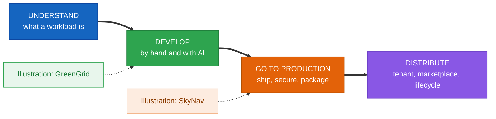
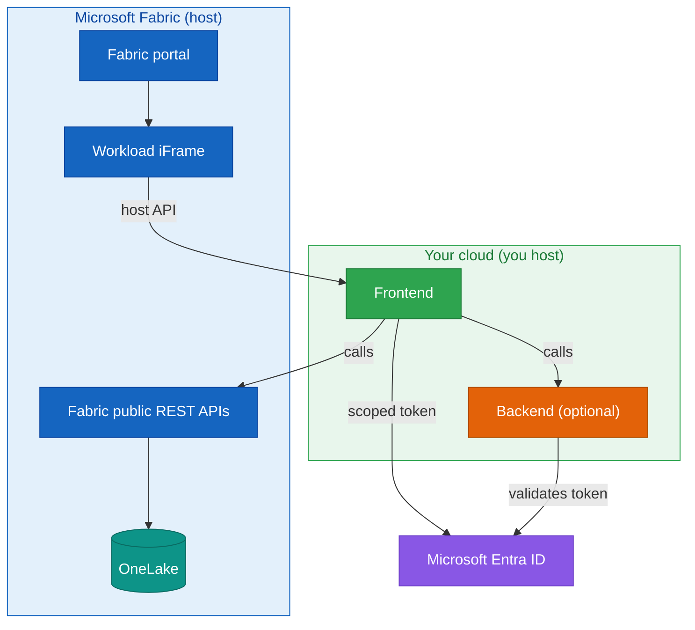
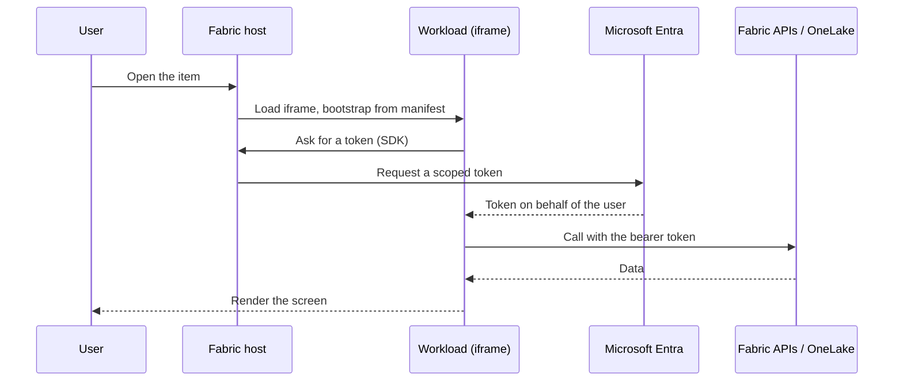
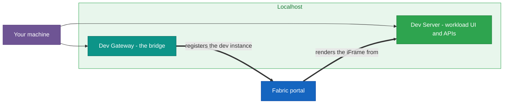
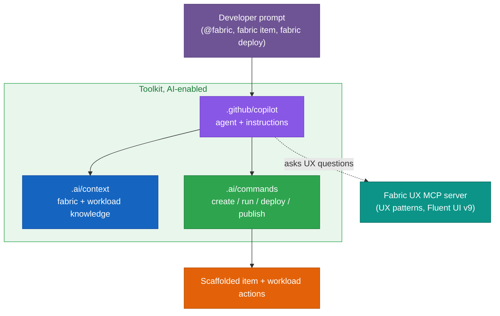
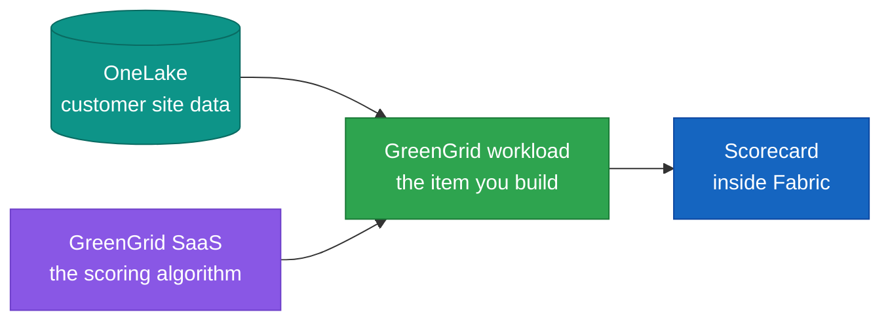
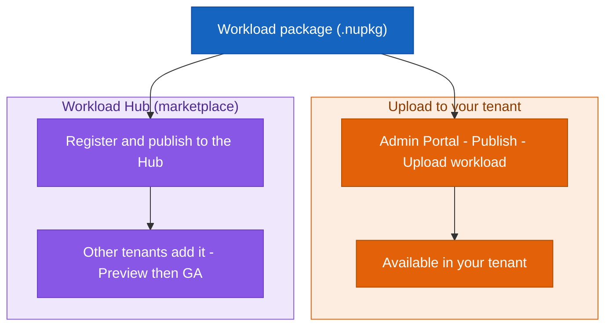

# Building Microsoft Fabric Workloads with the Extensibility Toolkit

### Understand the model, develop a workload (with AI assistance), take it to production, and distribute it

## Contents

**[0. Before you begin](#0-before-you-begin)**

**Understand**

- **[1. What a workload is, and why you would build one](#1-what-a-workload-is-and-why-you-would-build-one)**
- **[2. How a workload runs: architecture, the host, and one request](#2-how-a-workload-runs-architecture-the-host-and-one-request)**
- **[3. The manifest: the contract with Fabric](#3-the-manifest-the-contract-with-fabric)**
- **[4. Identity and access with Microsoft Entra](#4-identity-and-access-with-microsoft-entra)**

**Develop**

- **[5. The toolkit and the development environment](#5-the-toolkit-and-the-development-environment)**
- **[6. Building an item: editor, data, and capabilities](#6-building-an-item-editor-data-and-capabilities)**
- **[7. Developing with AI assistance](#7-developing-with-ai-assistance)**
- **[8. Diagnostics and debugging](#8-diagnostics-and-debugging)**
- **[9. Illustration: GreenGrid](#9-illustration-greengrid)**

**Go to production**

- **[10. From developer mode to production](#10-from-developer-mode-to-production)**
- **[11. Hosting, domain, and identity](#11-hosting-domain-and-identity)**
- **[12. Security and compliance](#12-security-and-compliance)**
- **[13. Packaging, validation, and CI/CD](#13-packaging-validation-and-cicd)**
- **[14. Patterns and anti-patterns](#14-patterns-and-anti-patterns)**
- **[15. Illustration: SkyNav](#15-illustration-skynav)**

**Distribute**

- **[16. Make it available in your tenant](#16-make-it-available-in-your-tenant)**
- **[17. Publish to the marketplace for distribution](#17-publish-to-the-marketplace-for-distribution)**
- **[18. The post-publish lifecycle](#18-the-post-publish-lifecycle)**
- **[19. Recap and next steps](#19-recap-and-next-steps)**

**Appendices**

---

> A single book chapter (about 150 to 200 pages).
> Topic: extending Microsoft Fabric with the **Extensibility Toolkit**.
> Audience: developers and architects building their first Fabric workload.

---

## How the chapter is organized

The chapter teaches the workload model itself, in four movements, after a short list of prerequisites. The concepts come first and stand on their own. Two real workloads appear only as **illustrations**, each at the end of the phase it demonstrates, and each is explained before it is used. The illustrations isolate one concept per phase, they are not reference architectures.

- **Understand**, what a workload is and how it runs inside Fabric.
- **Develop**, how you build a workload by hand and with the toolkit's AI assistant. Then an illustration with **GreenGrid**.
- **Go to production**, shipping a workload, its security and compliance, packaging and CI/CD. Then an illustration with **SkyNav**.
- **Distribute**, make the workload available in a tenant, publish it to the marketplace with its review and monetization, and run it through its post-publish life.

### The two illustrations (and where they appear)

| Illustration | Appears in | Why it is there |
|---|---|---|
| **GreenGrid** | Develop | A workload built locally with the Dev Gateway, explained from scratch |
| **SkyNav** | Go to production | A finished workload hosted on Azure and packaged for a tenant |

### Indicative page budget

| Sections | Movement | Pages |
|---|---|---|
| 0 | Before you begin | ~5 |
| 1-4 | Understand | ~28 |
| 5-9 | Develop (by hand, with AI, diagnostics, GreenGrid) | ~80 |
| 10-15 | Go to production | ~60 |
| 16-19 | Distribute | ~30 |
| Appendices A-G | Reference | ~10 |
| **Total** | | **~213** |

---

# 0. Before you begin

- 0.1 Environment, accounts, and assumed concepts, Azure subscription and Entra tenant, a Fabric or Trial capacity with admin access, Node.js and the toolkit scripts. Familiarity with HTTPS, REST, OAuth/OIDC tokens, iframe messaging, and OneLake paths. The administrator and user roles kept separate.
- 0.2 A five-minute first run, the shortest path from an empty folder to the Hello World item open inside Fabric, as a hook before the model.
- 0.3 Common pitfalls, the environment traps that catch people before any code, capacity, developer mode, env files, token audience, framing, and package version.

---

# Understand

> What a workload is, how Fabric runs it, and the contract that makes it native, anchored by one concrete request.

## 1. What a workload is, and why you would build one

- 1.1 What Fabric gives you, and what a workload adds, OneLake, items, workspaces, capacities. A hosted web app that becomes a native item.
- 1.2 The toolkit, when to use it, and its limits, the Starter-Kit and SDK, good fits. What it does not do (no server code in the Fabric runtime, no quota bypass, not on Power BI Pro) and the alternatives (Power BI custom visuals, Data Activator, Azure Functions behind a Data Pipeline).

## 2. How a workload runs: architecture, the host, and one request

- 2.1 The three parties and the host, the Fabric frontend as host, your web app, the Fabric service. Bootstrapping, theming, and the iframe boundary as the isolation model.

- 2.2 Items as native artifacts, CRUD, access control, search, lineage, CI/CD. The item definition and state stored in OneLake.
- 2.3 A request, step by step, from opening an item to a rendered screen, with the token in the middle.

## 3. The manifest: the contract with Fabric

- 3.1 Three manifests, one contract, the workload, product, and item manifests. Declarative, small, versioned (a release always bumps the version).
- 3.2 Identity and naming, `Org.[Name]` for internal use versus `[Publisher].[Workload]` for the marketplace, and why the choice is made early.

| Aspect | `Org.[Name]` (internal) | `[Publisher].[Workload]` (marketplace) |
|---|---|---|
| Audience | Your own tenant | Other tenants |
| Registration | None, just upload | Name reserved permanently on first upload |
| Requirements | General requirements only | Plus workload, item, and attestation requirements, and review |
| Verified Entra app | Custom domain verification | Plus Microsoft publisher verification |
| Rollout | Upload and enable | Selected tenants, then Preview, then GA |
| Name length | No special limit | Workload portion at most 32 characters |

## 4. Identity and access with Microsoft Entra

- 4.1 The frontend-only model and the on-behalf-of token, direct API calls, one token reused across Entra-secured services, simplified consent. Reading the user's data as the user.
- 4.2 The Entra application and calling services, `Fabric.Extend` and the Power BI preauthorization, granular read and write scopes, the redirect URI and application ID URI. Validating tokens when you run a backend, and a pointer to security and compliance.

---

# Develop

> How a workload is built, first by hand, then with the toolkit's AI assistant, then how you diagnose it. The movement ends with one illustration, GreenGrid.

## 5. The toolkit and the development environment

- 5.1 The Starter-Kit, the setup script, and the Entra app, cloning the kit, the one-script setup, and why an Entra app exists even in local development.
- 5.2 Dev Server, Dev Gateway, and the Hello World checkpoint, the two-terminal model, developer mode in the tenant, and proving the localhost-to-Fabric chain.

## 6. Building an item: editor, data, and capabilities

- 6.1 The item, its editor, and how it surfaces, the standard creation experience, the editor's views and route, and the declarations that make the type appear in the portal.
- 6.2 Reading data and storing state in OneLake, the on-behalf-of read kept behind a function, and the item's own state persisted as part of the item.
- 6.3 Capabilities that make it feel native, and when to add a backend, settings, About, localization, monitoring. Jobs, remote endpoints, lifecycle notifications, and iframe relaxation.

## 7. Developing with AI assistance

> The toolkit is an AI-enabled repository: it ships shared context, runnable commands, a Copilot agent, and a Fabric UX knowledge server so an assistant can scaffold and operate a workload with you.

- 7.1 The AI-enabled repository: shared context and runnable commands, the tool-agnostic `.ai/` folder (`context/` for Fabric and project knowledge, `commands/` for item and workload-lifecycle procedures the assistant can execute).
- 7.2 The Copilot agent, instructions, and the Fabric UX MCP server, `.github/copilot-instructions.md`, the `@fabric` development-assistant agent and activation keywords, the auto-applied `.github/instructions/`, and the MCP server that answers Fabric UX questions so generated UI matches the design system.
- 7.3 What it generates, and keeping it honest, the canonical item file set, Fluent UI v9 and ribbon conventions, method-based scopes, and why the generated code still goes through the manifest validator, the Dev Gateway, and the same boundaries.

## 8. Diagnostics and debugging

- 8.1 Reading the chain, and the token and manifest boundaries, comparing against Hello World. The redirect URI, application ID URI, and `Fabric.Extend` scope. The Workload Validator as the source of truth.
- 8.2 The Dev Gateway, the iframe boundary, and correlation, what the gateway routes and its precedence. The host API as the only channel, carrying `ActivityId` and `RequestId` into your logs.

## 9. Illustration: GreenGrid

> A teaching sample, not a reference architecture. It isolates the development concepts and deliberately skips production concerns.

- 9.1 What GreenGrid is, a solution development company whose scoring SaaS holds the algorithm while the customer's data stays in OneLake, joined by the workload.

- 9.2 Milestone 1, scoring with the SaaS, on seed data, proving the screen-to-service chain.
- 9.3 Milestones 2 and 3, real OneLake data behind the same function, then a graphical, native-feeling screen.

---

# Go to production

> What changes from developer mode, how you secure it, how you package and automate it, and the patterns that keep it sound. The movement ends with one illustration, SkyNav.

## 10. From developer mode to production

- 10.1 What changes, the Dev Gateway goes away and Fabric loads your hosted frontend, a side-by-side comparison.

| Concern | Developer mode | Production |
|---|---|---|
| Delivery to Fabric | Dev Gateway bridges localhost | Fabric loads your hosted URL directly |
| Frontend host | localhost | Your cloud, HTTPS, on a verified domain |
| Backend identity | Developer convenience | Managed identity, no stored secret |
| Telemetry | Console and local logs | Application Insights, correlation IDs retained |
| Reaching users | Your dev workspace | An uploaded package, or a marketplace listing |

- 10.2 What to verify across the transition, domain verification and HTTPS, framing by Fabric (CSP frame-ancestors), CORS, token audience, manifest version, and token lifetime.

## 11. Hosting, domain, and identity

- 11.1 Hosting, the verified domain, and the resource ID, a frontend and optional backend on your cloud. The frontend as a subdomain of a verified Entra domain, the resource ID format.
- 11.2 A production identity without secrets, the production Entra app, managed identity for backend access, and tokens validated rather than trusted.

## 12. Security and compliance

- 12.1 Data stays in the tenant. Labels, DLP, and PII, on-behalf-of access with no copies, data residency that follows OneLake, respecting sensitivity labels, tenant isolation, and handling of personal data.
- 12.2 Secrets, telemetry, and monitoring, managed identity and Key Vault with rotation, nothing sensitive in the frontend, `ActivityId`/`RequestId` into Application Insights and Azure Monitor with alerting.

## 13. Packaging, validation, and CI/CD

- 13.1 The package and validation, the `.nupkg` as a NuGet package reused as the distribution format (not an installer), carrying the manifests with a unique version, the Workload Validator.
- 13.2 Automating the pipeline, Bicep or Terraform for the hosting, and a GitHub Actions or Azure DevOps pipeline that builds, validates, versions, and uploads.

## 14. Patterns and anti-patterns

- 14.1 Patterns that hold up, data behind a function, state in OneLake, follow the host theme, least privilege, correlation IDs, clear empty and error states.
- 14.2 Anti-patterns to avoid, secrets in the frontend, bypassing the iframe boundary, ignoring sensitivity labels, reusing a package version, assuming data is always present.

## 15. Illustration: SkyNav

> A production workload, not a reference architecture. It shows how the production concepts land for one operator in one tenant.

- 15.1 What SkyNav is, and how it is hosted, a fleet-management workload (map, agent, ontology) with frontend and backend on Azure, an FE-remote manifest, and a verified custom domain.
- 15.2 SkyNav's production identity and path to a tenant, managed identity and validated tokens with no secrets, a versioned `.nupkg` uploaded to its own tenant rather than the marketplace.

---

# Distribute

> Put a finished workload in front of users, then keep it running.

## 16. Make it available in your tenant

- 16.1 The Admin Portal versus the Workload Hub, and uploading, the terms kept straight, the Publish and Manage my tenant tabs, and the upload with a fresh version.
- 16.2 Internal publishing with `Org.[Name]`, available in your own tenant, no registration and no marketplace requirements, where SkyNav ends.

## 17. Publish to the marketplace for distribution

- 17.1 The Workload Hub and the cross-tenant path, the reserved `[Publisher].[Workload]` name, selected tenants, Preview to GA, and consent.

- 17.2 Review, compliance, and monetization, general, workload, and item requirements plus a vendor attestation and a publisher-verified app. Azure Marketplace SaaS offers, external billing, or a hybrid, with the Fabric templates for the UX.
- 17.3 Choosing a path, an upload for one organization, the Workload Hub for many.

## 18. The post-publish lifecycle

- 18.1 Updates, migration, and deprecation, a new version per release, migrating item state across versions, and winding a type down without breaking existing items.
- 18.2 Monitoring, consent, rollback, and feature flags, telemetry as adoption signal, permission changes as consent changes, and a known-good package plus flags to undo safely.

## 19. Recap and next steps

- 19.1 The workload model end to end, a go-live checklist, and where to go next, richer items and additional item types, and monetization on the marketplace.

---

## Appendices

- **Appendix A: Manifest field reference** (workload, product, item)
- **Appendix B: Dev Server, Dev Gateway, and Workload Validator commands**
- **Appendix C: AI assistant reference** (`.ai/` context and commands, the `@fabric` agent, the Fabric UX MCP server)
- **Appendix D: Packaging and Admin Portal upload, step by step**
- **Appendix E: Release and compliance checklist, diagnostics quick reference**
- **Appendix F: Glossary and resources**
- **Appendix G: One-page cheat sheet** (commands, manifests, the identity rule, dev-to-prod swaps, diagnostics by boundary)

---

*Illustrations: GreenGrid (development, FY27FabricMotion repository, micro hack 2) and SkyNav (production, fredgis/SkyNav). Reference: Microsoft Learn, Extensibility Toolkit overview, architecture, key concepts, manifest, authentication guidelines, supportability, publishing, monetization, and the microsoft/fabric-extensibility-toolkit repository (`.ai/`, `.github/copilot`, `.github/instructions`, `.github/mcp-quick-start.md`).*
